```mermaid
sequenceDiagram
    participant Pipeline as CI/CD Pipeline
    participant API as ComplianceService API
    participant Handler as EvaluateHandler
    participant OPA as OPA Sidecar
    participant DB as PostgreSQL
    participant Audit as Audit Log

    Pipeline->>API: POST /api/compliance/evaluate
    API->>Handler: EvaluateComplianceCommand
    Handler->>DB: Load Application + Environment
    DB-->>Handler: Application (medium risk tier)
    Handler->>Handler: Build OPA input
    Handler->>OPA: POST /v1/data/compliance/medium_production
    OPA->>OPA: Evaluate policy
    OPA-->>Handler: {"allow": true, "violations": []}
    Handler->>DB: Save ComplianceEvaluation
    Handler->>Audit: Create AuditLog
    Audit->>DB: Save audit record
    Handler-->>API: EvaluationDto
    API-->>Pipeline: 200 OK (allowed: true)
    Pipeline->>Pipeline: ✅ Proceed with deployment
```

```mermaid
sequenceDiagram
    participant Snyk as Snyk Scanner
    participant Prisma as Prisma Cloud
    participant Pipeline as CI/CD Pipeline
    participant API as ComplianceService
    participant OPA as OPA Sidecar

    Snyk->>Pipeline: Scan results (1 high, 1 medium)
    Prisma->>Pipeline: Scan results (1 critical, 1 high)
    Pipeline->>Pipeline: Combine results
    Pipeline->>API: POST /api/compliance/evaluate
    API->>API: Aggregate: 1 crit, 2 high, 1 med
    API->>OPA: Evaluate combined results
    OPA->>OPA: Total critical (1) > 0 ❌
    OPA-->>API: {"allow": false}
    API-->>Pipeline: Deployment blocked
```

```mermaid
sequenceDiagram
    participant Dev as Developer
    participant Git as Git Repository
    participant CI as CI/CD Pipeline
    participant Snyk as Snyk Scanner
    participant Prisma as Prisma Cloud
    participant Compliance as ComplianceService
    participant OPA as OPA Sidecar
    participant K8s as Kubernetes
    participant Slack as Slack Notification

    Dev->>Git: git push origin feature/payment-fix
    Git->>CI: Trigger pipeline
    CI->>CI: Build application
    CI->>CI: Run unit tests

    par Security Scanning
        CI->>Snyk: Run Snyk scan
        Snyk-->>CI: Vulnerabilities report
    and
        CI->>Prisma: Run Prisma Cloud scan
        Prisma-->>CI: Vulnerabilities report
    end

    CI->>CI: Aggregate scan results
    CI->>Compliance: POST /api/compliance/evaluate
    Compliance->>OPA: Evaluate policy
    OPA-->>Compliance: Decision

    alt Evaluation Passed
        Compliance-->>CI: {"allowed": true}
        CI->>K8s: Deploy to production
        K8s-->>CI: Deployment successful
        CI->>Slack: ✅ Deployment successful
    else Evaluation Blocked
        Compliance-->>CI: {"allowed": false, "violations": [...]}
        CI->>CI: Block deployment
        CI->>Slack: ❌ Deployment blocked (violations)
        CI->>Dev: Send failure notification
    end
```

# Compliance Service Testing Scenarios

## Table of Contents
1. [Overview](#overview)
2. [Health Check Testing Scenarios](#health-check-testing-scenarios)
3. [Policy Management Testing Scenarios](#policy-management-testing-scenarios)
4. [Compliance Evaluation Testing Scenarios](#compliance-evaluation-testing-scenarios)
5. [Risk Tier Testing Scenarios](#risk-tier-testing-scenarios)
6. [Multi-Tool Aggregation Testing Scenarios](#multi-tool-aggregation-testing-scenarios)
7. [Audit Trail Testing Scenarios](#audit-trail-testing-scenarios)
8. [End-to-End Integration Testing](#end-to-end-integration-testing)
9. [Performance and Load Testing](#performance-and-load-testing)
10. [Failure and Recovery Testing](#failure-and-recovery-testing)

---

## Overview

This document provides comprehensive testing scenarios for the ComplianceService, a policy gateway for CI/CD pipelines that evaluates security scan results against centralized compliance policies. The service uses Open Policy Agent (OPA) for policy evaluation and PostgreSQL for persistent storage.

### System Architecture


### Core Components
- **Application Profiles**: Store application metadata and environment configurations
- **Environment Configs**: Risk tier and policy assignments per environment
- **OPA Policies**: Define compliance thresholds and business rules
- **Compliance Evaluations**: Record evaluation results and decisions
- **Audit Logs**: Immutable compliance decision records

---

## Health Check Testing Scenarios

### Scenario HC-1: System Health - All Services Healthy

**Objective**: Verify that health check endpoint returns healthy status when all dependencies are available.

**Prerequisites**:
- PostgreSQL database is running and accessible
- OPA sidecar is running on localhost:8181

**Test Steps**:
1. Send GET request to `/health`
2. Verify response status code is 200
3. Verify response body contains:
   - Overall status: "Healthy"
   - PostgreSQL check status: "Healthy"
   - OPA check status: "Healthy"
   - Duration metrics for each check

**Expected Response**:
```json
{
  "status": "Healthy",
  "totalDuration": "45ms",
  "checks": {
    "postgresql": {
      "status": "Healthy",
      "description": "PostgreSQL database connection",
      "duration": "23ms"
    },
    "opa": {
      "status": "Healthy",
      "description": "OPA sidecar connection",
      "duration": "5ms"
    }
  }
}
```

**Process Flow**:


---

### Scenario HC-2: Database Unavailable

**Objective**: Verify degraded health status when PostgreSQL is unavailable.

**Prerequisites**:
- PostgreSQL database is stopped or unreachable
- OPA sidecar is running

**Test Steps**:
1. Stop PostgreSQL service
2. Send GET request to `/health`
3. Verify response status code is 503
4. Verify PostgreSQL check shows "Unhealthy"
5. Verify OPA check shows "Healthy"

**Expected Response**:
```json
{
  "status": "Unhealthy",
  "totalDuration": "5012ms",
  "checks": {
    "postgresql": {
      "status": "Unhealthy",
      "description": "PostgreSQL database connection",
      "duration": "5000ms",
      "exception": "Npgsql.NpgsqlException: connection timeout"
    },
    "opa": {
      "status": "Healthy",
      "description": "OPA sidecar connection",
      "duration": "4ms"
    }
  }
}
```

**Impact**: Service cannot process evaluation requests without database access.

---

### Scenario HC-3: OPA Sidecar Unavailable

**Objective**: Verify degraded health status when OPA sidecar is unavailable.

**Prerequisites**:
- PostgreSQL database is running
- OPA sidecar is stopped

**Test Steps**:
1. Stop OPA sidecar service
2. Send GET request to `/health`
3. Verify response status code is 503
4. Verify OPA check shows "Unhealthy"
5. Verify PostgreSQL check shows "Healthy"

**Expected Response**:
```json
{
  "status": "Unhealthy",
  "totalDuration": "2018ms",
  "checks": {
    "postgresql": {
      "status": "Healthy",
      "description": "PostgreSQL database connection",
      "duration": "15ms"
    },
    "opa": {
      "status": "Unhealthy",
      "description": "OPA sidecar connection",
      "duration": "2000ms",
      "exception": "HttpRequestException: Connection refused"
    }
  }
}
```

**Impact**: Service cannot evaluate compliance policies without OPA.

---

## Policy Management Testing Scenarios

### Scenario PM-1: Register New Application

**Objective**: Register a new application with the compliance service.

**Test Steps**:
1. Send POST request to `/api/application`
2. Verify response contains application ID
3. Verify application is created in database
4. Verify default values are set correctly

**Request Body**:
```json
{
  "name": "payment-api",
  "owner": "payments-team@company.com"
}
```

**Expected Response**:
```json
{
  "id": "550e8400-e29b-41d4-a716-446655440000",
  "name": "payment-api",
  "owner": "payments-team@company.com",
  "isActive": true,
  "createdAt": "2026-02-11T10:00:00Z",
  "environments": []
}
```

**Process Flow**:


---

### Scenario PM-2: Add Environment Configuration

**Objective**: Add environment-specific configuration to an application.

**Prerequisites**:
- Application exists (e.g., payment-api)

**Test Steps**:
1. Send POST request to `/api/application/{id}/environments`
2. Verify environment config is created
3. Verify risk tier is set correctly
4. Verify security tools are configured
5. Verify policies are assigned

**Request Body**:
```json
{
  "environmentName": "production",
  "riskTier": "critical",
  "securityTools": ["snyk", "prismacloud"],
  "policies": ["compliance.critical_production"],
  "metadata": {
    "snykOrgId": "org-123456",
    "prismaCloudProjectId": "pc-789012"
  }
}
```

**Expected Response**:
```json
{
  "id": "env-550e8400-e29b-41d4-a716-446655440001",
  "applicationId": "550e8400-e29b-41d4-a716-446655440000",
  "environmentName": "production",
  "riskTier": "critical",
  "securityTools": ["snyk", "prismacloud"],
  "policies": ["compliance.critical_production"],
  "metadata": {
    "snykOrgId": "org-123456",
    "prismaCloudProjectId": "pc-789012"
  },
  "isActive": true,
  "createdAt": "2026-02-11T10:05:00Z"
}
```

**Validation Rules**:
- Environment name must be valid (production, staging, development)
- Risk tier must be valid (critical, high, medium, low)
- At least one security tool must be specified
- At least one policy must be specified

---

### Scenario PM-3: Update Environment Configuration

**Objective**: Update risk tier or policies for an existing environment.

**Prerequisites**:
- Application exists with environment configuration

**Test Steps**:
1. Send PUT request to `/api/application/{id}/environments/{name}`
2. Verify environment config is updated
3. Verify old values are replaced
4. Verify audit trail is created

**Request Body**:
```json
{
  "riskTier": "high",
  "securityTools": ["snyk", "prismacloud", "trivy"],
  "policies": ["compliance.high_production"],
  "metadata": {
    "snykOrgId": "org-123456",
    "prismaCloudProjectId": "pc-789012",
    "trivyVersion": "0.48.0"
  }
}
```

**Expected Result**: Environment configuration updated with new values.

---

### Scenario PM-4: Multiple Environments Per Application

**Objective**: Verify an application can have different configurations per environment.

**Test Steps**:
1. Create application "payment-api"
2. Add production environment with "critical" risk tier
3. Add staging environment with "high" risk tier
4. Add development environment with "medium" risk tier
5. Verify each environment has independent configuration

**Expected Configuration**:


**Verification**:
- Production uses `compliance.critical_production` policy
- Staging uses `compliance.high_staging` policy
- Development uses `compliance.medium_development` policy

---

## Compliance Evaluation Testing Scenarios

### Scenario CE-1: Successful Evaluation - No Vulnerabilities

**Objective**: Verify that applications with no vulnerabilities pass compliance evaluation.

**Prerequisites**:
- Application "web-dashboard" registered
- Production environment configured with "medium" risk tier
- OPA policy allows clean scans

**Test Steps**:
1. Send POST request to `/api/compliance/evaluate`
2. Verify response shows "allowed: true"
3. Verify evaluation is saved to database
4. Verify audit log is created

**Request Body**:
```json
{
  "applicationId": "app-123456",
  "environment": "production",
  "scanResults": [
    {
      "toolName": "snyk",
      "scannedAt": "2026-02-11T09:00:00Z",
      "vulnerabilities": []
    }
  ]
}
```

**Expected Response**:
```json
{
  "id": "eval-123456",
  "applicationId": "app-123456",
  "applicationName": "web-dashboard",
  "environment": "production",
  "evaluatedAt": "2026-02-11T09:05:00Z",
  "passed": true,
  "scanResults": [...],
  "policyDecision": {
    "allow": true,
    "violations": [],
    "reason": "All compliance checks passed"
  },
  "aggregatedCounts": {
    "critical": 0,
    "high": 0,
    "medium": 0,
    "low": 0,
    "total": 0
  }
}
```

**Process Flow**:


---

### Scenario CE-2: Blocked Evaluation - Critical Vulnerabilities

**Objective**: Verify that applications with critical vulnerabilities are blocked in production.

**Prerequisites**:
- Application "payment-api" registered
- Production environment configured with "critical" risk tier
- OPA policy: 0 critical vulnerabilities allowed

**Test Steps**:
1. Send POST request to `/api/compliance/evaluate` with critical vulnerabilities
2. Verify response shows "allowed: false"
3. Verify violations are detailed
4. Verify notification is sent
5. Verify audit log contains complete evidence

**Request Body**:
```json
{
  "applicationId": "550e8400-e29b-41d4-a716-446655440000",
  "environment": "production",
  "scanResults": [
    {
      "toolName": "snyk",
      "scannedAt": "2026-02-11T10:00:00Z",
      "vulnerabilities": [
        {
          "cveId": "CVE-2024-1234",
          "severity": "critical",
          "description": "Remote Code Execution in OpenSSL",
          "packageName": "openssl",
          "currentVersion": "1.1.1f",
          "fixedVersion": "1.1.1w",
          "cvssScore": 9.8
        },
        {
          "cveId": "SNYK-JS-LODASH-590103",
          "severity": "high",
          "description": "Prototype Pollution",
          "packageName": "lodash",
          "currentVersion": "4.17.19",
          "fixedVersion": "4.17.21",
          "cvssScore": 7.4
        }
      ]
    }
  ]
}
```

**Expected Response**:
```json
{
  "id": "eval-789012",
  "applicationId": "550e8400-e29b-41d4-a716-446655440000",
  "applicationName": "payment-api",
  "environment": "production",
  "evaluatedAt": "2026-02-11T10:05:00Z",
  "passed": false,
  "scanResults": [...],
  "policyDecision": {
    "allow": false,
    "violations": [
      {
        "rule": "no_critical_vulnerabilities",
        "message": "Critical vulnerabilities (1) exceed maximum (0)",
        "severity": "critical"
      }
    ],
    "reason": "Policy violations detected"
  },
  "aggregatedCounts": {
    "critical": 1,
    "high": 1,
    "medium": 0,
    "low": 0,
    "total": 2
  }
}
```

**Process Flow**:


**CI/CD Pipeline Action**:
```bash
# Pipeline script
if [ "$COMPLIANCE_ALLOWED" != "true" ]; then
  echo "❌ Deployment blocked by compliance policy"
  echo "Violations: $VIOLATIONS"
  exit 1
fi
```

---

### Scenario CE-3: Evaluation with Mixed Severity Levels

**Objective**: Verify that OPA policies correctly evaluate mixed severity vulnerabilities.

**Prerequisites**:
- Application "internal-tool" registered
- Production environment with "medium" risk tier
- Policy: 2 critical, 5 high, 10 medium allowed

**Test Steps**:
1. Send evaluation request with mixed vulnerabilities
2. Verify OPA evaluates total counts against thresholds
3. Verify decision is based on aggregate counts

**Request Body**:
```json
{
  "applicationId": "app-internal-tool",
  "environment": "production",
  "scanResults": [
    {
      "toolName": "snyk",
      "scannedAt": "2026-02-11T10:00:00Z",
      "vulnerabilities": [
        {"cveId": "CVE-2024-1111", "severity": "critical", "cvssScore": 9.8, ...},
        {"cveId": "CVE-2024-2222", "severity": "high", "cvssScore": 7.5, ...},
        {"cveId": "CVE-2024-3333", "severity": "high", "cvssScore": 7.2, ...},
        {"cveId": "CVE-2024-4444", "severity": "medium", "cvssScore": 5.3, ...},
        {"cveId": "CVE-2024-5555", "severity": "medium", "cvssScore": 5.1, ...},
        {"cveId": "CVE-2024-6666", "severity": "low", "cvssScore": 3.1, ...}
      ]
    }
  ]
}
```

**Expected Evaluation**:
- Critical: 1 (within threshold of 2) ✅
- High: 2 (within threshold of 5) ✅
- Medium: 2 (within threshold of 10) ✅
- Low: 1 (no threshold) ✅
- **Result**: allowed = true

**OPA Policy Logic**:
```rego
package compliance.medium_production

import future.keywords.if

default allow = false

allow if {
    count_critical <= 2
    count_high <= 5
    count_medium <= 10
}

count_critical = count([v | v := input.scanResults[_].vulnerabilities[_]; v.severity == "critical"])
count_high = count([v | v := input.scanResults[_].vulnerabilities[_]; v.severity == "high"])
count_medium = count([v | v := input.scanResults[_].vulnerabilities[_]; v.severity == "medium"])
```

---

## Risk Tier Testing Scenarios

### Scenario RT-1: Critical Risk Tier - Zero Tolerance

**Objective**: Verify that critical risk tier applications have zero tolerance for critical vulnerabilities.

**Application**: payment-api (handles PCI-DSS data)
**Environment**: production
**Risk Tier**: critical

**Policy Requirements**:
- 0 critical vulnerabilities allowed
- 0 high vulnerabilities allowed
- 3 medium vulnerabilities allowed
- No limit on low vulnerabilities

**Test Cases**:

| Test Case | Critical | High | Medium | Low | Expected Result |
|-----------|----------|------|--------|-----|-----------------|
| RT-1.1    | 0        | 0    | 0      | 0   | ✅ Allowed       |
| RT-1.2    | 0        | 0    | 2      | 5   | ✅ Allowed       |
| RT-1.3    | 1        | 0    | 0      | 0   | ❌ Blocked       |
| RT-1.4    | 0        | 1    | 0      | 0   | ❌ Blocked       |
| RT-1.5    | 0        | 0    | 4      | 0   | ❌ Blocked       |

**Process Diagram**:

```mermaid
graph TD
    A[Scan Results] --> B{Critical > 0?}
    B -->|Yes| Z[❌ BLOCKED]
    B -->|No| C{High > 0?}
    C -->|Yes| Z
    C -->|No| D{Medium > 3?}
    D -->|Yes| Z
    D -->|No| Y[✅ ALLOWED]

    style Z fill:#f99,stroke:#333,stroke-width:3px
    style Y fill:#9f9,stroke:#333,stroke-width:3px
```


---

### Scenario RT-2: High Risk Tier - Minimal Tolerance

**Objective**: Verify that high risk tier applications have minimal tolerance for vulnerabilities.

**Application**: user-auth-service (handles authentication)
**Environment**: production
**Risk Tier**: high

**Policy Requirements**:
- 0 critical vulnerabilities allowed
- 2 high vulnerabilities allowed
- 5 medium vulnerabilities allowed
- No limit on low vulnerabilities

**Test Cases**:

| Test Case | Critical | High | Medium | Low | Expected Result |
|-----------|----------|------|--------|-----|-----------------|
| RT-2.1    | 0        | 0    | 0      | 10  | ✅ Allowed       |
| RT-2.2    | 0        | 2    | 5      | 0   | ✅ Allowed       |
| RT-2.3    | 1        | 0    | 0      | 0   | ❌ Blocked       |
| RT-2.4    | 0        | 3    | 0      | 0   | ❌ Blocked       |
| RT-2.5    | 0        | 1    | 6      | 0   | ❌ Blocked       |

---

### Scenario RT-3: Medium Risk Tier - Moderate Tolerance

**Objective**: Verify that medium risk tier applications have moderate tolerance for vulnerabilities.

**Application**: analytics-dashboard (internal tool)
**Environment**: production
**Risk Tier**: medium

**Policy Requirements**:
- 2 critical vulnerabilities allowed
- 5 high vulnerabilities allowed
- 10 medium vulnerabilities allowed
- No limit on low vulnerabilities

**Test Cases**:

| Test Case | Critical | High | Medium | Low | Expected Result |
|-----------|----------|------|--------|-----|-----------------|
| RT-3.1    | 0        | 0    | 0      | 20  | ✅ Allowed       |
| RT-3.2    | 2        | 5    | 10     | 0   | ✅ Allowed       |
| RT-3.3    | 3        | 0    | 0      | 0   | ❌ Blocked       |
| RT-3.4    | 0        | 6    | 0      | 0   | ❌ Blocked       |
| RT-3.5    | 1        | 4    | 11     | 0   | ❌ Blocked       |

---

### Scenario RT-4: Low Risk Tier - High Tolerance

**Objective**: Verify that low risk tier applications have high tolerance for vulnerabilities.

**Application**: dev-playground (testing environment)
**Environment**: development
**Risk Tier**: low

**Policy Requirements**:
- 5 critical vulnerabilities allowed
- 10 high vulnerabilities allowed
- 20 medium vulnerabilities allowed
- No limit on low vulnerabilities

**Test Cases**:

| Test Case | Critical | High | Medium | Low | Expected Result |
|-----------|----------|------|--------|-----|-----------------|
| RT-4.1    | 0        | 0    | 0      | 50  | ✅ Allowed       |
| RT-4.2    | 5        | 10   | 20     | 0   | ✅ Allowed       |
| RT-4.3    | 6        | 0    | 0      | 0   | ❌ Blocked       |
| RT-4.4    | 0        | 11   | 0      | 0   | ❌ Blocked       |

---

### Scenario RT-5: Risk Tier Progression Across Environments

**Objective**: Verify that the same application can have different risk tiers per environment.

**Application**: mobile-app-backend

**Environment Configurations**:


**Test Scenario**:
Same vulnerability set evaluated across different environments:
- 1 critical, 3 high, 8 medium vulnerabilities

**Expected Results**:
- Development (low): ✅ Allowed (1 ≤ 5, 3 ≤ 10, 8 ≤ 20)
- Staging (medium): ❌ Blocked (1 ≤ 2 ✅, 3 ≤ 5 ✅, 8 ≤ 10 ✅) → Actually allowed!
- Production (high): ❌ Blocked (1 > 0 critical)

---

## Multi-Tool Aggregation Testing Scenarios

### Scenario MT-1: Aggregation from Multiple Security Tools

**Objective**: Verify that vulnerabilities from multiple security tools are aggregated correctly.

**Prerequisites**:
- Application configured with both Snyk and Prisma Cloud
- OPA policy evaluates combined results

**Test Steps**:
1. Send evaluation request with results from both Snyk and Prisma Cloud
2. Verify service aggregates vulnerabilities from both tools
3. Verify OPA receives combined input
4. Verify decision is based on total counts

**Request Body**:
```json
{
  "applicationId": "app-multi-tool",
  "environment": "production",
  "scanResults": [
    {
      "toolName": "snyk",
      "scannedAt": "2026-02-11T10:00:00Z",
      "vulnerabilities": [
        {"cveId": "SNYK-JS-LODASH-590103", "severity": "high", ...},
        {"cveId": "SNYK-JS-AXIOS-2348556", "severity": "medium", ...}
      ]
    },
    {
      "toolName": "prismacloud",
      "scannedAt": "2026-02-11T10:02:00Z",
      "vulnerabilities": [
        {"cveId": "CVE-2024-1234", "severity": "critical", ...},
        {"cveId": "CVE-2024-5678", "severity": "high", ...}
      ]
    }
  ]
}
```

**Aggregated Counts**:
- Critical: 1 (from Prisma Cloud)
- High: 2 (1 from Snyk + 1 from Prisma Cloud)
- Medium: 1 (from Snyk)
- Total: 4 vulnerabilities

**OPA Input Structure**:
```json
{
  "application": {
    "name": "app-multi-tool",
    "environment": "production",
    "riskTier": "high",
    "owner": "devops@company.com"
  },
  "scanResults": [
    {
      "tool": "snyk",
      "scannedAt": "2026-02-11T10:00:00Z",
      "vulnerabilities": [...]
    },
    {
      "tool": "prismacloud",
      "scannedAt": "2026-02-11T10:02:00Z",
      "vulnerabilities": [...]
    }
  ]
}
```

**Process Flow**:


---

### Scenario MT-2: Duplicate Vulnerability Detection

**Objective**: Verify handling of same vulnerability reported by multiple tools.

**Test Case**: CVE-2024-1234 reported by both Snyk and Prisma Cloud

**Request Body**:
```json
{
  "applicationId": "app-duplicate-test",
  "environment": "production",
  "scanResults": [
    {
      "toolName": "snyk",
      "vulnerabilities": [
        {"cveId": "CVE-2024-1234", "severity": "critical", "packageName": "openssl"}
      ]
    },
    {
      "toolName": "prismacloud",
      "vulnerabilities": [
        {"cveId": "CVE-2024-1234", "severity": "critical", "packageName": "openssl"}
      ]
    }
  ]
}
```

**Expected Behavior**:
- **Current Implementation**: Counts as 2 critical vulnerabilities (no deduplication)
- **Reason**: Different tools may have different context/metadata
- **Alternative**: Implement deduplication based on CVE-ID in future version

**Recommendation**:
- Document that duplicates are counted separately
- Consider adding deduplication logic based on CVE-ID in future iteration
- Allow policy authors to handle duplicates in OPA logic

---

### Scenario MT-3: Tool-Specific Policy Requirements

**Objective**: Verify that policies can enforce tool-specific requirements.

**Use Case**: Require both Snyk and Prisma Cloud scans for critical applications.

**OPA Policy**:
```rego
package compliance.critical_production

import future.keywords.if

default allow = false

# Require both tools to have scanned
required_tools := ["snyk", "prismacloud"]

tools_present := [tool | tool := input.scanResults[_].tool]

all_tools_present if {
    count(required_tools) == count([t | t := required_tools[_]; t in tools_present])
}

allow if {
    all_tools_present
    count_critical == 0
    count_high == 0
}

violations[msg] {
    not all_tools_present
    msg := "Missing required security tool scans"
}
```

**Test Cases**:

| Test Case | Snyk | Prisma | Result | Reason |
|-----------|------|--------|--------|--------|
| MT-3.1    | ✅   | ✅     | ✅     | Both tools present |
| MT-3.2    | ✅   | ❌     | ❌     | Missing Prisma Cloud |
| MT-3.3    | ❌   | ✅     | ❌     | Missing Snyk |

---

## Audit Trail Testing Scenarios

### Scenario AT-1: Complete Audit Trail Creation

**Objective**: Verify that all evaluations create complete audit trails with full evidence.

**Prerequisites**:
- Application evaluated with compliance service
- Evaluation completes successfully

**Test Steps**:
1. Send evaluation request
2. Verify audit log is created
3. Verify audit log contains:
   - Complete scan results (JSON)
   - OPA input (JSON)
   - OPA output (JSON)
   - Application metadata
   - Evaluation timestamp
   - Decision and violations

**Expected Audit Log Structure**:
```json
{
  "id": "audit-123456",
  "evaluationId": "eval-789012",
  "applicationId": "app-payment-api",
  "applicationName": "payment-api",
  "environment": "production",
  "riskTier": "critical",
  "allowed": false,
  "reason": "Policy violations detected",
  "violations": [
    {
      "rule": "no_critical_vulnerabilities",
      "message": "Critical vulnerabilities (1) exceed maximum (0)",
      "severity": "critical"
    }
  ],
  "decisionEvidence": {
    "scanResultsJson": "{...complete scan results...}",
    "policyInputJson": "{...OPA input payload...}",
    "policyOutputJson": "{...OPA decision...}"
  },
  "criticalCount": 1,
  "highCount": 2,
  "mediumCount": 5,
  "lowCount": 10,
  "totalVulnerabilityCount": 18,
  "evaluationDurationMs": 85,
  "createdAt": "2026-02-11T10:05:00Z"
}
```

**Verification**:
- GET `/api/audit/{id}` returns complete audit log
- All evidence fields are populated
- Evidence is valid JSON
- Evidence can be used for post-incident investigation

---

### Scenario AT-2: Audit Log Immutability

**Objective**: Verify that audit logs cannot be modified after creation.

**Test Steps**:
1. Create evaluation (audit log created)
2. Attempt to modify audit log via direct database access
3. Verify application layer prevents updates
4. Verify no UPDATE methods exist for audit logs

**Expected Behavior**:
- Audit logs are append-only
- No update/delete operations available
- Database constraints prevent modifications
- Only read operations supported

**Database Constraints**:
```sql
-- No UPDATE or DELETE triggers should exist
-- Audit logs table should have restricted permissions
REVOKE UPDATE, DELETE ON compliance.audit_logs FROM compliance_user;
GRANT INSERT, SELECT ON compliance.audit_logs TO compliance_user;
```

---

### Scenario AT-3: Audit Query by Application

**Objective**: Retrieve all audit logs for a specific application.

**Test Steps**:
1. Send GET request to `/api/audit/application/{appId}`
2. Verify response contains all evaluations for application
3. Verify pagination works correctly
4. Verify results are sorted by date (newest first)

**Request**:
```
GET /api/audit/application/app-payment-api?pageSize=10&pageNumber=1
```

**Expected Response**:
```json
{
  "data": [
    {
      "id": "audit-123456",
      "evaluationId": "eval-789012",
      "applicationName": "payment-api",
      "environment": "production",
      "allowed": false,
      "criticalCount": 1,
      "highCount": 2,
      "evaluatedAt": "2026-02-11T10:05:00Z"
    },
    {
      "id": "audit-123455",
      "evaluationId": "eval-789011",
      "applicationName": "payment-api",
      "environment": "staging",
      "allowed": true,
      "criticalCount": 0,
      "highCount": 0,
      "evaluatedAt": "2026-02-10T15:30:00Z"
    }
  ],
  "pageNumber": 1,
  "pageSize": 10,
  "totalCount": 2,
  "totalPages": 1
}
```

---

### Scenario AT-4: Audit Statistics and Reporting

**Objective**: Generate aggregate statistics from audit logs for compliance reporting.

**Test Steps**:
1. Send GET request to `/api/audit/statistics`
2. Verify statistics include:
   - Total evaluations
   - Blocked deployments count
   - Pass rate percentage
   - Average vulnerabilities per scan
   - Breakdown by risk tier
   - Breakdown by environment

**Request**:
```
GET /api/audit/statistics?startDate=2026-02-01&endDate=2026-02-11
```

**Expected Response**:
```json
{
  "period": {
    "startDate": "2026-02-01T00:00:00Z",
    "endDate": "2026-02-11T23:59:59Z"
  },
  "totalEvaluations": 1234,
  "allowedEvaluations": 987,
  "blockedEvaluations": 247,
  "passRate": 80.0,
  "averageVulnerabilitiesPerScan": 8.5,
  "byRiskTier": {
    "critical": {
      "total": 123,
      "allowed": 45,
      "blocked": 78,
      "passRate": 36.6
    },
    "high": {
      "total": 456,
      "allowed": 312,
      "blocked": 144,
      "passRate": 68.4
    },
    "medium": {
      "total": 567,
      "allowed": 534,
      "blocked": 33,
      "passRate": 94.2
    },
    "low": {
      "total": 88,
      "allowed": 96,
      "blocked": 2,
      "passRate": 97.7
    }
  },
  "byEnvironment": {
    "production": {
      "total": 567,
      "allowed": 445,
      "blocked": 122,
      "passRate": 78.5
    },
    "staging": {
      "total": 445,
      "allowed": 389,
      "blocked": 56,
      "passRate": 87.4
    },
    "development": {
      "total": 222,
      "allowed": 153,
      "blocked": 69,
      "passRate": 68.9
    }
  },
  "topBlockedApplications": [
    {
      "applicationName": "legacy-monolith",
      "blockedCount": 45
    },
    {
      "applicationName": "payment-api",
      "blockedCount": 23
    }
  ]
}
```

**Process Flow**:


---

### Scenario AT-5: Blocked Decisions Query

**Objective**: Retrieve all blocked deployments for security review.

**Test Steps**:
1. Send GET request to `/api/audit/blocked`
2. Verify response contains only blocked evaluations
3. Verify violations are included
4. Verify results are sorted by severity

**Request**:
```
GET /api/audit/blocked?days=7
```

**Expected Response**:
```json
{
  "data": [
    {
      "id": "audit-123456",
      "applicationName": "payment-api",
      "environment": "production",
      "riskTier": "critical",
      "allowed": false,
      "violations": [
        {
          "rule": "no_critical_vulnerabilities",
          "message": "Critical vulnerabilities (1) exceed maximum (0)",
          "severity": "critical"
        }
      ],
      "criticalCount": 1,
      "highCount": 2,
      "evaluatedAt": "2026-02-11T10:05:00Z"
    },
    {
      "id": "audit-123455",
      "applicationName": "user-service",
      "environment": "production",
      "riskTier": "high",
      "allowed": false,
      "violations": [
        {
          "rule": "high_vulnerabilities_limit",
          "message": "High vulnerabilities (5) exceed maximum (2)",
          "severity": "high"
        }
      ],
      "criticalCount": 0,
      "highCount": 5,
      "evaluatedAt": "2026-02-10T14:22:00Z"
    }
  ],
  "totalCount": 2
}
```

**Use Cases**:
- Security team daily review of blocked deployments
- Identify applications with recurring issues
- Compliance reporting for management
- Incident investigation

---

## End-to-End Integration Testing

### Scenario E2E-1: Complete CI/CD Pipeline Integration

**Objective**: Test full workflow from code commit to deployment decision.

**Process Flow**:


**Test Steps**:

1. **Setup Phase**:
   - Register application "payment-api"
   - Configure production environment with "critical" risk tier
   - Set OPA policy: 0 critical, 0 high allowed
   - Configure CI/CD pipeline with compliance integration

2. **Execution Phase**:
   - Developer pushes code with vulnerable dependency
   - CI pipeline builds application
   - Snyk scans and finds 1 critical vulnerability
   - Prisma Cloud scans and finds 1 high vulnerability
   - Pipeline calls ComplianceService with results
   - Service evaluates against policy
   - Service returns blocked decision
   - Pipeline fails deployment

3. **Verification Phase**:
   - Verify evaluation saved to database
   - Verify audit log created with evidence
   - Verify notification sent to team
   - Verify deployment did not proceed
   - Verify pipeline exit code is non-zero

**Expected Pipeline Output**:
```bash
✅ Build successful
✅ Unit tests passed
🔍 Running security scans...
  ⚠️  Snyk found 1 critical, 0 high, 2 medium vulnerabilities
  ⚠️  Prisma Cloud found 0 critical, 1 high, 0 medium vulnerabilities
🔒 Evaluating compliance...
  ❌ BLOCKED by compliance policy

Violations:
  - Critical vulnerabilities (1) exceed maximum (0)
  - High vulnerabilities (1) exceed maximum (0)

Remediation:
  - Fix CVE-2024-1234 in openssl (upgrade to 1.1.1w)
  - Fix SNYK-JS-AXIOS-2348556 in axios (upgrade to 1.6.2)

Deployment aborted.
Exit code: 1
```

---

### Scenario E2E-2: Policy Update Workflow

**Objective**: Verify that updating OPA policies immediately affects new evaluations.

**Test Steps**:

1. **Initial State**:
   - Application "web-app" configured
   - Policy: 0 critical, 2 high allowed
   - Test evaluation: 0 critical, 3 high → Blocked

2. **Policy Update**:
   - Compliance team updates OPA policy
   - New policy: 0 critical, 5 high allowed
   - OPA automatically reloads policy

3. **New Evaluation**:
   - Run evaluation with same vulnerabilities: 0 critical, 3 high
   - Verify evaluation now passes
   - Verify no application configuration changes needed

**Process Flow**:


**Verification**:
- Old evaluations in audit log remain unchanged
- New evaluations use updated policy
- No downtime during policy update
- Policy versioning tracked in git

---

### Scenario E2E-3: Emergency Override Process

**Objective**: Document process for emergency deployments that bypass compliance.

**Use Case**: Critical production bug requires immediate hotfix, but fix introduces temporary vulnerability.

**Process**:

1. **Request Override**:
   - Engineering manager requests emergency override
   - Security team reviews request
   - Override approved with conditions

2. **Temporary Policy Update**:
   - Create temporary OPA policy exception
   - Deploy to OPA with specific application ID
   - Set expiration time

3. **Deploy with Override**:
   - Run deployment pipeline
   - Compliance evaluation uses override policy
   - Deployment proceeds
   - Audit log records override

4. **Remediation**:
   - Create ticket to fix vulnerability
   - Set deadline for remediation
   - Revert override policy after fix deployed
   - Verify compliance restored

**OPA Override Policy**:
```rego
package compliance.critical_production

import future.keywords.if

# Emergency override for payment-api (expires 2026-02-15)
emergency_override if {
    input.application.name == "payment-api"
    time.now_ns() < time.parse_rfc3339_ns("2026-02-15T00:00:00Z")
}

allow if {
    emergency_override
}

allow if {
    not emergency_override
    count_critical == 0
    count_high == 0
}
```

**Audit Trail**:
```json
{
  "evaluationId": "eval-emergency-001",
  "applicationName": "payment-api",
  "allowed": true,
  "reason": "Emergency override active until 2026-02-15",
  "violations": [],
  "metadata": {
    "override": true,
    "overrideReason": "Critical production bug fix - CVE-2024-9999",
    "approvedBy": "security-manager@company.com",
    "expiresAt": "2026-02-15T00:00:00Z",
    "ticketId": "SEC-1234"
  }
}
```

---

## Performance and Load Testing

### Scenario PT-1: Concurrent Evaluation Requests

**Objective**: Verify system can handle multiple concurrent evaluation requests.

**Test Configuration**:
- 100 concurrent requests
- Mix of allowed/blocked evaluations
- Different applications and environments
- Each request has 10-50 vulnerabilities

**Expected Performance**:
- 95th percentile response time: < 200ms
- 99th percentile response time: < 500ms
- No failed requests
- No database connection pool exhaustion

**Test Script**:
```bash
# Using Apache Bench or similar
ab -n 1000 -c 100 -p evaluation.json -T application/json \
   http://localhost:5000/api/compliance/evaluate
```

**Monitoring Metrics**:
- Average response time
- Database connection pool usage
- OPA sidecar CPU usage
- Memory consumption
- Error rate

---

### Scenario PT-2: Large Vulnerability Dataset

**Objective**: Verify system handles evaluations with large numbers of vulnerabilities.

**Test Cases**:

| Test Case | Vulnerabilities | Expected Response Time |
|-----------|-----------------|------------------------|
| PT-2.1    | 10              | < 100ms                |
| PT-2.2    | 100             | < 200ms                |
| PT-2.3    | 500             | < 500ms                |
| PT-2.4    | 1000            | < 1000ms               |

**Verification**:
- Response time scales linearly with vulnerability count
- No memory leaks
- Database writes complete successfully
- Audit logs contain complete data

---

### Scenario PT-3: Database Query Performance

**Objective**: Verify audit log queries perform well with large datasets.

**Test Setup**:
- Insert 1 million audit log entries
- Query by application (100,000 entries)
- Query by date range (50,000 entries)
- Query blocked evaluations (10,000 entries)

**Expected Performance**:
- Single record lookup: < 10ms
- Paginated query (50 results): < 50ms
- Statistics aggregation: < 500ms
- Index usage verified for all queries

**Database Indexes**:
```sql
CREATE INDEX idx_audit_logs_application ON audit_logs(application_id, created_at DESC);
CREATE INDEX idx_audit_logs_blocked ON audit_logs(allowed) WHERE allowed = false;
CREATE INDEX idx_audit_logs_date_range ON audit_logs(created_at DESC);
CREATE INDEX idx_audit_logs_risk_tier ON audit_logs(risk_tier);
```

---

## Failure and Recovery Testing

### Scenario FR-1: Database Connection Loss During Evaluation

**Objective**: Verify graceful handling when database connection is lost mid-evaluation.

**Test Steps**:
1. Start evaluation request
2. Simulate database connection loss before save
3. Verify appropriate error returned
4. Verify no partial data saved
5. Verify OPA evaluation not recorded

**Expected Behavior**:
- Return 503 Service Unavailable
- Log error with details
- No orphaned records in database
- Client can retry request

**Error Response**:
```json
{
  "error": "ServiceUnavailable",
  "message": "Database connection lost during evaluation",
  "details": "Unable to save compliance evaluation. Please retry.",
  "retryable": true
}
```

---

### Scenario FR-2: OPA Sidecar Unavailable

**Objective**: Verify handling when OPA sidecar is unavailable during evaluation.

**Test Steps**:
1. Stop OPA sidecar
2. Send evaluation request
3. Verify error response
4. Verify no evaluation saved
5. Verify health check shows unhealthy

**Expected Behavior**:
- Return 503 Service Unavailable
- Error message: "Policy evaluation service unavailable"
- Health check endpoint shows OPA unhealthy
- Client receives actionable error

**Fallback Options** (Future Enhancement):
- Fail-open mode: Allow deployment with warning
- Fail-closed mode: Block deployment (current behavior)
- Cache last known good policy decision

---

### Scenario FR-3: Invalid OPA Policy Response

**Objective**: Verify handling when OPA returns unexpected response format.

**Test Steps**:
1. Configure OPA to return malformed JSON
2. Send evaluation request
3. Verify error handling
4. Verify evaluation marked as failed
5. Verify audit log records error

**Expected Behavior**:
- Return 500 Internal Server Error
- Log detailed error for debugging
- Audit log records policy evaluation failure
- Alert sent to operations team

---

### Scenario FR-4: Transaction Rollback

**Objective**: Verify database transactions rollback correctly on errors.

**Test Steps**:
1. Start evaluation that will fail validation
2. Verify ComplianceEvaluation not saved
3. Verify AuditLog not saved
4. Verify no orphaned records
5. Verify database state unchanged

**Expected Behavior**:
- Atomic operations: all-or-nothing
- No partial saves
- Transaction rolled back on error
- Database consistency maintained

---

## Test Data Setup Scripts

### Script 1: Create Test Applications

```bash
#!/bin/bash

# Register Critical Risk Application
curl -X POST http://localhost:5000/api/application \
  -H "Content-Type: application/json" \
  -d '{
    "name": "payment-api",
    "owner": "payments-team@company.com"
  }'

# Add Production Environment (Critical Risk)
curl -X POST http://localhost:5000/api/application/{app-id}/environments \
  -H "Content-Type: application/json" \
  -d '{
    "environmentName": "production",
    "riskTier": "critical",
    "securityTools": ["snyk", "prismacloud"],
    "policies": ["compliance.critical_production"],
    "metadata": {
      "snykOrgId": "org-123456",
      "prismaCloudProjectId": "pc-789012"
    }
  }'

# Register High Risk Application
curl -X POST http://localhost:5000/api/application \
  -H "Content-Type: application/json" \
  -d '{
    "name": "user-auth-service",
    "owner": "identity-team@company.com"
  }'

# Add Production Environment (High Risk)
curl -X POST http://localhost:5000/api/application/{app-id}/environments \
  -H "Content-Type: application/json" \
  -d '{
    "environmentName": "production",
    "riskTier": "high",
    "securityTools": ["snyk"],
    "policies": ["compliance.high_production"],
    "metadata": {
      "snykOrgId": "org-234567"
    }
  }'

# Register Medium Risk Application
curl -X POST http://localhost:5000/api/application \
  -H "Content-Type: application/json" \
  -d '{
    "name": "analytics-dashboard",
    "owner": "analytics-team@company.com"
  }'

# Add Production Environment (Medium Risk)
curl -X POST http://localhost:5000/api/application/{app-id}/environments \
  -H "Content-Type: application/json" \
  -d '{
    "environmentName": "production",
    "riskTier": "medium",
    "securityTools": ["snyk"],
    "policies": ["compliance.medium_production"],
    "metadata": {
      "snykOrgId": "org-345678"
    }
  }'
```

### Script 2: Sample OPA Policies

**Critical Production Policy**:
```rego
package compliance.critical_production

import future.keywords.if

default allow = false

# Critical applications: zero tolerance
allow if {
    count_critical == 0
    count_high == 0
    count_medium <= 3
}

count_critical = count([v |
    v := input.scanResults[_].vulnerabilities[_]
    v.severity == "critical"
])

count_high = count([v |
    v := input.scanResults[_].vulnerabilities[_]
    v.severity == "high"
])

count_medium = count([v |
    v := input.scanResults[_].vulnerabilities[_]
    v.severity == "medium"
])

violations[msg] {
    count_critical > 0
    msg := sprintf("Critical vulnerabilities (%d) exceed maximum (0)", [count_critical])
}

violations[msg] {
    count_high > 0
    msg := sprintf("High vulnerabilities (%d) exceed maximum (0)", [count_high])
}

violations[msg] {
    count_medium > 3
    msg := sprintf("Medium vulnerabilities (%d) exceed maximum (3)", [count_medium])
}
```

**High Production Policy**:
```rego
package compliance.high_production

import future.keywords.if

default allow = false

allow if {
    count_critical == 0
    count_high <= 2
    count_medium <= 5
}

count_critical = count([v |
    v := input.scanResults[_].vulnerabilities[_]
    v.severity == "critical"
])

count_high = count([v |
    v := input.scanResults[_].vulnerabilities[_]
    v.severity == "high"
])

count_medium = count([v |
    v := input.scanResults[_].vulnerabilities[_]
    v.severity == "medium"
])

violations[msg] {
    count_critical > 0
    msg := sprintf("Critical vulnerabilities (%d) exceed maximum (0)", [count_critical])
}

violations[msg] {
    count_high > 2
    msg := sprintf("High vulnerabilities (%d) exceed maximum (2)", [count_high])
}

violations[msg] {
    count_medium > 5
    msg := sprintf("Medium vulnerabilities (%d) exceed maximum (5)", [count_medium])
}
```

---

## Summary

This document provides comprehensive testing scenarios covering:

1. **Health Checks**: System availability and dependency monitoring
2. **Policy Management**: Application registration and environment configuration
3. **Compliance Evaluations**: Core evaluation workflow with OPA integration
4. **Risk Tiers**: Different tolerance levels for critical/high/medium/low applications
5. **Multi-Tool Aggregation**: Combining results from multiple security scanners
6. **Audit Trails**: Immutable compliance records for reporting and investigation
7. **End-to-End Integration**: Complete CI/CD pipeline workflows
8. **Performance Testing**: Load and scalability verification
9. **Failure Scenarios**: Error handling and recovery testing

### Key Testing Principles

- ✅ **Comprehensive Coverage**: Test all critical paths and edge cases
- ✅ **Realistic Data**: Use production-like vulnerability datasets
- ✅ **Performance Validation**: Ensure sub-second response times
- ✅ **Audit Integrity**: Verify complete and immutable audit trails
- ✅ **Policy Flexibility**: Confirm OPA policies control all decisions
- ✅ **Error Handling**: Validate graceful degradation and clear error messages

### Next Steps

1. Implement automated test suite based on these scenarios
2. Set up continuous testing in CI/CD pipeline
3. Create monitoring dashboards for compliance metrics
4. Document runbooks for operational procedures
5. Train teams on compliance service usage
