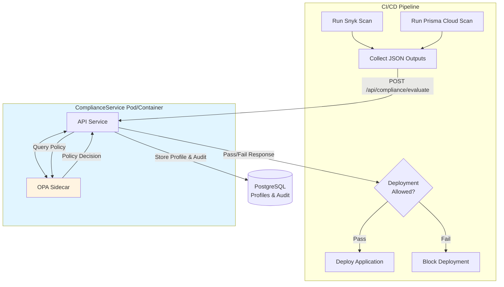
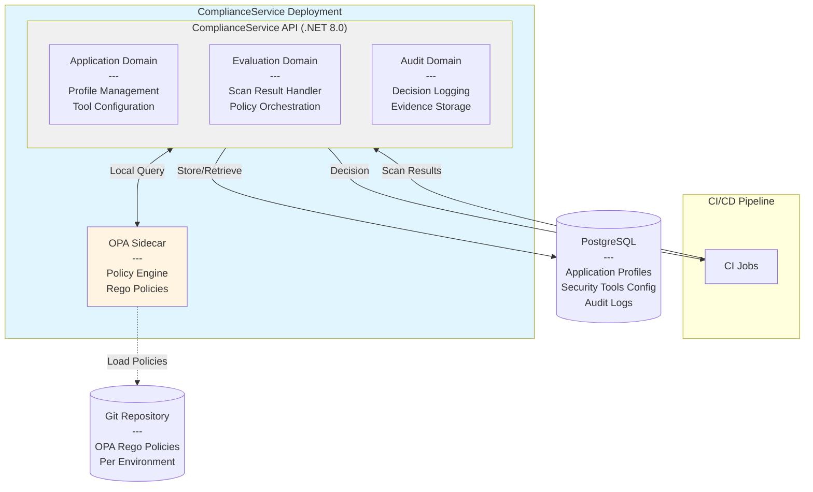
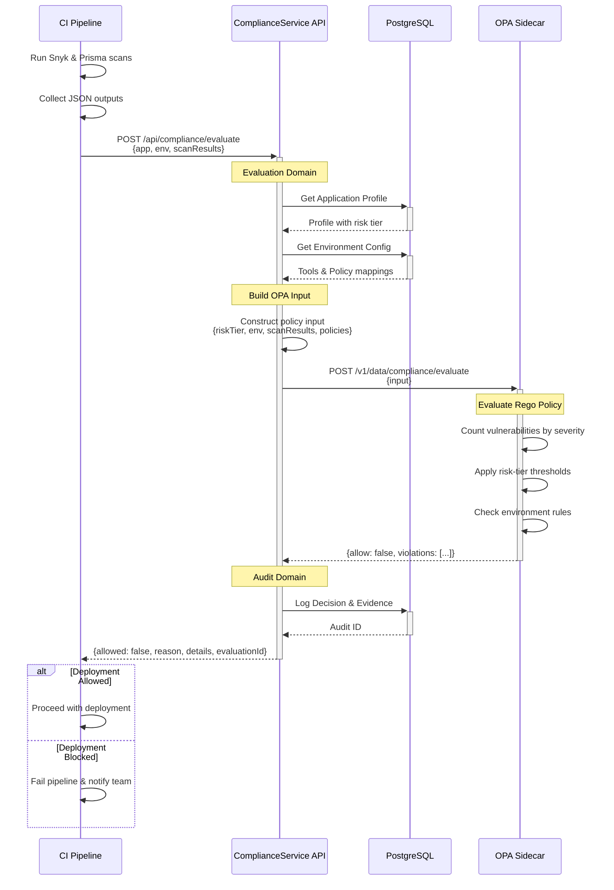

# ComplianceService

A policy gateway for CI/CD pipelines that evaluates security scan results against compliance policies before allowing deployments.

## Overview

ComplianceService acts as an intelligent policy enforcement layer in your CI/CD pipeline, providing centralized compliance evaluation and risk-based decision making. By leveraging Open Policy Agent (OPA) and risk-tier-based application profiles, organizations can maintain consistent security standards across diverse applications without hardcoding policies into individual pipelines.

## Problem Statement

Organizations struggle with:

- ❌ **Hardcoded security thresholds** in CI pipelines
- ❌ **Different risk tolerances** for different applications (payment apps vs internal tools)
- ❌ **Developers managing** compliance policies
- ❌ **Slow policy updates** requiring code changes and deployments
- ❌ **No centralized compliance** decision audit trail

## Solution

- ✅ **Centralized policy evaluation** with OPA Rego policies
- ✅ **Risk-tier-based thresholds** via application profiles
- ✅ **Compliance team autonomy** - update policies without developer involvement
- ✅ **30-second policy deployment** via Git push
- ✅ **Complete audit trail** with decision logs and evidence storage
- ✅ **Scalable** - manage 100+ applications with varying security requirements

## Key Features

### 1. Application Profile Management
Manage applications with configurable profiles for different environments and compliance policies:
- Define application environments (dev, staging, production)
- Configure security tools per environment (Snyk, Prisma Cloud)
- Assign OPA policies per environment
- Risk-tier classification (critical, high, medium, low)
- Application metadata and ownership
- **Note:** Thresholds are defined in OPA policies, not in application profiles

### 2. Security Tool Management
Manage security tool configurations and process their scan results:
- **Snyk** - Dependency vulnerability scanning results
- **Prisma Cloud** - Container and cloud security scan results
- Tool registration per application (metadata only)
- CI pipeline executes security tools and forwards JSON outputs
- ComplianceService processes scan results without direct tool integration
- OPA applies correct compliance evaluations based on application's configured tools

### 3. Direct Pipeline Architecture
Streamlined evaluation flow with no normalization overhead:



**Flow:**
1. CI pipeline runs security scans (Snyk, Prisma Cloud, etc.)
2. CI pipeline collects JSON outputs from security tools
3. CI pipeline sends scan results to ComplianceService API
4. ComplianceService retrieves application profile and policies
5. ComplianceService queries OPA sidecar for policy evaluation
6. OPA evaluates against environment-specific policies
7. ComplianceService logs decision and returns pass/fail
8. CI pipeline proceeds with deployment or blocks based on decision

**Benefits:**
- **No direct security tool integration** - CI pipeline controls tool execution
- **OPA as sidecar** - Low latency, same deployment unit
- **No normalization layer** - Raw scan results processed directly
- **Fast evaluation** - In-process OPA queries (microseconds)
- **Policy decisions immediately available** - No network overhead

### 4. Policy as Code
- OPA Rego policies stored in version control
- Policy changes deployed automatically
- Rollback capability for policy issues
- Compliance team owns policy repository

### 5. Audit & Compliance
- Complete decision history
- Evidence storage for compliance reporting
- Traceability of all security decisions
- Support for regulatory compliance requirements

## Tech Stack

- **.NET 8.0** - Modern, high-performance runtime
- **PostgreSQL** - Reliable relational database for application profiles and audit logs
- **.NET API Services** - RESTful API endpoints for pipeline integration
- **DDD Architecture** - Domain-Driven Design for maintainable, scalable code
- **OPA (Open Policy Agent)** - Policy engine for compliance evaluation

## Architecture

The service follows **Domain-Driven Design (DDD)** principles with OPA deployed as a sidecar:



**Key Components:**

- **ComplianceService API**: .NET 8.0 service with three domains (Application, Evaluation, Audit)
- **OPA Sidecar**: Policy engine running in same pod/container group for low-latency evaluation
- **PostgreSQL**: Stores application profiles, tool configurations, and audit logs
- **Policy Repository**: Git-based Rego policies loaded by OPA

## API Flow - Compliance Evaluation

Detailed sequence diagram showing the evaluation process:



**Key Points:**
- Application profiles determine which policies apply per environment
- Environment configuration specifies tools and policy requirements
- OPA policies contain all threshold logic (not in application profile)
- Complete audit trail for compliance reporting

## Getting Started

### Prerequisites

- .NET 8.0 SDK
- PostgreSQL 14+
- OPA binary (deployed as sidecar)
- Docker or Kubernetes for deployment
- CI pipeline configured with Snyk and/or Prisma Cloud
- Git repository for OPA Rego policies

### Installation

#### Local Development

```bash
# Clone the repository
git clone <repository-url>
cd ComplianceService

# Restore dependencies
dotnet restore

# Update database connection string in appsettings.json
# Configure OPA endpoint (localhost:8181 for local sidecar)

# Run database migrations
dotnet ef database update

# Start OPA sidecar
opa run --server --addr localhost:8181 --bundle /path/to/policies &

# Run the application
dotnet run
```

#### Docker Compose (Recommended for Local Dev)

```yaml
version: '3.8'
services:
  complianceservice:
    build: .
    ports:
      - "5000:5000"
    environment:
      - ConnectionStrings__DefaultConnection=Host=postgres;Database=compliancedb;Username=user;Password=pass
      - OPA__Endpoint=http://opa:8181
    depends_on:
      - postgres
      - opa

  opa:
    image: openpolicyagent/opa:latest
    command:
      - "run"
      - "--server"
      - "--addr=0.0.0.0:8181"
      - "--bundle=/policies"
    volumes:
      - ./policies:/policies
    ports:
      - "8181:8181"

  postgres:
    image: postgres:14
    environment:
      POSTGRES_DB: compliancedb
      POSTGRES_USER: user
      POSTGRES_PASSWORD: pass
    ports:
      - "5432:5432"
```

```bash
docker-compose up
```

### Configuration

Configure the following in `appsettings.json`:

```json
{
  "ConnectionStrings": {
    "DefaultConnection": "Host=localhost;Database=compliancedb;Username=user;Password=pass"
  },
  "OPA": {
    "Endpoint": "http://localhost:8181",
    "PolicyPath": "/v1/data/compliance/evaluate"
  },
  "Logging": {
    "LogLevel": {
      "Default": "Information"
    }
  }
}
```

**Notes:**
- **OPA Sidecar**: OPA runs on localhost as a sidecar container (typically port 8181)
- **No Security Tool Credentials**: CI pipeline executes tools and forwards JSON outputs
- **Policy Repository**: OPA loads Rego policies from Git repository on startup

## API Usage

### Evaluate Compliance

CI pipeline sends scan results for evaluation:

```bash
POST /api/compliance/evaluate
Content-Type: application/json

{
  "applicationId": "my-payment-app",
  "environment": "production",
  "scanResults": [
    {
      "tool": "snyk",
      "scanDate": "2024-01-15T10:30:00Z",
      "vulnerabilities": [
        {
          "id": "SNYK-JS-AXIOS-1234567",
          "severity": "high",
          "packageName": "axios",
          "version": "0.21.0",
          "title": "Server-Side Request Forgery (SSRF)"
        }
      ]
    },
    {
      "tool": "prismacloud",
      "scanDate": "2024-01-15T10:32:00Z",
      "vulnerabilities": [
        {
          "id": "CVE-2024-1234",
          "severity": "critical",
          "component": "nginx",
          "version": "1.19.0"
        }
      ]
    }
  ]
}
```

**Response:**
```json
{
  "allowed": false,
  "reason": "Critical vulnerabilities found in production environment",
  "details": {
    "criticalCount": 1,
    "highCount": 1,
    "policyViolations": [
      "Production deployments must have 0 critical vulnerabilities"
    ]
  },
  "evaluationId": "eval-12345",
  "timestamp": "2024-01-15T10:33:00Z"
}
```

### Register Application

Register an application with its environments, tools, and policy mappings:

```bash
POST /api/applications
Content-Type: application/json

{
  "name": "my-payment-app",
  "riskTier": "critical",
  "owner": "payments-team",
  "environments": [
    {
      "name": "production",
      "securityTools": ["snyk", "prismacloud"],
      "policies": [
        "compliance/critical-production",
        "compliance/zero-critical-vulns"
      ],
      "metadata": {
        "snykProjectId": "abc-123",
        "prismaProjectId": "xyz-789"
      }
    },
    {
      "name": "staging",
      "securityTools": ["snyk", "prismacloud"],
      "policies": [
        "compliance/critical-staging",
        "compliance/limited-high-vulns"
      ],
      "metadata": {
        "snykProjectId": "abc-456",
        "prismaProjectId": "xyz-012"
      }
    },
    {
      "name": "dev",
      "securityTools": ["snyk"],
      "policies": [
        "compliance/dev-relaxed"
      ],
      "metadata": {
        "snykProjectId": "abc-789"
      }
    }
  ]
}
```

**Key Points:**
- **No thresholds** in application profile - thresholds are defined in OPA policies
- **Tools per environment** - Different environments can use different security tools
- **Policies per environment** - Map to OPA policy packages
- **Metadata only** - Tool configuration for reference, not for direct integration
- **CI pipeline responsibility** - Executes tools and sends outputs to ComplianceService

## OPA Policy Examples

### Policy Structure

Policies are organized by environment and purpose. **All thresholds are defined in policies, NOT in application profiles.**

#### Policy 1: `compliance/critical-production.rego`

Zero tolerance for critical applications in production:

```rego
package compliance.critical_production

import future.keywords.if

# Default deny
default allow := false
default decision := {
    "allow": false,
    "violations": [],
    "details": {}
}

# Main evaluation rule
decision := result if {
    # Count vulnerabilities by severity across ALL security tools
    critical_count := count(all_critical_vulnerabilities)
    high_count := count(all_high_vulnerabilities)
    medium_count := count(all_medium_vulnerabilities)

    # THRESHOLDS DEFINED HERE - not in application profile
    max_critical := 0
    max_high := 0
    max_medium := 5

    violations := check_thresholds(critical_count, high_count, medium_count, max_critical, max_high, max_medium)

    result := {
        "allow": count(violations) == 0,
        "violations": violations,
        "details": {
            "criticalCount": critical_count,
            "highCount": high_count,
            "mediumCount": medium_count,
            "thresholds": {
                "critical": max_critical,
                "high": max_high,
                "medium": max_medium
            }
        }
    }
}

# Aggregate vulnerabilities from all security tools
all_critical_vulnerabilities contains vuln if {
    scan := input.scanResults[_]
    vuln := scan.vulnerabilities[_]
    vuln.severity == "critical"
}

all_high_vulnerabilities contains vuln if {
    scan := input.scanResults[_]
    vuln := scan.vulnerabilities[_]
    vuln.severity == "high"
}

all_medium_vulnerabilities contains vuln if {
    scan := input.scanResults[_]
    vuln := scan.vulnerabilities[_]
    vuln.severity == "medium"
}

# Check threshold violations
check_thresholds(critical, high, medium, max_c, max_h, max_m) := violations if {
    violations := array.concat(
        check_critical(critical, max_c),
        array.concat(
            check_high(high, max_h),
            check_medium(medium, max_m)
        )
    )
}

check_critical(count, max) := [msg] if {
    count > max
    msg := sprintf("Critical vulnerabilities (%d) exceed maximum (%d)", [count, max])
} else := []

check_high(count, max) := [msg] if {
    count > max
    msg := sprintf("High vulnerabilities (%d) exceed maximum (%d)", [count, max])
} else := []

check_medium(count, max) := [msg] if {
    count > max
    msg := sprintf("Medium vulnerabilities (%d) exceed maximum (%d)", [count, max])
} else := []
```

#### Policy 2: `compliance/critical-staging.rego`

Relaxed thresholds for staging environments:

```rego
package compliance.critical_staging

import future.keywords.if

default decision := {
    "allow": false,
    "violations": [],
    "details": {}
}

decision := result if {
    critical_count := count(all_critical_vulnerabilities)
    high_count := count(all_high_vulnerabilities)

    # Different thresholds for staging
    max_critical := 2
    max_high := 5

    violations := []
    violations := array.concat(violations, check_critical(critical_count, max_critical))
    violations := array.concat(violations, check_high(high_count, max_high))

    result := {
        "allow": count(violations) == 0,
        "violations": violations,
        "details": {
            "criticalCount": critical_count,
            "highCount": high_count,
            "environment": "staging"
        }
    }
}

# ... (vulnerability aggregation rules same as above)
```

### Input Structure

ComplianceService sends this structure to OPA:

```json
{
  "applicationId": "my-payment-app",
  "riskTier": "critical",
  "environment": "production",
  "policies": ["compliance/critical-production", "compliance/zero-critical-vulns"],
  "scanResults": [
    {
      "tool": "snyk",
      "scanDate": "2024-01-15T10:30:00Z",
      "vulnerabilities": [
        {
          "id": "SNYK-JS-AXIOS-1234567",
          "severity": "high",
          "packageName": "axios",
          "version": "0.21.0"
        }
      ]
    },
    {
      "tool": "prismacloud",
      "scanDate": "2024-01-15T10:32:00Z",
      "vulnerabilities": [
        {
          "id": "CVE-2024-1234",
          "severity": "critical",
          "component": "nginx",
          "version": "1.19.0"
        }
      ]
    }
  ]
}
```

**Key Principles:**
- **Thresholds in policies** - Application profiles only reference policy names
- **Environment-specific policies** - Different thresholds for dev/staging/production
- **Multi-tool aggregation** - Policies count vulnerabilities across all security tools
- **Risk-tier aware** - Policies can check risk tier for additional logic

## Development

### Project Structure

```
ComplianceService/
├── src/
│   ├── Domain/                          # Domain models and logic
│   │   ├── ApplicationProfile/          # Application aggregate
│   │   ├── Evaluation/                  # Evaluation aggregate
│   │   └── Audit/                       # Audit aggregate
│   ├── Application/                     # Use cases and orchestration
│   ├── Infrastructure/                  # Data access, external services
│   │   ├── Persistence/                 # PostgreSQL repositories
│   │   └── OPA/                         # OPA client integration
│   └── API/                             # Controllers and API configuration
├── tests/
│   ├── UnitTests/
│   ├── IntegrationTests/
│   └── ArchitectureTests/
├── k8s/                                 # Kubernetes manifests
│   ├── deployment.yaml                  # ComplianceService + OPA sidecar
│   ├── service.yaml
│   └── configmap.yaml
└── docker-compose.yml                   # Local development setup

Separate Policy Repository:
compliance-policies/
├── compliance/
│   ├── critical-production.rego         # Zero tolerance policy
│   ├── critical-staging.rego            # Limited tolerance policy
│   ├── dev-relaxed.rego                 # Development policy
│   └── common/
│       ├── vulnerability-helpers.rego   # Reusable functions
│       └── severity-aggregation.rego    # Counting utilities
└── tests/
    └── compliance_test.rego             # Policy unit tests
```

### Running Tests

```bash
dotnet test
```

### Database Migrations

```bash
# Add a new migration
dotnet ef migrations add MigrationName

# Apply migrations
dotnet ef database update
```

## Contributing

1. Fork the repository
2. Create a feature branch (`git checkout -b feature/amazing-feature`)
3. Commit your changes (`git commit -m 'Add amazing feature'`)
4. Push to the branch (`git push origin feature/amazing-feature`)
5. Open a Pull Request

## Deployment

### Kubernetes Deployment (Recommended)

Deploy ComplianceService with OPA as a sidecar:

```yaml
apiVersion: apps/v1
kind: Deployment
metadata:
  name: complianceservice
spec:
  replicas: 3
  selector:
    matchLabels:
      app: complianceservice
  template:
    metadata:
      labels:
        app: complianceservice
    spec:
      containers:
      # Main application container
      - name: api
        image: complianceservice:latest
        ports:
        - containerPort: 5000
        env:
        - name: ConnectionStrings__DefaultConnection
          valueFrom:
            secretKeyRef:
              name: complianceservice-secrets
              key: db-connection
        - name: OPA__Endpoint
          value: "http://localhost:8181"
        - name: OPA__PolicyPath
          value: "/v1/data/compliance/evaluate"
        resources:
          requests:
            memory: "256Mi"
            cpu: "250m"
          limits:
            memory: "512Mi"
            cpu: "500m"

      # OPA sidecar container
      - name: opa
        image: openpolicyagent/opa:latest
        ports:
        - containerPort: 8181
        args:
        - "run"
        - "--server"
        - "--addr=0.0.0.0:8181"
        - "--set=bundles.complianceservice.service=bundle-server"
        - "--set=bundles.complianceservice.resource=/bundles/compliance.tar.gz"
        volumeMounts:
        - name: policy-bundle
          mountPath: /policies
        resources:
          requests:
            memory: "128Mi"
            cpu: "100m"
          limits:
            memory: "256Mi"
            cpu: "200m"

      volumes:
      - name: policy-bundle
        configMap:
          name: opa-policies
```

### Policy Updates

Policies can be updated without redeploying the service:

**Option 1: Git-based Policy Bundle (Recommended)**
1. Update Rego policies in Git repository
2. OPA polls Git for policy changes
3. Policies reload automatically within 30 seconds
4. No pod restart required

**Option 2: ConfigMap Update**
```bash
# Update policies ConfigMap
kubectl create configmap opa-policies --from-file=./policies --dry-run=client -o yaml | kubectl apply -f -

# Restart OPA sidecar to load new policies
kubectl rollout restart deployment complianceservice
```

### Service Deployment

```bash
# Build for production
dotnet publish -c Release

# Build Docker image
docker build -t complianceservice:latest .

# Push to registry
docker push your-registry/complianceservice:latest

# Deploy to Kubernetes
kubectl apply -f k8s/deployment.yaml
kubectl apply -f k8s/service.yaml
```

### Health Checks

```yaml
# Add to deployment spec
livenessProbe:
  httpGet:
    path: /health
    port: 5000
  initialDelaySeconds: 30
  periodSeconds: 10

readinessProbe:
  httpGet:
    path: /ready
    port: 5000
  initialDelaySeconds: 10
  periodSeconds: 5
```

## Support

For issues and questions:
- Create an issue in the repository
- Contact the compliance team
- Review documentation in `/docs`

## License

[Specify your license here]

---

**Built with ❤️ for better security compliance**
