# ComplianceService Technical Proposal

> **Document Type:** Technical Proposal and Architecture Design
> **Service Name:** ComplianceService
> **Status:** Proposed
> **Date:** February 2026
> **Target Delivery:** March 31, 2026
> **Audience:** Engineering Leadership, Security Team, DevOps, Architecture Review Board

---

## Table of Contents

1. [Introduction](#1-introduction)
2. [Problem Statement and Business Case](#2-problem-statement-and-business-case)
3. [Proposed Solution](#3-proposed-solution)
4. [High Level System Architecture](#4-high-level-system-architecture)
5. [Service Flow and Process Design](#5-service-flow-and-process-design)
6. [CI/CD Pipeline Integration Model](#6-cicd-pipeline-integration-model)
7. [Open Policy Agent (OPA) as the Decision Engine](#7-open-policy-agent-opa-as-the-decision-engine)
8. [Policy Management at Scale](#8-policy-management-at-scale)
9. [Infrastructure and Deployment Architecture](#9-infrastructure-and-deployment-architecture)
10. [Scalability and Growth Strategy](#10-scalability-and-growth-strategy)
11. [Security and Governance](#11-security-and-governance)
12. [Technology Stack Summary](#12-technology-stack-summary)

---

## 1. Introduction

### 1.1 Purpose

This document proposes **ComplianceService**, a centralized policy gateway designed to automate security compliance decisions within CI/CD pipelines. The service operates as an intermediary between security scanning tools such as Snyk, Prisma Cloud, and other security tools and the deployment targets they protect. It provides a deterministic **allow or deny decision** for every deployment based on organizational compliance policies expressed as code.

### 1.2 Scope

ComplianceService encompasses the following functional domains:

| Area | Description |
|------|-------------|
| **Compliance Evaluation** | Ingests structured security scan output from pipeline runners and evaluates that data against Rego policy bundles using the Open Policy Agent runtime in real time |
| **Application Management** | Provides a registration and configuration surface for applications, supporting per environment risk tier assignment and policy binding |
| **Audit Trail** | Persists every compliance decision alongside the full evidence chain including raw scan input, policy engine payload, and engine response for regulatory and internal review |
| **Alerting** | Dispatches notifications to application owners and security stakeholders when a deployment is blocked or when critical severity vulnerabilities are detected |
| **Reporting** | Exposes aggregate compliance statistics across the entire application portfolio for dashboards and executive reporting |

### 1.3 Key Stakeholders

| Stakeholder | Interest |
|-------------|----------|
| **DevOps and Platform Engineering** | Pipeline integration, automated deployment gating |
| **Application Security** | Policy authoring, vulnerability lifecycle tracking |
| **Compliance and GRC** | Audit trail integrity, regulatory evidence generation |
| **Engineering Teams** | Self service application registration, evaluation result visibility |
| **Engineering Leadership** | Portfolio wide security posture and trend reporting |

---

## 2. Problem Statement and Business Case

### 2.1 Current Challenges

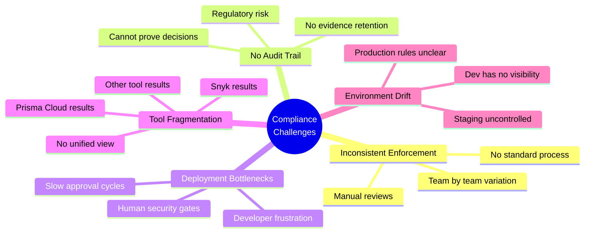
```mermaid
mindmap
  root((Compliance<br/>Challenges))
    Inconsistent Enforcement
      Manual reviews
      Team by team variation
      No standard process
    No Audit Trail
      Cannot prove decisions
      Regulatory risk
      No evidence retention
    Deployment Bottlenecks
      Human security gates
      Slow approval cycles
      Developer frustration
    Tool Fragmentation
      Snyk results
      Prisma Cloud results
      Other tool results
      No unified view
    Environment Drift
      Production rules unclear
      Staging uncontrolled
      Dev has no visibility
```

### 2.2 Business Impact

| Impact Area | Without ComplianceService | With ComplianceService |
|-------------|--------------------------|----------------------|
| **Deployment speed** | Hours or days waiting for manual approval | Seconds with automated allow or deny |
| **Policy consistency** | Varies by team, individual, and day | Identical rules applied to every deployment uniformly |
| **Audit readiness** | Manual evidence gathering across multiple tools | Instant access to every decision with full evidence |
| **Vulnerability visibility** | Fragmented across individual scanner dashboards | Single consolidated portfolio wide view |
| **Regulatory compliance** | Difficult to demonstrate controls to auditors | Immutable timestamped decision records always available |
| **Risk management** | Reactive discovery after deployment | Preventive enforcement before deployment reaches infrastructure |

### 2.3 Value Proposition

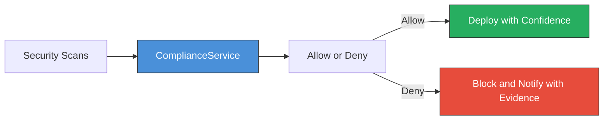
```mermaid
graph LR
    A[Security Scans] --> B[ComplianceService]
    B --> C[Allow or Deny]
    C -->|Allow| D[Deploy with Confidence]
    C -->|Deny| E[Block and Notify with Evidence]

    style B fill:#4A90D9,stroke:#333,color:#fff
    style D fill:#27AE60,stroke:#333,color:#fff
    style E fill:#E74C3C,stroke:#333,color:#fff
```

**One API call. Consistent policy enforcement. Full audit trail. Zero manual intervention.**

---

## 3. Proposed Solution

### 3.1 Solution Summary

ComplianceService is a RESTful API that provides automated compliance gating for CI/CD pipelines. When a pipeline reaches the security phase it sends scan results from one or more tools to the service over HTTPS. The service resolves the appropriate policy for the given application and environment, delegates the evaluation to Open Policy Agent running as a local sidecar, persists the outcome as an immutable audit record, and returns a structured response that the pipeline uses to proceed or halt.

The core workflow consists of five stages:

1. **Receive** security scan results from the calling pipeline
2. **Evaluate** those results against environment specific Rego policies via OPA
3. **Decide** whether the deployment is allowed or denied based on policy output
4. **Record** the complete decision with full evidence into an immutable audit log
5. **Notify** stakeholders asynchronously when deployments are blocked or critical vulnerabilities are found

### 3.2 Core Capabilities

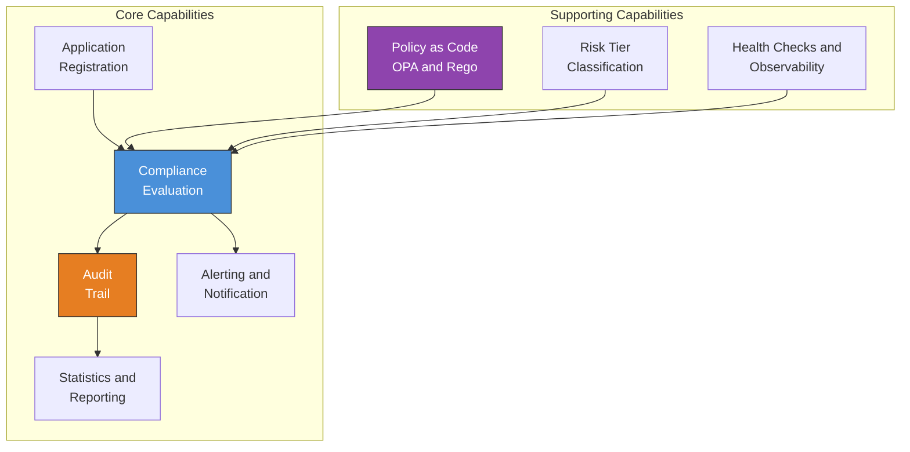
```mermaid
graph TB
    subgraph "Core Capabilities"
        direction TB
        R[Application<br/>Registration] --> E[Compliance<br/>Evaluation]
        E --> A[Audit<br/>Trail]
        E --> N[Alerting and<br/>Notification]
        A --> S[Statistics and<br/>Reporting]
    end

    subgraph "Supporting Capabilities"
        direction TB
        P[Policy as Code<br/>OPA and Rego]
        T[Risk Tier<br/>Classification]
        H[Health Checks and<br/>Observability]
    end

    P --> E
    T --> E
    H --> E

    style E fill:#4A90D9,stroke:#333,color:#fff
    style P fill:#8E44AD,stroke:#333,color:#fff
    style A fill:#E67E22,stroke:#333,color:#fff
```

### 3.3 How It Fits Into the Ecosystem

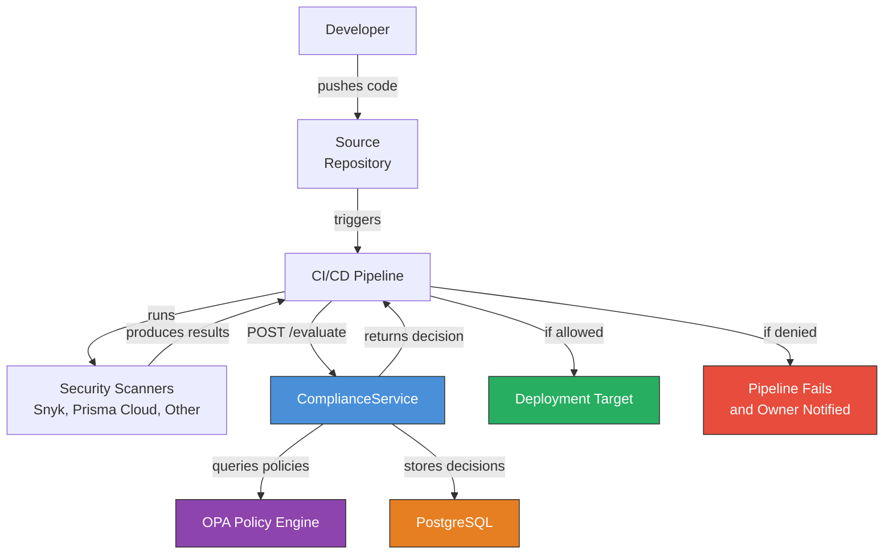
```mermaid
graph TB
    DEV[Developer] -->|pushes code| REPO[Source<br/>Repository]
    REPO -->|triggers| CI[CI/CD Pipeline]
    CI -->|runs| SCAN[Security Scanners<br/>Snyk, Prisma Cloud, Other]
    SCAN -->|produces results| CI
    CI -->|POST /evaluate| CS[ComplianceService]
    CS -->|queries policies| OPA[OPA Policy Engine]
    CS -->|stores decisions| DB[PostgreSQL]
    CS -->|returns decision| CI
    CI -->|if allowed| DEPLOY[Deployment Target]
    CI -->|if denied| FAIL[Pipeline Fails<br/>and Owner Notified]

    style CS fill:#4A90D9,stroke:#333,color:#fff
    style OPA fill:#8E44AD,stroke:#333,color:#fff
    style DB fill:#E67E22,stroke:#333,color:#fff
    style DEPLOY fill:#27AE60,stroke:#333,color:#fff
    style FAIL fill:#E74C3C,stroke:#333,color:#fff
```

---

## 4. High Level System Architecture

### 4.1 System Component Diagram

The service boundary contains three primary components: the API application, an OPA sidecar responsible for policy evaluation, and a PostgreSQL database that stores application profiles, evaluation outcomes, and audit records. External callers are CI/CD pipeline runners that communicate with the service over HTTPS through a load balancer or ingress controller.

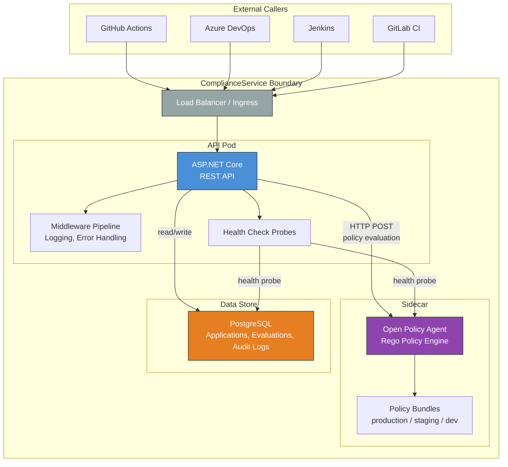
```mermaid
graph TB
    subgraph "External Callers"
        GH[GitHub Actions]
        AZ[Azure DevOps]
        JK[Jenkins]
        GL[GitLab CI]
    end

    subgraph "ComplianceService Boundary"
        direction TB
        LB[Load Balancer / Ingress]

        subgraph "API Pod"
            API[ASP.NET Core<br/>REST API]
            MW[Middleware Pipeline<br/>Logging, Error Handling]
            HC[Health Check Probes]
        end

        subgraph "Sidecar"
            OPA[Open Policy Agent<br/>Rego Policy Engine]
            POL[Policy Bundles<br/>production / staging / dev]
        end

        subgraph "Data Store"
            PG[PostgreSQL<br/>Applications, Evaluations, Audit Logs]
        end
    end

    GH --> LB
    AZ --> LB
    JK --> LB
    GL --> LB
    LB --> API
    API --> MW
    API --> HC
    API -->|HTTP POST<br/>policy evaluation| OPA
    OPA --> POL
    API -->|read/write| PG
    HC -->|health probe| PG
    HC -->|health probe| OPA

    style API fill:#4A90D9,stroke:#333,color:#fff
    style OPA fill:#8E44AD,stroke:#333,color:#fff
    style PG fill:#E67E22,stroke:#333,color:#fff
    style LB fill:#95A5A6,stroke:#333,color:#fff
```

### 4.2 Internal Layer Architecture (Clean Architecture)

The service is structured using Clean Architecture with four layers. Each layer has a strict inward dependency rule meaning it can only reference the layer directly beneath it. The Domain layer sits at the center with zero external dependencies, ensuring business logic remains isolated from infrastructure concerns.

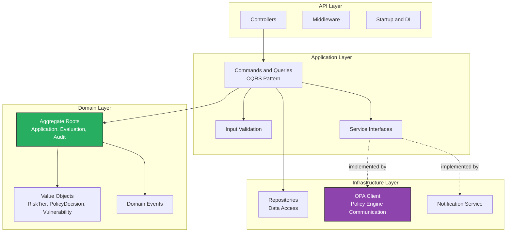
```mermaid
graph TB
    subgraph "API Layer"
        CTRL[Controllers]
        MID[Middleware]
        BOOT[Startup and DI]
    end

    subgraph "Application Layer"
        CMD[Commands and Queries<br/>CQRS Pattern]
        VAL[Input Validation]
        INTF[Service Interfaces]
    end

    subgraph "Domain Layer"
        AGG[Aggregate Roots<br/>Application, Evaluation, Audit]
        VO[Value Objects<br/>RiskTier, PolicyDecision, Vulnerability]
        EVT[Domain Events]
    end

    subgraph "Infrastructure Layer"
        REPO[Repositories<br/>Data Access]
        OPAC[OPA Client<br/>Policy Engine Communication]
        NOTIF[Notification Service]
    end

    CTRL --> CMD
    CMD --> VAL
    CMD --> INTF
    CMD --> AGG
    AGG --> VO
    AGG --> EVT
    INTF -.->|implemented by| OPAC
    INTF -.->|implemented by| NOTIF
    CMD --> REPO

    style AGG fill:#27AE60,stroke:#333,color:#fff
    style OPAC fill:#8E44AD,stroke:#333,color:#fff
```

| Layer | Responsibility |
|-------|---------------|
| **API** | Accepts HTTP requests, applies middleware for structured logging and global error handling, configures dependency injection and health probes |
| **Application** | Orchestrates use cases through CQRS commands and queries, validates inbound request contracts, defines service interfaces consumed by infrastructure |
| **Domain** | Encapsulates all business rules within aggregate roots, value objects, and domain events with no dependency on any external framework or library |
| **Infrastructure** | Provides concrete implementations for database persistence via Entity Framework Core, HTTP communication with the OPA sidecar, and notification dispatch |

---

## 5. Service Flow and Process Design

### 5.1 Primary Flow: Compliance Evaluation

This is the core workflow that executes every time a CI/CD pipeline submits scan results for evaluation. The entire flow is synchronous from the caller's perspective and typically completes within hundreds of milliseconds.

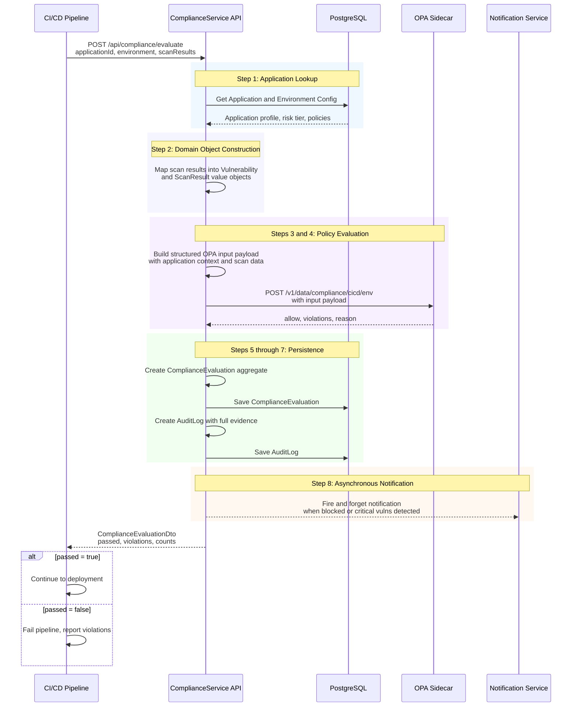
```mermaid
sequenceDiagram
    participant P as CI/CD Pipeline
    participant API as ComplianceService API
    participant DB as PostgreSQL
    participant OPA as OPA Sidecar
    participant N as Notification Service

    P->>API: POST /api/compliance/evaluate<br/>applicationId, environment, scanResults

    rect rgb(240, 248, 255)
        Note over API,DB: Step 1: Application Lookup
        API->>DB: Get Application and Environment Config
        DB-->>API: Application profile, risk tier, policies
    end

    rect rgb(245, 245, 255)
        Note over API: Step 2: Domain Object Construction
        API->>API: Map scan results into Vulnerability<br/>and ScanResult value objects
    end

    rect rgb(248, 240, 255)
        Note over API,OPA: Steps 3 and 4: Policy Evaluation
        API->>API: Build structured OPA input payload<br/>with application context and scan data
        API->>OPA: POST /v1/data/compliance/cicd/env<br/>with input payload
        OPA-->>API: allow, violations, reason
    end

    rect rgb(240, 255, 240)
        Note over API,DB: Steps 5 through 7: Persistence
        API->>API: Create ComplianceEvaluation aggregate
        API->>DB: Save ComplianceEvaluation
        API->>API: Create AuditLog with full evidence
        API->>DB: Save AuditLog
    end

    rect rgb(255, 248, 240)
        Note over API,N: Step 8: Asynchronous Notification
        API-->>N: Fire and forget notification<br/>when blocked or critical vulns detected
    end

    API-->>P: ComplianceEvaluationDto<br/>passed, violations, counts

    alt passed = true
        P->>P: Continue to deployment
    else passed = false
        P->>P: Fail pipeline, report violations
    end
```

### 5.2 Evaluation Process Detail

| Step | Action | Description |
|------|--------|-------------|
| **1** | **Application Lookup** | Queries PostgreSQL for the registered application profile. Validates that the application is in an active state and retrieves the environment configuration which includes the assigned risk tier, bound policy references, and required security tooling. |
| **2** | **Domain Object Construction** | Deserializes each scan result into strongly typed ScanResult and Vulnerability value objects within the domain layer. Performs structural validation on CVE identifiers, severity classification levels, CVSS scores within the 0 to 10 range, and package metadata fields. |
| **3** | **OPA Input Assembly** | Constructs a normalized JSON payload that conforms to the OPA input contract. This payload contains the full application context including name, environment, risk tier, and owner alongside the structured scan data from all submitted tools. |
| **4** | **OPA Sidecar Evaluation** | Issues an HTTP POST to the OPA Data API at the resolved policy package path. OPA evaluates the applicable Rego rules and returns a response containing the allow boolean, a violations array with individual rule messages, and a human readable reason string. |
| **5** | **PolicyDecision Creation** | Maps the OPA response into a PolicyDecision domain value object. Enforces the domain invariant that a deny decision must always carry at least one violation entry to ensure every denial is explainable. |
| **6** | **Evaluation Persistence** | Constructs the ComplianceEvaluation aggregate root containing the full scan results and policy decision then persists it through the repository layer. |
| **7** | **Audit Log Creation** | Builds an immutable AuditLog record that captures three layers of evidence: the raw scan results JSON exactly as received, the exact OPA input payload that was sent, and the exact OPA output response that was returned. Also records aggregated vulnerability counts and the final decision. |
| **8** | **Notification Dispatch** | If the deployment was denied or critical severity vulnerabilities were detected the service dispatches a notification to the application owner. This is a fire and forget asynchronous operation that does not block the response to the caller. |
| **9** | **Response Return** | Returns the evaluation result to the pipeline containing the pass or fail decision, detailed violation messages, and aggregated vulnerability counts by severity level. |

### 5.3 Application Registration Flow

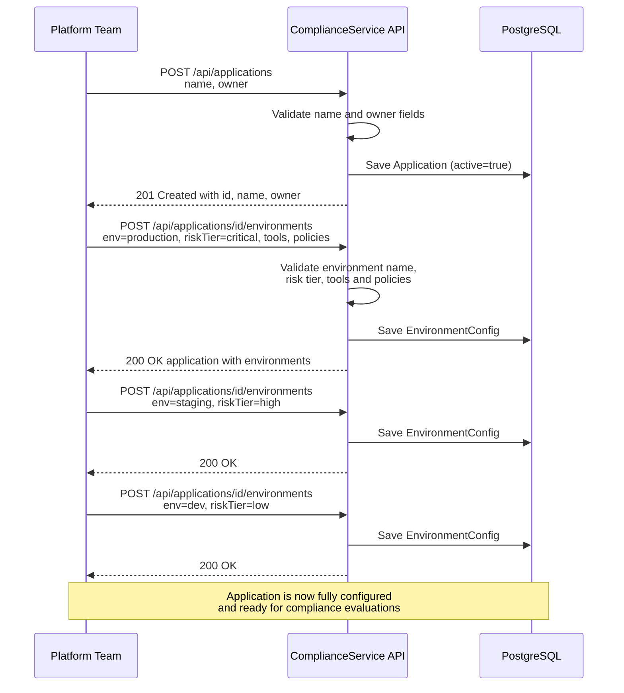
```mermaid
sequenceDiagram
    participant U as Platform Team
    participant API as ComplianceService API
    participant DB as PostgreSQL

    U->>API: POST /api/applications<br/>name, owner
    API->>API: Validate name and owner fields
    API->>DB: Save Application (active=true)
    API-->>U: 201 Created with id, name, owner

    U->>API: POST /api/applications/id/environments<br/>env=production, riskTier=critical, tools, policies
    API->>API: Validate environment name,<br/>risk tier, tools and policies
    API->>DB: Save EnvironmentConfig
    API-->>U: 200 OK application with environments

    U->>API: POST /api/applications/id/environments<br/>env=staging, riskTier=high
    API->>DB: Save EnvironmentConfig
    API-->>U: 200 OK

    U->>API: POST /api/applications/id/environments<br/>env=dev, riskTier=low
    API->>DB: Save EnvironmentConfig
    API-->>U: 200 OK

    Note over U,DB: Application is now fully configured<br/>and ready for compliance evaluations
```

### 5.4 Audit Query and Reporting Flow

The audit and reporting capabilities are consumed by three primary personas. Compliance officers use aggregate statistics and blocked deployment lists to prepare for audits. Security teams drill into critical vulnerability data and risk tier views to track remediation progress. Dashboards and BI tools pull from all three endpoints to render portfolio level visualizations.

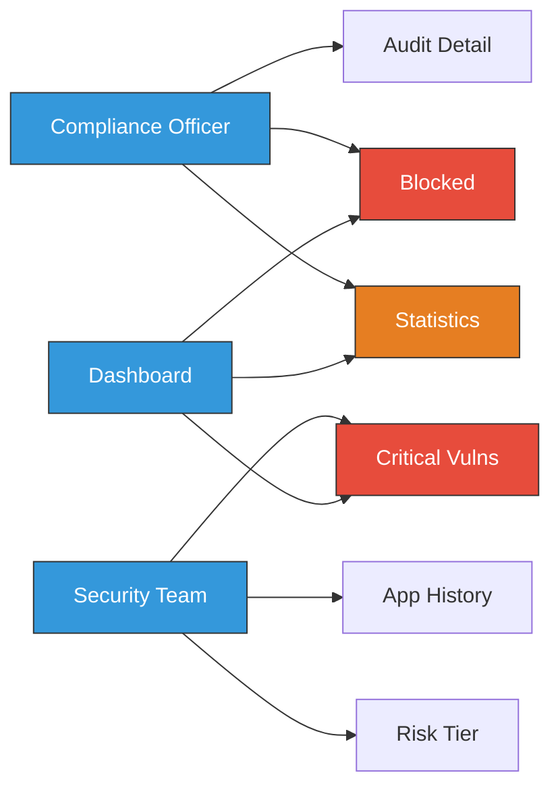
```mermaid
graph LR
    CO[Compliance Officer] --> S[Statistics]
    CO --> B[Blocked]
    CO --> DET[Audit Detail]
    SEC[Security Team] --> CV[Critical Vulns]
    SEC --> RT[Risk Tier]
    SEC --> APP[App History]
    DASH[Dashboard] --> S
    DASH --> B
    DASH --> CV

    style S fill:#E67E22,stroke:#333,color:#fff
    style B fill:#E74C3C,stroke:#333,color:#fff
    style CV fill:#E74C3C,stroke:#333,color:#fff
    style CO fill:#3498DB,stroke:#333,color:#fff
    style SEC fill:#3498DB,stroke:#333,color:#fff
    style DASH fill:#3498DB,stroke:#333,color:#fff
```

---

## 6. CI/CD Pipeline Integration Model

### 6.1 Pipeline Gate Architecture

ComplianceService operates as a **quality gate** within the CI/CD pipeline. It is positioned after the security scanning phase and before the deployment phase. All scan results from the security tools are aggregated and submitted to ComplianceService in a single POST request. The service evaluates the combined results against the applicable policy and returns a deterministic allow or deny decision that the pipeline uses to proceed or halt execution.

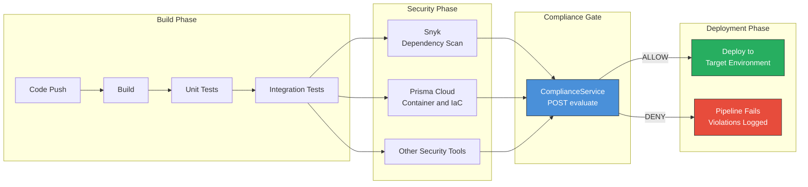
```mermaid
graph LR
    subgraph "Build Phase"
        A[Code Push] --> B[Build]
        B --> C[Unit Tests]
        C --> D[Integration Tests]
    end

    subgraph "Security Phase"
        D --> E[Snyk<br/>Dependency Scan]
        D --> F[Prisma Cloud<br/>Container and IaC]
        D --> G[Other Security Tools]
    end

    subgraph "Compliance Gate"
        E --> H[ComplianceService<br/>POST evaluate]
        F --> H
        G --> H
    end

    subgraph "Deployment Phase"
        H -->|ALLOW| I[Deploy to<br/>Target Environment]
        H -->|DENY| J[Pipeline Fails<br/>Violations Logged]
    end

    style H fill:#4A90D9,stroke:#333,color:#fff
    style I fill:#27AE60,stroke:#333,color:#fff
    style J fill:#E74C3C,stroke:#333,color:#fff
```

### 6.2 Integration Contract

The integration contract is designed to be tool agnostic. Any security scanner can submit results as long as they conform to the scan result schema. This allows organizations to add or replace scanning tools without modifying the ComplianceService API.

**Request (from CI/CD pipeline):**

```json
{
  "applicationId": "a1b2c3d4-e5f6-7890-abcd-ef1234567890",
  "environment": "production",
  "initiatedBy": "github-actions@org.com",
  "scanResults": [
    {
      "toolName": "snyk",
      "scannedAt": "2026-02-11T10:30:00Z",
      "vulnerabilities": [
        {
          "cveId": "CVE-2026-1234",
          "severity": "critical",
          "cvssScore": 9.8,
          "packageName": "lodash",
          "currentVersion": "4.17.20",
          "fixedVersion": "4.17.21"
        }
      ],
      "rawOutput": "{...}"
    }
  ],
  "metadata": {
    "pipelineId": "run-12345",
    "commitSha": "abc123"
  }
}
```

**Response (to CI/CD pipeline):**

```json
{
  "id": "eval-uuid",
  "applicationId": "a1b2c3d4-...",
  "applicationName": "payment-service",
  "environment": "production",
  "passed": false,
  "policyDecision": {
    "allow": false,
    "violations": [
      {
        "rule": "no_critical_vulnerabilities",
        "message": "Production deployments must have zero critical vulnerabilities. Found: 1",
        "severity": "critical"
      }
    ],
    "policyPackage": "compliance.cicd.production",
    "reason": "Production compliance violations detected"
  },
  "aggregatedCounts": {
    "critical": 1,
    "high": 0,
    "medium": 3,
    "low": 7,
    "total": 11
  }
}
```

### 6.3 Pipeline Decision Matrix

This matrix defines the enforcement behavior for each environment. Production enforces zero tolerance on critical and high severity findings. Staging allows limited high severity findings while still blocking critical issues. Development operates in a permissive advisory mode that tracks vulnerabilities without blocking deployments.

| Condition | Production | Staging | Development |
|-----------|-----------|---------|-------------|
| Critical vulnerabilities greater than 0 | **DENY** | **DENY** | Allow (up to 5) |
| High vulnerabilities greater than 0 | **DENY** | Allow (up to 3) | Allow |
| Missing required scan tools | **DENY** | **DENY** | Warn only |
| High severity license violations | **DENY** | Allow | Allow |
| No scans submitted | **DENY** | **DENY** | Warn only |
| All checks pass | **ALLOW** | **ALLOW** | **ALLOW** |

---

## 7. Open Policy Agent (OPA) as the Decision Engine

### 7.1 What OPA Does

Open Policy Agent is a general purpose policy engine that decouples policy decisions from application code. Rather than embedding compliance logic directly into the service, ComplianceService delegates all decision making to OPA. The service constructs a structured JSON payload representing the current evaluation context and submits it to OPA over a local HTTP interface. OPA evaluates the input against Rego policy files and returns a deterministic decision that the service then records and returns to the caller.

This separation means policy rules can be authored, reviewed, tested, and deployed independently of the service codebase.

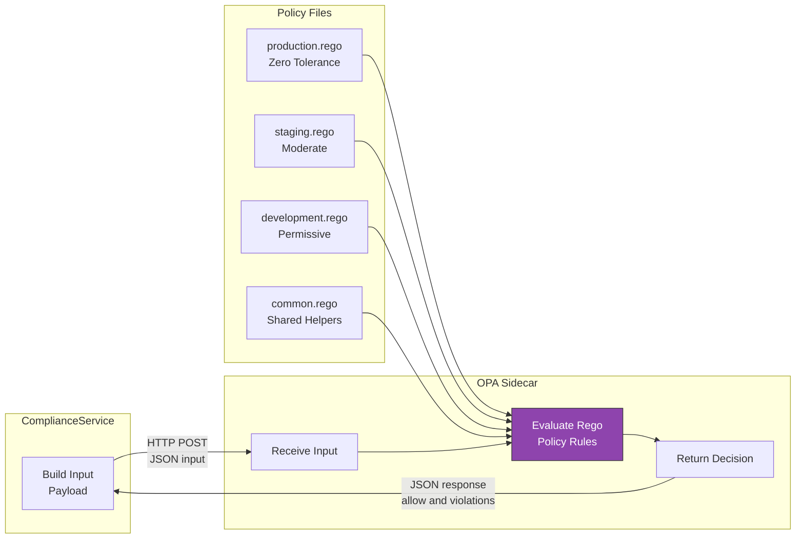
```mermaid
graph LR
    subgraph "ComplianceService"
        A[Build Input<br/>Payload]
    end

    subgraph "OPA Sidecar"
        B[Receive Input]
        C[Evaluate Rego<br/>Policy Rules]
        D[Return Decision]
    end

    subgraph "Policy Files"
        P1[production.rego<br/>Zero Tolerance]
        P2[staging.rego<br/>Moderate]
        P3[development.rego<br/>Permissive]
        P4[common.rego<br/>Shared Helpers]
    end

    A -->|HTTP POST<br/>JSON input| B
    B --> C
    P1 --> C
    P2 --> C
    P3 --> C
    P4 --> C
    C --> D
    D -->|JSON response<br/>allow and violations| A

    style C fill:#8E44AD,stroke:#333,color:#fff
```

### 7.2 OPA Communication Pattern

The API communicates with OPA over localhost on port 8181. Because OPA runs as a sidecar within the same pod there is no network hop and latency is minimal, typically under 10 milliseconds for policy evaluation.

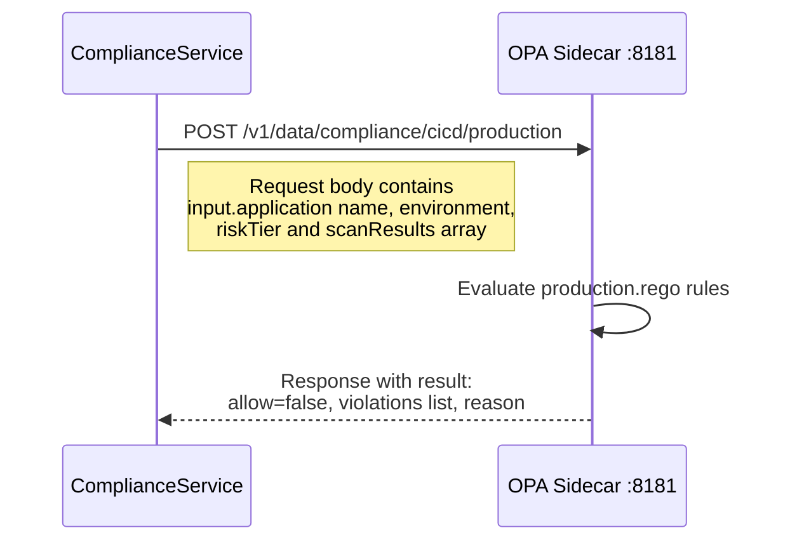
```mermaid
sequenceDiagram
    participant API as ComplianceService
    participant OPA as OPA Sidecar :8181

    API->>OPA: POST /v1/data/compliance/cicd/production
    Note right of API: Request body contains<br/>input.application name, environment,<br/>riskTier and scanResults array

    OPA->>OPA: Evaluate production.rego rules

    OPA-->>API: Response with result:<br/>allow=false, violations list, reason
```

### 7.3 Policy Strictness Hierarchy

Each environment has a dedicated Rego policy file with escalating strictness. Development is permissive and advisory. Staging enforces critical severity blocking while allowing limited high severity findings. Production enforces zero tolerance across all critical and high severity categories and requires all configured scanning tools to have executed.

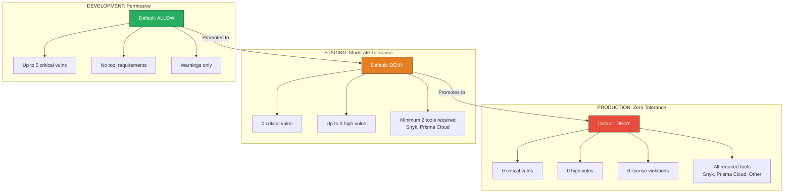
```mermaid
graph TB
    subgraph "PRODUCTION: Zero Tolerance"
        P1[Default: DENY]
        P1A[0 critical vulns]
        P1B[0 high vulns]
        P1C[0 license violations]
        P1D[All required tools<br/>Snyk, Prisma Cloud, Other]
        P1 --> P1A
        P1 --> P1B
        P1 --> P1C
        P1 --> P1D
    end

    subgraph "STAGING: Moderate Tolerance"
        P2[Default: DENY]
        P2A[0 critical vulns]
        P2B[Up to 3 high vulns]
        P2C[Minimum 2 tools required<br/>Snyk, Prisma Cloud]
        P2 --> P2A
        P2 --> P2B
        P2 --> P2C
    end

    subgraph "DEVELOPMENT: Permissive"
        P3[Default: ALLOW]
        P3A[Up to 5 critical vulns]
        P3B[No tool requirements]
        P3C[Warnings only]
        P3 --> P3A
        P3 --> P3B
        P3 --> P3C
    end

    P3 -->|Promotes to| P2
    P2 -->|Promotes to| P1

    style P1 fill:#E74C3C,stroke:#333,color:#fff
    style P2 fill:#E67E22,stroke:#333,color:#fff
    style P3 fill:#27AE60,stroke:#333,color:#fff
```

### 7.4 Policy as Code Benefits

Expressing compliance rules as Rego code rather than application logic provides several operational advantages:

| Benefit | Description |
|---------|-------------|
| **Version controlled** | Rego files are stored in Git alongside the service so every change is tracked with full commit history |
| **Reviewable** | Policy changes follow the same pull request and peer review workflow as application code |
| **Testable** | OPA includes a built in test framework that validates Rego rules against known inputs and expected outputs |
| **Decoupled** | Policies can be updated and deployed independently without rebuilding or redeploying the API service |
| **Auditable** | Git history provides a complete record of who changed what policy, when it was changed, and why |
| **Declarative** | Rules express what should be enforced rather than how the enforcement logic should execute |

---

## 8. Policy Management at Scale

### 8.1 The Scaling Challenge

A flat policy directory with three environment specific Rego files works well for a small number of applications. However as the organization onboards more applications this approach introduces operational overhead that becomes increasingly difficult to manage.

| Challenge | Impact at Scale |
|-----------|----------------|
| Manual policy assignment per application and environment | Unsustainable when every new application requires manual setup |
| No automatic policy selection by risk tier | Misconfiguration risk grows across hundreds of environment configurations |
| Flat policy namespace | No organizational structure by business domain or team |
| Volume mount policy loading | Requires OPA container restart for any policy change |
| Single policy per evaluation | Cannot layer organization wide rules with application specific overrides |
| No policy versioning | Cannot roll back a problematic policy without redeploying the entire service |

### 8.2 Proposed Architecture: Hierarchical Policy Resolution

The recommended approach introduces a **three tier policy hierarchy** where the system resolves the correct policy by walking from the most specific match to the least specific. The first match in the chain wins and is used for evaluation.

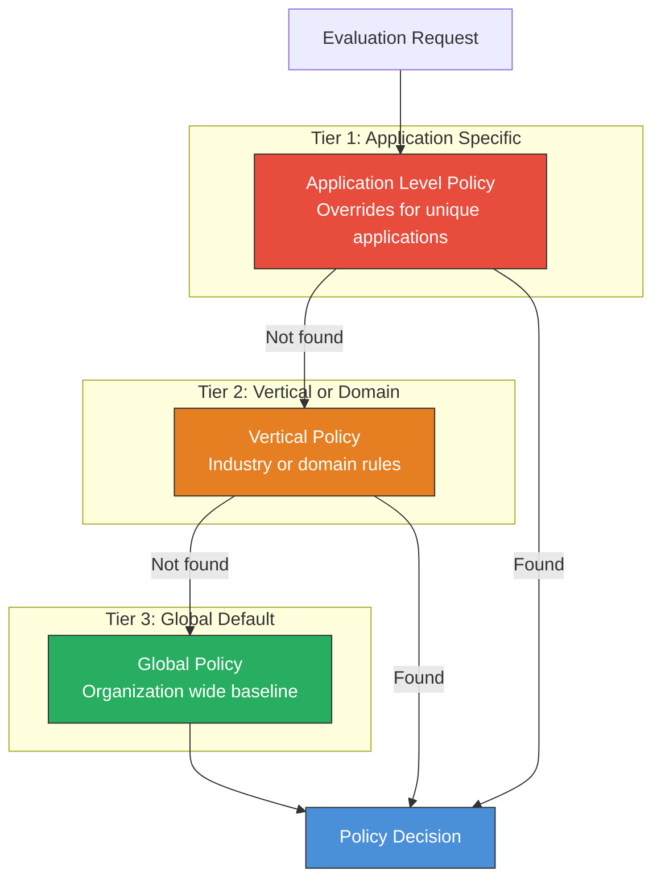
```mermaid
graph TB
    subgraph "Tier 1: Application Specific"
        T1[Application Level Policy<br/>Overrides for unique applications]
    end

    subgraph "Tier 2: Vertical or Domain"
        T2[Vertical Policy<br/>Industry or domain rules]
    end

    subgraph "Tier 3: Global Default"
        T3[Global Policy<br/>Organization wide baseline]
    end

    REQ[Evaluation Request] --> T1
    T1 -->|Not found| T2
    T2 -->|Not found| T3
    T3 --> DEC[Policy Decision]
    T1 -->|Found| DEC
    T2 -->|Found| DEC

    style T1 fill:#E74C3C,stroke:#333,color:#fff
    style T2 fill:#E67E22,stroke:#333,color:#fff
    style T3 fill:#27AE60,stroke:#333,color:#fff
    style DEC fill:#4A90D9,stroke:#333,color:#fff
```

**Resolution chain for each evaluation:**

```
1. Application specific   -->  app/{app-name}/{environment}.rego
2. Vertical               -->  vertical/{vertical}/{environment}.rego
3. Global default          -->  global/{environment}.rego
```

Most applications (80 to 90 percent) will fall through to the global default, meaning they require zero per application policy configuration.

### 8.3 Policy Directory Structure

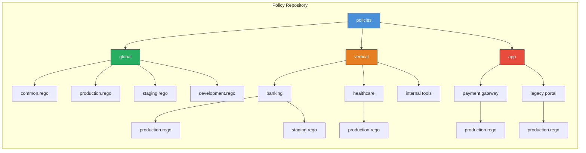
```mermaid
graph LR
    subgraph "Policy Repository"
        ROOT[policies]
        ROOT --> G[global]
        ROOT --> V[vertical]
        ROOT --> A[app]

        G --> GC[common.rego]
        G --> GP[production.rego]
        G --> GS[staging.rego]
        G --> GD[development.rego]

        V --> VB[banking]
        V --> VH[healthcare]
        V --> VI[internal tools]
        VB --> VBP[production.rego]
        VB --> VBS[staging.rego]
        VH --> VHP[production.rego]

        A --> AP[payment gateway]
        A --> AL[legacy portal]
        AP --> APP[production.rego]
        AL --> ALP[production.rego]
    end

    style ROOT fill:#4A90D9,stroke:#333,color:#fff
    style G fill:#27AE60,stroke:#333,color:#fff
    style V fill:#E67E22,stroke:#333,color:#fff
    style A fill:#E74C3C,stroke:#333,color:#fff
```

**Directory layout:**

```
policies/
  global/                              # Organization wide baseline (every app inherits)
    common.rego                        # Shared helper functions
    production.rego                    # Default production rules
    staging.rego                       # Default staging rules
    development.rego                   # Default development rules

  vertical/                            # Industry and domain overrides
    banking/
      production.rego                  # Stricter PCI DSS and SOX compliance rules
      staging.rego                     # Banking staging rules
    healthcare/
      production.rego                  # HIPAA requirements
      staging.rego                     # Healthcare staging rules
    internal-tools/
      production.rego                  # Relaxed rules for internal only applications

  app/                                 # Application specific overrides (rare)
    payment-gateway/
      production.rego                  # Zero tolerance with custom CVE blocklist
    legacy-portal/
      production.rego                  # Temporary exception waivers
```

### 8.4 Policy Resolution Flow

The following two sequence diagrams illustrate how policy resolution works in practice. The first shows an application that has its own specific policy. The second shows a standard application that falls through to the global default.

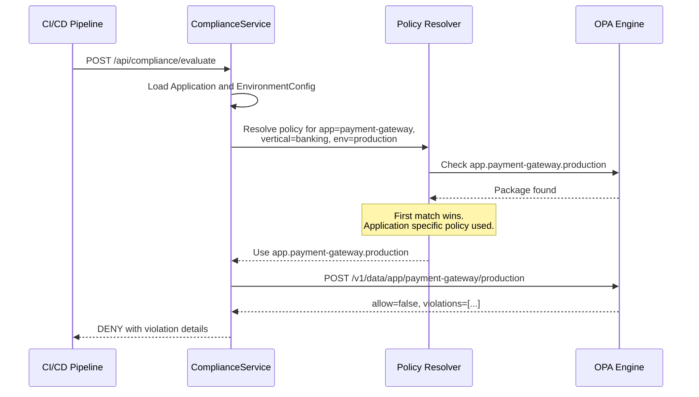
```mermaid
sequenceDiagram
    participant Pipeline as CI/CD Pipeline
    participant API as ComplianceService
    participant Resolver as Policy Resolver
    participant OPA as OPA Engine

    Pipeline->>API: POST /api/compliance/evaluate
    API->>API: Load Application and EnvironmentConfig

    API->>Resolver: Resolve policy for app=payment-gateway,<br/>vertical=banking, env=production

    Resolver->>OPA: Check app.payment-gateway.production
    OPA-->>Resolver: Package found

    Note over Resolver: First match wins.<br/>Application specific policy used.

    Resolver-->>API: Use app.payment-gateway.production

    API->>OPA: POST /v1/data/app/payment-gateway/production
    OPA-->>API: allow=false, violations=[...]
    API-->>Pipeline: DENY with violation details
```

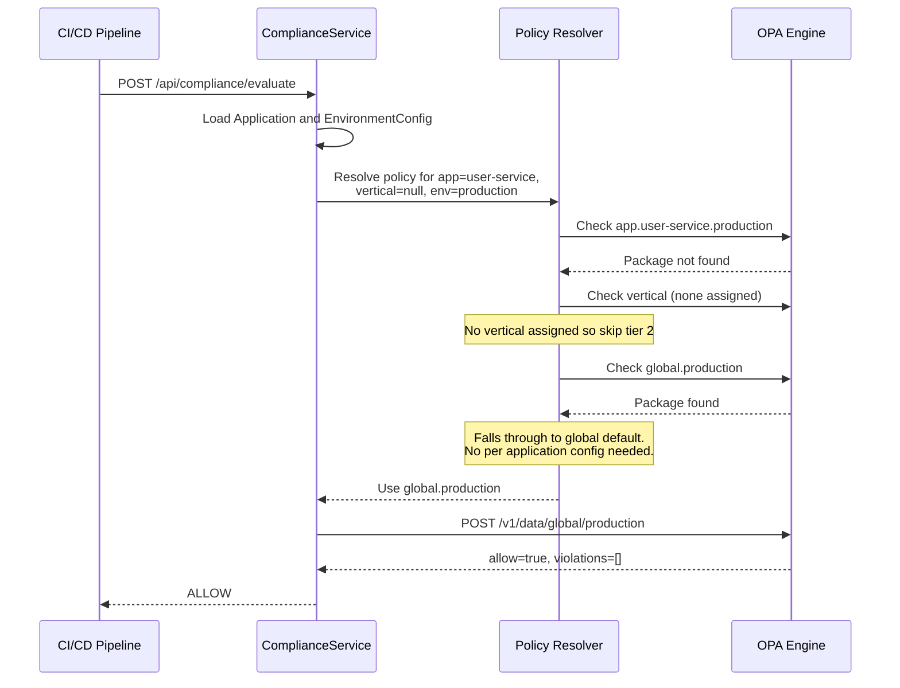
```mermaid
sequenceDiagram
    participant Pipeline as CI/CD Pipeline
    participant API as ComplianceService
    participant Resolver as Policy Resolver
    participant OPA as OPA Engine

    Pipeline->>API: POST /api/compliance/evaluate
    API->>API: Load Application and EnvironmentConfig

    API->>Resolver: Resolve policy for app=user-service,<br/>vertical=null, env=production

    Resolver->>OPA: Check app.user-service.production
    OPA-->>Resolver: Package not found

    Resolver->>OPA: Check vertical (none assigned)
    Note over Resolver: No vertical assigned so skip tier 2

    Resolver->>OPA: Check global.production
    OPA-->>Resolver: Package found

    Note over Resolver: Falls through to global default.<br/>No per application config needed.

    Resolver-->>API: Use global.production

    API->>OPA: POST /v1/data/global/production
    OPA-->>API: allow=true, violations=[]
    API-->>Pipeline: ALLOW
```

### 8.5 Policy Inheritance via Rego Import

Application specific and vertical policies do not duplicate global rules. Instead they **import and extend** the global baseline using Rego's module import system. This means a vertical policy like banking can enforce all of the standard production rules and then add PCI DSS specific checks on top. An application specific policy can further extend a vertical policy with custom CVE blocklists or exception waivers.

**Global baseline** (`global/production.rego`):

```rego
package global.production

import data.global.common

default allow := false

allow if {
    common.total_critical(input.scanResults) == 0
    common.total_high(input.scanResults) == 0
    common.tools_executed(input.scanResults, {"snyk", "prisma-cloud"})
    no_high_severity_license_violations
}

violations[msg] if {
    common.total_critical(input.scanResults) > 0
    msg := sprintf("Found %d critical vulnerabilities", [common.total_critical(input.scanResults)])
}
```

**Vertical override** (`vertical/banking/production.rego`):

```rego
package vertical.banking.production

import data.global.production as base
import data.global.common

default allow := false

# Banking requires ALL base production rules PLUS PCI DSS checks
allow if {
    base.allow
    pci_dss_compliant
    no_unencrypted_storage_dependencies
}

pci_dss_compliant if {
    pci_cves := [v |
        some scan in input.scanResults
        some v in scan.vulnerabilities
        startswith(v.cveId, "CVE-PCI")
    ]
    count(pci_cves) == 0
}

violations[msg] if {
    some msg in base.violations
}

violations[msg] if {
    not pci_dss_compliant
    msg := "PCI DSS compliance failure: blocked CVEs found in PCI scope"
}
```

**Application specific override** (`app/payment-gateway/production.rego`):

```rego
package app.payment_gateway.production

import data.vertical.banking.production as banking
import data.global.common

default allow := false

allow if {
    banking.allow
    no_blocked_cves
}

blocked_cve_list := {"CVE-2024-1234", "CVE-2024-5678", "CVE-2025-0001"}

no_blocked_cves if {
    found := [v |
        some scan in input.scanResults
        some v in scan.vulnerabilities
        v.cveId in blocked_cve_list
    ]
    count(found) == 0
}

violations[msg] if {
    some msg in banking.violations
}

violations[msg] if {
    not no_blocked_cves
    msg := "Blocked CVE detected on payment gateway explicit blocklist"
}
```

### 8.6 Distribution Model at Scale

For local development policies are loaded via volume mount. For staging and production environments the volume mount approach should be replaced with **OPA Bundle distribution** which enables hot reloading, versioning, and cryptographic signing of policy artifacts.

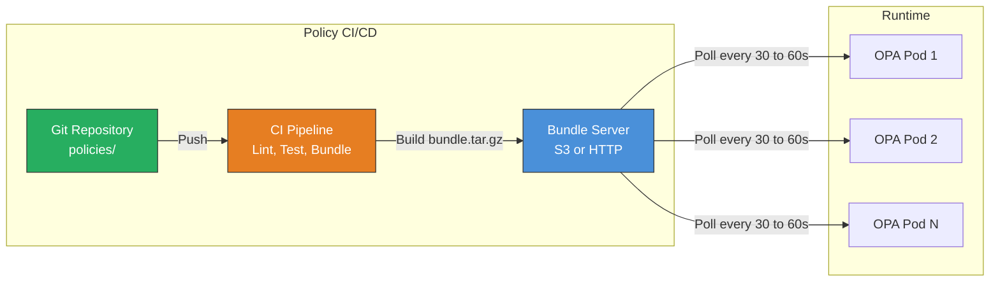
```mermaid
graph LR
    subgraph "Policy CI/CD"
        GIT[Git Repository<br/>policies/]
        CI[CI Pipeline<br/>Lint, Test, Bundle]
        STORE[Bundle Server<br/>S3 or HTTP]
    end

    subgraph "Runtime"
        OPA1[OPA Pod 1]
        OPA2[OPA Pod 2]
        OPAN[OPA Pod N]
    end

    GIT -->|Push| CI
    CI -->|Build bundle.tar.gz| STORE
    STORE -->|Poll every 30 to 60s| OPA1
    STORE -->|Poll every 30 to 60s| OPA2
    STORE -->|Poll every 30 to 60s| OPAN

    style CI fill:#E67E22,stroke:#333,color:#fff
    style STORE fill:#4A90D9,stroke:#333,color:#fff
    style GIT fill:#27AE60,stroke:#333,color:#fff
```

| Method | Use Case | Hot Reload | Versioned | Signed |
|--------|----------|------------|-----------|--------|
| **Volume mount** | Local development, Docker Compose | No (restart required) | No | No |
| **OPA Bundles** | Staging, Production, Kubernetes | Yes (polling interval) | Yes | Yes |
| **OPA Management API** | Emergency policy push | Yes (immediate) | No | No |

### 8.7 Policy Lifecycle and CI/CD for Policies

Every policy change follows a governed pipeline before reaching OPA in any environment. This ensures that all rules are syntactically valid, tested against known inputs, and reviewed by both a peer engineer and a security team member before promotion.


```mermaid
graph LR
    A[Author writes<br/>or edits .rego] --> B[Pull Request<br/>created]
    B --> C[Automated Checks]
    C --> D[Peer Review<br/>and Security Approval]
    D --> E[Merge to main]
    E --> F[Bundle Build<br/>and Sign]
    F --> G[Deploy to<br/>Staging OPA]
    G --> H[Smoke Test<br/>with known inputs]
    H --> I[Promote to<br/>Production OPA]

    style C fill:#E67E22,stroke:#333,color:#fff
    style D fill:#4A90D9,stroke:#333,color:#fff
    style I fill:#27AE60,stroke:#333,color:#fff
```

**Automated checks in the policy CI pipeline:**

| Check | Tool | Purpose |
|-------|------|---------|
| Syntax validation | `opa check` | Ensures all Rego files parse correctly and are free of syntax errors |
| Unit tests | `opa test` | Runs test cases for each policy package against known input and expected output pairs |
| Coverage report | `opa test --coverage` | Validates that a minimum of 90 percent of policy rules are exercised by test cases |
| Dependency analysis | Custom script | Verifies all Rego import statements resolve to valid packages in the bundle |
| Breaking change detection | Diff analysis | Flags changes to allow or violations rule signatures that could affect consumers |
| Bundle build | `opa build` | Produces a signed and versioned bundle artifact ready for distribution |

### 8.8 Application Onboarding Model

With hierarchical resolution in place, onboarding a new application becomes straightforward. The vast majority of applications will use the global default policy with zero additional configuration.

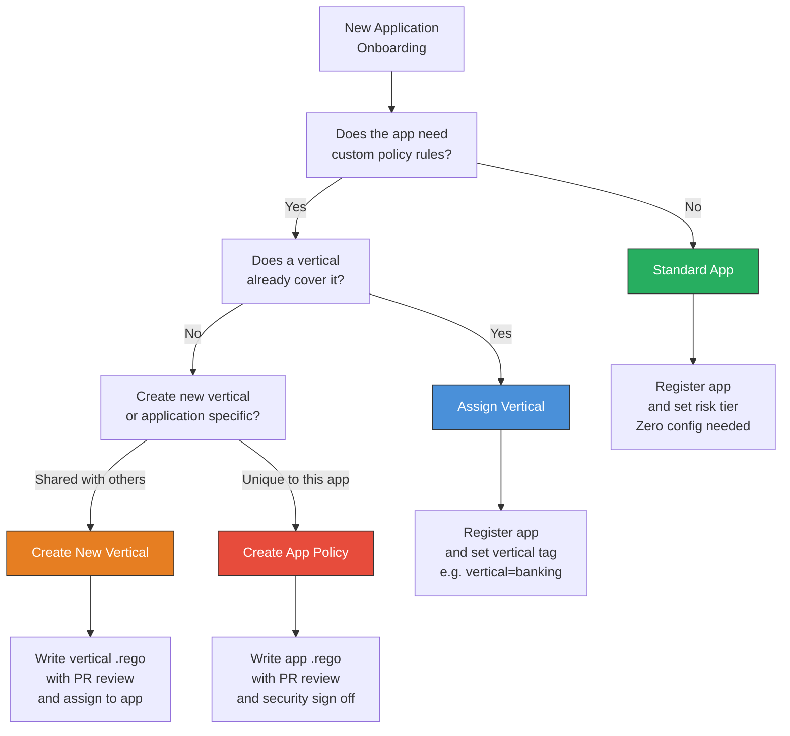
```mermaid
graph TD
    NEW[New Application<br/>Onboarding] --> Q1[Does the app need<br/>custom policy rules?]

    Q1 -->|No| PATH1[Standard App]
    Q1 -->|Yes| Q2[Does a vertical<br/>already cover it?]

    Q2 -->|Yes| PATH2[Assign Vertical]
    Q2 -->|No| Q3[Create new vertical<br/>or application specific?]

    Q3 -->|Shared with others| PATH3[Create New Vertical]
    Q3 -->|Unique to this app| PATH4[Create App Policy]

    PATH1 --> R1[Register app<br/>and set risk tier<br/>Zero config needed]
    PATH2 --> R2[Register app<br/>and set vertical tag<br/>e.g. vertical=banking]
    PATH3 --> R3[Write vertical .rego<br/>with PR review<br/>and assign to app]
    PATH4 --> R4[Write app .rego<br/>with PR review<br/>and security sign off]

    style PATH1 fill:#27AE60,stroke:#333,color:#fff
    style PATH2 fill:#4A90D9,stroke:#333,color:#fff
    style PATH3 fill:#E67E22,stroke:#333,color:#fff
    style PATH4 fill:#E74C3C,stroke:#333,color:#fff
```

| Onboarding Path | Effort | Frequency | Policy Files Changed |
|----------------|--------|-----------|---------------------|
| **Standard app** (global policy) | 5 minutes | ~85% of apps | None |
| **Assign existing vertical** | 10 minutes | ~10% of apps | None |
| **Create new vertical** | 1 to 2 days | ~4% of apps | 1 to 2 new Rego files |
| **Application specific override** | 1 to 2 days | ~1% of apps | 1 new Rego file |

### 8.9 Scale Projections

| Metric | 10 Apps | 100 Apps | 500 Apps |
|--------|---------|----------|----------|
| Total Rego files | ~4 | 8 to 12 | 15 to 25 |
| Global policies | 4 | 4 | 4 |
| Vertical policies | 0 | 2 to 4 verticals (4 to 8 files) | 5 to 10 verticals (10 to 20 files) |
| Application specific policies | 0 | 1 to 3 | 3 to 8 |
| Apps needing zero policy config | 10 | ~85 | ~425 |
| Policy bundle size | Under 50 KB | Under 100 KB | Under 200 KB |
| OPA evaluation latency impact | None | Negligible | Under 5ms increase |

The hierarchy keeps the policy repository manageable regardless of how many applications are onboarded. Adding a new standard application requires **zero policy changes** and only a single API call to register it.

---

## 9. Infrastructure and Deployment Architecture

### 9.1 Container Topology

The initial deployment topology consists of three containers running on a shared Docker network. The API container hosts the ASP.NET Core application. The OPA container runs the policy engine with Rego files mounted as a read only volume. The PostgreSQL container provides persistent storage with a named volume for data durability.

```mermaid
graph TB
    API[ComplianceService API<br>ASP.NET Core<br>Port 5000]
    OPA[OPA Policy Engine<br>Port 8181]
    REGO[Rego Policy Files<br>Read Only Volume]
    PG[PostgreSQL<br>Port 5432]
    PGVOL[Persistent Volume<br>postgres data]

    API -->|HTTP| OPA
    API -->|TCP| PG
    OPA --> REGO
    PG --> PGVOL

    style API fill:#4A90D9,stroke:#333,color:#fff
    style OPA fill:#8E44AD,stroke:#333,color:#fff
    style PG fill:#E67E22,stroke:#333,color:#fff
    style REGO fill:#D5A6E6,stroke:#333,color:#000
    style PGVOL fill:#F0C27A,stroke:#333,color:#000
```

| Container | Image | Ports | Volumes | Health Check |
|-----------|-------|-------|---------|-------------|
| `compliance-api` | .NET 8.0 build | `5000:80` | none | HTTP GET /health |
| `compliance-opa` | `openpolicyagent/opa` | `8181:8181` | `./policies` (read only) | HTTP GET /health |
| `compliance-postgres` | `postgres:16-alpine` | `5432:5432` | `postgres-data` (named volume) | pg_isready |

### 9.2 Production Deployment Target (Kubernetes)

The production topology deploys the API and OPA as co located containers within the same Kubernetes pod. This ensures policy evaluation remains a localhost call with no network overhead. The deployment is backed by a Horizontal Pod Autoscaler that scales based on CPU utilization and request rate. The data tier uses a PostgreSQL primary with read replicas to separate write traffic from query traffic.

```mermaid
graph TB
    subgraph "Kubernetes Cluster"
        ING[Ingress Controller<br/>TLS Termination]

        subgraph "ComplianceService Deployment (HPA)"
            subgraph "Pod 1"
                API1[API Container]
                OPA1[OPA Sidecar]
            end
            subgraph "Pod 2"
                API2[API Container]
                OPA2[OPA Sidecar]
            end
            subgraph "Pod N"
                APIN[API Container]
                OPAN[OPA Sidecar]
            end
        end

        SVC[ClusterIP Service]

        subgraph "Data Tier"
            PG_P[PostgreSQL Primary]
            PG_R1[Read Replica 1]
            PG_R2[Read Replica 2]
        end

        CM[ConfigMap<br/>Rego Policies]
        SEC[Secret<br/>DB Credentials]
    end

    ING --> SVC
    SVC --> API1
    SVC --> API2
    SVC --> APIN
    API1 --> OPA1
    API2 --> OPA2
    APIN --> OPAN
    API1 -->|writes| PG_P
    API2 -->|writes| PG_P
    APIN -->|writes| PG_P
    API1 -->|reads| PG_R1
    API2 -->|reads| PG_R1
    APIN -->|reads| PG_R2
    PG_P -->|replication| PG_R1
    PG_P -->|replication| PG_R2
    CM --> OPA1
    CM --> OPA2
    CM --> OPAN
    SEC --> API1
    SEC --> API2
    SEC --> APIN

    style ING fill:#95A5A6,stroke:#333,color:#fff
    style SVC fill:#95A5A6,stroke:#333,color:#fff
    style PG_P fill:#E67E22,stroke:#333,color:#fff
```

### 9.3 Database Schema Management

| Aspect | Strategy |
|--------|----------|
| **Migration tool** | Entity Framework Core migrations |
| **Development** | Auto migrate on startup for rapid iteration |
| **Staging** | Migration scripts applied during the deployment pipeline |
| **Production** | Explicit versioned SQL scripts only; auto migration is never enabled |
| **Rollback** | Down migrations are maintained and tested in staging before any production release |
| **Connection resilience** | Retry on transient failure with configurable retry count and backoff delay |

---

## 10. Scalability and Growth Strategy

### 10.1 Scalability Assessment

The API and OPA sidecar are both stateless which means they scale horizontally by adding more pods. PostgreSQL is the stateful component and scales vertically initially then horizontally via read replicas to offload audit and reporting queries from the write path.

```mermaid
graph TB
    subgraph "Stateless Components: Horizontally Scalable"
        API[ComplianceService API<br/>Scale by adding more pods]
        OPA[OPA Sidecar<br/>One per API pod]
    end

    subgraph "Stateful Components: Vertical then Read Replicas"
        PG[PostgreSQL<br/>Scale vertically then add read replicas]
    end

    subgraph "Growth Path"
        direction LR
        S1[Phase 1<br/>Single Instance<br/>~10 apps<br/>~50 evals/day]
        S2[Phase 2<br/>Multi Instance with K8s<br/>~100 to 500 apps<br/>~5,000 evals/day]
        S3[Phase 3<br/>Event Driven<br/>~1,000+ apps<br/>~100,000+ evals/day]
        S1 --> S2 --> S3
    end

    style S1 fill:#27AE60,stroke:#333,color:#fff
    style S2 fill:#F39C12,stroke:#333,color:#fff
    style S3 fill:#4A90D9,stroke:#333,color:#fff
```

### 10.2 Scaling Strategies by Phase

#### Phase 1: Single Instance

The initial deployment uses Docker Compose with a single API instance, OPA sidecar, and PostgreSQL database. This is suitable for the initial rollout with a small number of teams and provides the fastest path to having the service operational in a non production environment.

```mermaid
graph LR
    CI[CI/CD Pipelines] --> API[Single API<br/>with OPA Sidecar]
    API --> PG[Single PostgreSQL]

    style API fill:#27AE60,stroke:#333,color:#fff
```

#### Phase 2: Kubernetes Multi Instance

As adoption grows the service moves to Kubernetes with multiple replicas behind a load balanced ClusterIP service. A Horizontal Pod Autoscaler adjusts the replica count based on CPU utilization and inbound request rate. PostgreSQL adds a read replica to offload audit queries. OPA policies are distributed via ConfigMap or an OPA Bundle Server for centralized management.

```mermaid
graph TB
    CI[CI/CD Pipelines] --> LB[Load Balancer]
    LB --> API1[Pod 1: API with OPA]
    LB --> API2[Pod 2: API with OPA]
    LB --> API3[Pod 3: API with OPA]
    API1 -->|writes| PGP[PG Primary]
    API2 -->|writes| PGP
    API3 -->|writes| PGP
    API1 -->|reads| PGR[PG Replica]
    API2 -->|reads| PGR
    API3 -->|reads| PGR
    PGP --> PGR

    style LB fill:#95A5A6,stroke:#333,color:#fff
    style PGP fill:#E67E22,stroke:#333,color:#fff
```

#### Phase 3: Event Driven Architecture

At enterprise scale the architecture evolves to decouple write heavy operations from the synchronous evaluation path. Audit log writes and notification dispatch move to asynchronous consumers reading from a message queue. A Redis cache layer reduces database load for application profile lookups. The data tier splits into dedicated write and read stores with full CQRS separation.

```mermaid
graph TB
    CI[CI/CD Pipelines] --> LB[Load Balancer]
    LB --> API[API Pods<br/>with OPA Sidecars]
    API -->|evaluation results| MQ[Message Queue<br/>RabbitMQ or Kafka]
    MQ --> AW[Audit Writer<br/>Service]
    MQ --> NW[Notification<br/>Service]
    MQ --> MW[Metrics<br/>Aggregator]
    AW --> PGW[Write DB]
    API -->|reads| PGR[Read DB]
    PGW -->|replication| PGR
    API --> CACHE[Redis Cache<br/>App Profiles]

    style MQ fill:#8E44AD,stroke:#333,color:#fff
    style CACHE fill:#E74C3C,stroke:#333,color:#fff
```

### 10.3 Performance Optimization Path

| Optimization | Impact | Effort | Phase |
|-------------|--------|--------|-------|
| Redis cache for application profiles | Reduces database read volume by approximately 80 percent | Low | 2 |
| Database read replicas | Offloads audit and reporting queries from the primary | Medium | 2 |
| Async audit log writes | Reduces synchronous evaluation latency by deferring persistence | Medium | 2 |
| OPA bundle server | Centralizes policy distribution with versioning and signing | Medium | 2 |
| Message queue for notifications | Decouples notification delivery from the evaluation path | Medium | 3 |
| Request idempotency | Prevents duplicate evaluations from pipeline retries | Low | 2 |
| Database index tuning | Accelerates audit queries across time range and application dimensions | Low | 2 |
| Audit log archival to cold storage | Manages unbounded data growth in the primary database | Medium | 3 |

### 10.4 Growth Targets

| Metric | Phase 1 | Phase 2 | Phase 3 |
|--------|---------|---------|---------|
| Applications onboarded | 5 to 10 | 50 to 100 | 500+ |
| Evaluations per day | ~50 | ~2,000 | ~50,000+ |
| Evaluation latency (p95) | Under 2s | Under 500ms | Under 200ms |
| Audit query response time | Under 5s | Under 1s | Under 500ms |
| Availability | 99% | 99.9% | 99.95% |

---

## 11. Security and Governance

### 11.1 Security Architecture

The security model is organized into four layers. The perimeter layer handles TLS termination, authentication, and rate limiting. The application layer validates all inbound data and sanitizes error responses. The data layer ensures encryption at rest and enforces role based access controls. The policy layer protects the integrity of the compliance rules themselves through Git based version control and read only runtime mounts.

```mermaid
graph TB
    subgraph "Perimeter Security"
        TLS[TLS and HTTPS<br/>Encryption in Transit]
        AUTH[Authentication<br/>OAuth 2.0 or API Keys]
        RATE[Rate Limiting<br/>Abuse Prevention]
    end

    subgraph "Application Security"
        VAL[Input Validation<br/>FluentValidation]
        ERR[Error Sanitization<br/>No stack traces in production]
        CORS[CORS Policy<br/>Restricted origins]
        MW[Request Logging<br/>Structured and Sanitized]
    end

    subgraph "Data Security"
        ENC[Encryption at Rest<br/>PostgreSQL TDE]
        RBAC[Role Based Access<br/>Audit endpoints restricted]
        EVID[Evidence Immutability<br/>Write once audit logs]
    end

    subgraph "Policy Security"
        GIT[Policy as Code<br/>Git version control]
        RO[Read Only Mount<br/>Policies cannot be modified at runtime]
        PR[Pull Request Review<br/>Policy changes require approval]
    end

    TLS --> VAL --> ENC --> GIT
    AUTH --> ERR --> RBAC --> RO
    RATE --> CORS --> EVID --> PR

    style AUTH fill:#E74C3C,stroke:#333,color:#fff
    style EVID fill:#E67E22,stroke:#333,color:#fff
    style GIT fill:#8E44AD,stroke:#333,color:#fff
```

### 11.2 Security Controls

| Control | Category |
|---------|----------|
| HTTPS enforcement for all communication | Perimeter |
| Authentication via OAuth 2.0 or API keys | Perimeter |
| Role based authorization (RBAC) | Perimeter |
| CORS restriction to known origins | Perimeter |
| Rate limiting on all public endpoints | Perimeter |
| Structural and semantic input validation | Application |
| Error response sanitization in production | Application |
| Structured request and response logging | Observability |
| Composite health check probes for PostgreSQL and OPA | Observability |
| Secrets management through external vault integration | Infrastructure |
| Transparent data encryption at rest | Data |
| Read only policy file mounts at runtime | Policy |
| Immutable full evidence audit trail | Governance |
| HMAC or JWT signing for scan result integrity | Data Integrity |
| Cryptographic bundle signing for OPA policies | Policy |

### 11.3 Security Scanning Integration

The service integrates with industry standard security scanning tools through a tool agnostic scan result contract. Any scanner that can produce output conforming to the schema can participate in the compliance evaluation.

| Tool | Purpose |
|------|---------|
| **Snyk** | Software composition analysis covering dependency vulnerability scanning and license compliance verification |
| **Prisma Cloud** | Container image security scanning, infrastructure as code analysis, and cloud security posture management |
| **Other Security Tools** | Static application security testing, dynamic analysis, or custom internal scanners all extensible via the scan result contract |

### 11.4 Governance Framework

```mermaid
graph TB
    subgraph "Policy Governance"
        PG1[Rego policies in Git]
        PG2[PR based policy changes]
        PG3[Policy version tracking]
        PG4[Environment specific enforcement]
    end

    subgraph "Risk Governance"
        RG1[Risk tier classification]
        RG2[Tier appropriate strictness]
        RG3[Required tool enforcement]
        RG4[Escalating tolerance by environment]
    end

    subgraph "Audit Governance"
        AG1[Every decision recorded]
        AG2[Full evidence preserved]
        AG3[Immutable audit logs]
        AG4[Queryable by any dimension]
    end

    subgraph "Operational Governance"
        OG1[Automated enforcement]
        OG2[No manual bypass]
        OG3[Owner notifications]
        OG4[Portfolio wide visibility]
    end

    PG1 --> CENTER((Compliance<br/>Governance))
    PG2 --> CENTER
    PG3 --> CENTER
    PG4 --> CENTER
    RG1 --> CENTER
    RG2 --> CENTER
    RG3 --> CENTER
    RG4 --> CENTER
    AG1 --> CENTER
    AG2 --> CENTER
    AG3 --> CENTER
    AG4 --> CENTER
    OG1 --> CENTER
    OG2 --> CENTER
    OG3 --> CENTER
    OG4 --> CENTER

    style CENTER fill:#4A90D9,stroke:#333,color:#fff
```

### 11.5 Compliance Readiness

The audit trail is designed to support evidence generation for the following regulatory frameworks:

| Framework | Supported Capability |
|-----------|---------------------|
| **SOC 2 Type II** | Continuous control evidence with timestamped decisions |
| **PCI DSS** | Vulnerability management evidence for Requirements 6.1 and 6.2 |
| **HIPAA** | Access control and audit log requirements |
| **ISO 27001** | Information security management controls |
| **FedRAMP** | Continuous monitoring and vulnerability tracking |

---

## 12. Technology Stack Summary

```mermaid
graph TB
    subgraph "Application Runtime"
        NET[.NET 8.0 LTS]
        ASP[ASP.NET Core]
    end

    subgraph "Architecture Patterns"
        DDD[Domain Driven Design]
        CQRS[CQRS via MediatR]
        CA[Clean Architecture]
    end

    subgraph "Policy Engine"
        OPA[Open Policy Agent]
        REGO[Rego Policy Language]
    end

    subgraph Data and Persistence
        PG[PostgreSQL]
        EF[Entity Framework Core]
    end

    subgraph "Infrastructure"
        DC[Docker Compose]
        K8S[Kubernetes]
    end

    NET --> ASP
    ASP --> DDD
    ASP --> CQRS
    ASP --> CA
    OPA --> REGO
    PG --> EF
    DC --> K8S

    style NET fill:#512BD4,stroke:#333,color:#fff
    style OPA fill:#8E44AD,stroke:#333,color:#fff
    style PG fill:#336791,stroke:#333,color:#fff
    style K8S fill:#326CE5,stroke:#333,color:#fff
```

| Category | Technology | Purpose |
|----------|-----------|---------|
| **Runtime** | .NET 8.0 LTS | Long term support application runtime |
| **Web Framework** | ASP.NET Core | REST API hosting and middleware pipeline |
| **Policy Engine** | Open Policy Agent | Rego based policy evaluation via sidecar |
| **Database** | PostgreSQL | Persistent relational data store for application profiles, evaluations, and audit records |
| **ORM** | Entity Framework Core | Database access layer with migration support |
| **Mediator** | MediatR | CQRS command and query dispatch with pipeline behaviors |
| **Validation** | FluentValidation | Declarative request input validation with strongly typed rules |
| **Logging** | Serilog | Structured logging with context enrichment and multiple sink support |
| **Containers** | Docker and Kubernetes | Development orchestration and production deployment |

---

> **Next Steps:** Review this proposal with stakeholders and approve for development to begin. The target is to deliver the core service by **March 31, 2026** with the foundational architecture, security controls, policy evaluation engine, and CI/CD pipeline integration operational.

---

*Technical Proposal prepared February 2026*
*ComplianceService: Policy Gateway for CI/CD Pipeline Compliance*
*Target Delivery: March 31, 2026*
