# ComplianceService - Technical Proposal

> **Document Type:** Technical Proposal & Architecture Design
> **Service Name:** ComplianceService
> **Status:** Proposed
> **Date:** February 2026
> **Audience:** Engineering Leadership, Security Team, DevOps, Architecture Review Board

---

## Table of Contents

1. [Introduction](#1-introduction)
2. [Problem Statement & Business Case](#2-problem-statement--business-case)
3. [Proposed Solution](#3-proposed-solution)
4. [High-Level System Architecture](#4-high-level-system-architecture)
5. [Service Flow & Process Design](#5-service-flow--process-design)
6. [CI/CD Pipeline Integration Model](#6-cicd-pipeline-integration-model)
7. [Open Policy Agent (OPA) - The Decision Engine](#7-open-policy-agent-opa---the-decision-engine)
8. [Policy Management at Scale](#8-policy-management-at-scale)
9. [Domain Model & Data Design](#9-domain-model--data-design)
10. [API Contract & Interface Design](#10-api-contract--interface-design)
11. [Infrastructure & Deployment Architecture](#11-infrastructure--deployment-architecture)
12. [Security & Governance Model](#12-security--governance-model)
13. [Observability & Monitoring Strategy](#13-observability--monitoring-strategy)
14. [Scalability & Growth Strategy](#14-scalability--growth-strategy)
15. [Risk Assessment & Mitigations](#15-risk-assessment--mitigations)
16. [Maturity Roadmap & Phased Delivery](#16-maturity-roadmap--phased-delivery)
17. [Technology Stack Summary](#17-technology-stack-summary)

---

## 1. Introduction

### 1.1 Purpose

This document proposes **ComplianceService** -- a centralized policy gateway that automates security compliance decisions within CI/CD pipelines. The service sits between security scanning tools (Snyk, Prisma Cloud, SonarQube) and deployment targets, providing an automated **allow/deny decision** based on organizational compliance policies.

### 1.2 Scope

ComplianceService covers the following functional areas:

| Area | Description |
|------|-------------|
| **Compliance Evaluation** | Accept security scan results and evaluate them against Rego policies in real time |
| **Application Management** | Register and configure applications with per-environment risk tiers and policy assignments |
| **Audit Trail** | Record every compliance decision with full evidence for regulatory and internal review |
| **Alerting** | Notify stakeholders when deployments are blocked or critical vulnerabilities are found |
| **Reporting** | Provide aggregate statistics across the application portfolio |

### 1.3 Key Stakeholders

| Stakeholder | Interest |
|-------------|----------|
| **DevOps / Platform Engineering** | Pipeline integration, deployment gating |
| **Application Security** | Policy authoring, vulnerability tracking |
| **Compliance / GRC** | Audit trail, regulatory evidence |
| **Engineering Teams** | Self-service registration, evaluation results |
| **Engineering Leadership** | Portfolio-wide security posture visibility |

---

## 2. Problem Statement & Business Case

### 2.1 Current Challenges

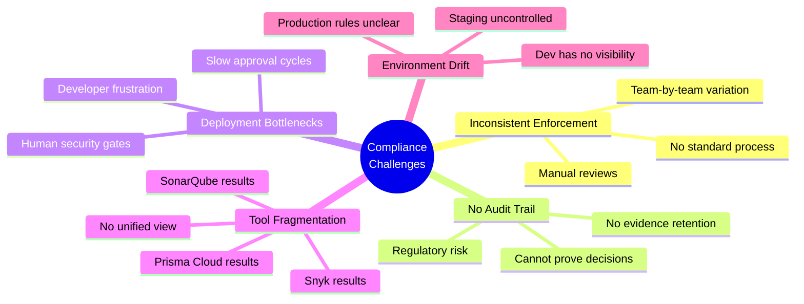
```mermaid
mindmap
  root((Compliance<br/>Challenges))
    Inconsistent Enforcement
      Manual reviews
      Team-by-team variation
      No standard process
    No Audit Trail
      Cannot prove decisions
      Regulatory risk
      No evidence retention
    Deployment Bottlenecks
      Human security gates
      Slow approval cycles
      Developer frustration
    Tool Fragmentation
      Snyk results
      Prisma Cloud results
      SonarQube results
      No unified view
    Environment Drift
      Production rules unclear
      Staging uncontrolled
      Dev has no visibility
```

### 2.2 Business Impact

| Impact Area | Without ComplianceService | With ComplianceService |
|-------------|--------------------------|----------------------|
| **Deployment speed** | Hours/days waiting for manual approval | Seconds -- automated allow/deny |
| **Policy consistency** | Varies by team, person, and day | Same rules applied to every deployment, every time |
| **Audit readiness** | Manual evidence gathering for audits | Instant access to every decision + evidence |
| **Vulnerability visibility** | Fragmented across scanner dashboards | Single portfolio-wide view |
| **Regulatory compliance** | Difficult to demonstrate controls | Immutable, timestamped decision records |
| **Risk management** | Reactive -- found after deployment | Preventive -- blocked before deployment |

### 2.3 Value Proposition

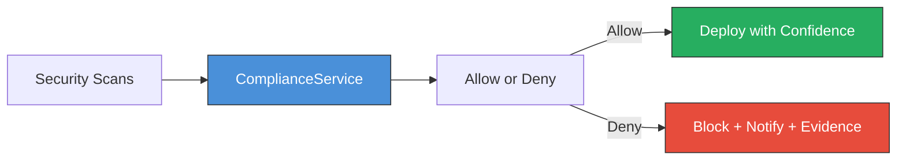
```mermaid
graph LR
    A[Security Scans] --> B[ComplianceService]
    B --> C[Allow or Deny]
    C -->|Allow| D[Deploy with Confidence]
    C -->|Deny| E[Block + Notify + Evidence]

    style B fill:#4A90D9,stroke:#333,color:#fff
    style D fill:#27AE60,stroke:#333,color:#fff
    style E fill:#E74C3C,stroke:#333,color:#fff
```

**One API call. Consistent policy enforcement. Full audit trail. Zero manual intervention.**

---

## 3. Proposed Solution

### 3.1 Solution Summary

ComplianceService is a RESTful API service that:

1. **Receives** security scan results from CI/CD pipelines
2. **Evaluates** them against environment-specific policies using Open Policy Agent
3. **Decides** whether to allow or deny the deployment
4. **Records** the full decision with evidence into an immutable audit log
5. **Notifies** stakeholders when deployments are blocked or critical vulnerabilities are found

### 3.2 Core Capabilities

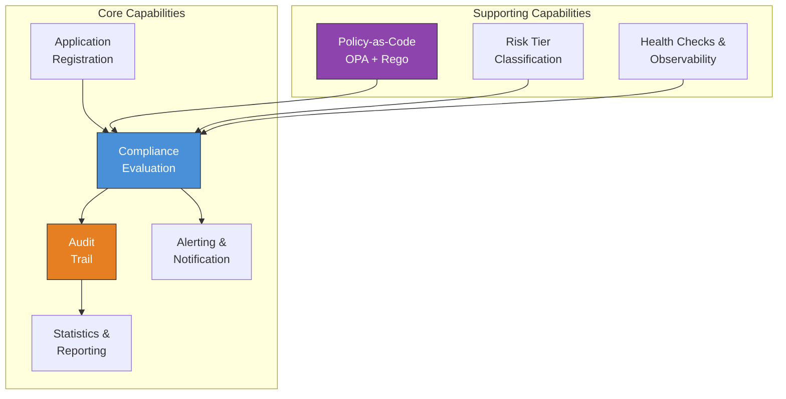
```mermaid
graph TB
    subgraph "Core Capabilities"
        direction TB
        R[Application<br/>Registration] --> E[Compliance<br/>Evaluation]
        E --> A[Audit<br/>Trail]
        E --> N[Alerting &<br/>Notification]
        A --> S[Statistics &<br/>Reporting]
    end

    subgraph "Supporting Capabilities"
        direction TB
        P[Policy-as-Code<br/>OPA + Rego]
        T[Risk Tier<br/>Classification]
        H[Health Checks &<br/>Observability]
    end

    P --> E
    T --> E
    H --> E

    style E fill:#4A90D9,stroke:#333,color:#fff
    style P fill:#8E44AD,stroke:#333,color:#fff
    style A fill:#E67E22,stroke:#333,color:#fff
```

### 3.3 How It Fits Into the Ecosystem

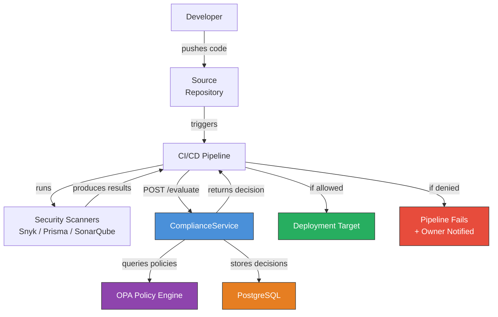
```mermaid
graph TB
    DEV[Developer] -->|pushes code| REPO[Source<br/>Repository]
    REPO -->|triggers| CI[CI/CD Pipeline]
    CI -->|runs| SCAN[Security Scanners<br/>Snyk / Prisma / SonarQube]
    SCAN -->|produces results| CI
    CI -->|POST /evaluate| CS[ComplianceService]
    CS -->|queries policies| OPA[OPA Policy Engine]
    CS -->|stores decisions| DB[PostgreSQL]
    CS -->|returns decision| CI
    CI -->|if allowed| DEPLOY[Deployment Target]
    CI -->|if denied| FAIL[Pipeline Fails<br/>+ Owner Notified]

    style CS fill:#4A90D9,stroke:#333,color:#fff
    style OPA fill:#8E44AD,stroke:#333,color:#fff
    style DB fill:#E67E22,stroke:#333,color:#fff
    style DEPLOY fill:#27AE60,stroke:#333,color:#fff
    style FAIL fill:#E74C3C,stroke:#333,color:#fff
```

---

## 4. High-Level System Architecture

### 4.1 System Component Diagram

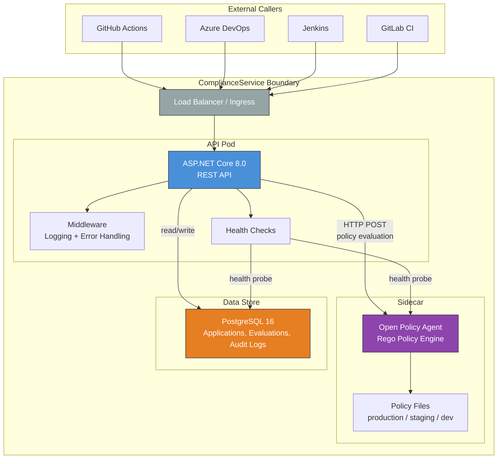
```mermaid
graph TB
    subgraph "External Callers"
        GH[GitHub Actions]
        AZ[Azure DevOps]
        JK[Jenkins]
        GL[GitLab CI]
    end

    subgraph "ComplianceService Boundary"
        direction TB
        LB[Load Balancer / Ingress]

        subgraph "API Pod"
            API[ASP.NET Core 8.0<br/>REST API]
            MW[Middleware<br/>Logging + Error Handling]
            HC[Health Checks]
        end

        subgraph "Sidecar"
            OPA[Open Policy Agent<br/>Rego Policy Engine]
            POL[Policy Files<br/>production / staging / dev]
        end

        subgraph "Data Store"
            PG[PostgreSQL 16<br/>Applications, Evaluations, Audit Logs]
        end
    end

    GH --> LB
    AZ --> LB
    JK --> LB
    GL --> LB
    LB --> API
    API --> MW
    API --> HC
    API -->|HTTP POST<br/>policy evaluation| OPA
    OPA --> POL
    API -->|read/write| PG
    HC -->|health probe| PG
    HC -->|health probe| OPA

    style API fill:#4A90D9,stroke:#333,color:#fff
    style OPA fill:#8E44AD,stroke:#333,color:#fff
    style PG fill:#E67E22,stroke:#333,color:#fff
    style LB fill:#95A5A6,stroke:#333,color:#fff
```

### 4.2 Internal Layer Architecture (Clean Architecture)

The service follows **Clean Architecture** principles with four layers and strict dependency rules:

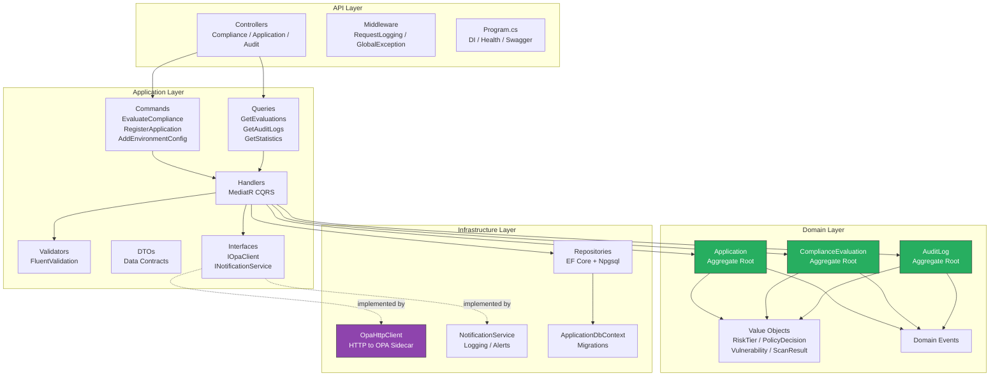
```mermaid
graph TB
    subgraph "API Layer"
        CTRL[Controllers<br/>Compliance / Application / Audit]
        MID[Middleware<br/>RequestLogging / GlobalException]
        BOOT[Program.cs<br/>DI / Health / Swagger]
    end

    subgraph "Application Layer"
        CMD[Commands<br/>EvaluateCompliance<br/>RegisterApplication<br/>AddEnvironmentConfig]
        QRY[Queries<br/>GetEvaluations<br/>GetAuditLogs<br/>GetStatistics]
        HAND[Handlers<br/>MediatR CQRS]
        VAL[Validators<br/>FluentValidation]
        DTO[DTOs<br/>Data Contracts]
        INTF[Interfaces<br/>IOpaClient<br/>INotificationService]
    end

    subgraph "Domain Layer"
        AGG1[Application<br/>Aggregate Root]
        AGG2[ComplianceEvaluation<br/>Aggregate Root]
        AGG3[AuditLog<br/>Aggregate Root]
        VO[Value Objects<br/>RiskTier / PolicyDecision<br/>Vulnerability / ScanResult]
        EVT[Domain Events]
    end

    subgraph "Infrastructure Layer"
        REPO[Repositories<br/>EF Core + Npgsql]
        OPAC[OpaHttpClient<br/>HTTP to OPA Sidecar]
        NOTIF[NotificationService<br/>Logging / Alerts]
        DBCTX[ApplicationDbContext<br/>Migrations]
    end

    CTRL --> CMD
    CTRL --> QRY
    CMD --> HAND
    QRY --> HAND
    HAND --> VAL
    HAND --> INTF
    HAND --> AGG1
    HAND --> AGG2
    HAND --> AGG3
    AGG1 --> VO
    AGG2 --> VO
    AGG3 --> VO
    AGG1 --> EVT
    AGG2 --> EVT
    AGG3 --> EVT
    INTF -.->|implemented by| OPAC
    INTF -.->|implemented by| NOTIF
    REPO --> DBCTX
    HAND --> REPO

    style AGG1 fill:#27AE60,stroke:#333,color:#fff
    style AGG2 fill:#27AE60,stroke:#333,color:#fff
    style AGG3 fill:#27AE60,stroke:#333,color:#fff
    style OPAC fill:#8E44AD,stroke:#333,color:#fff
```

**Dependency Rule:** Each layer depends only on the layer below it. The Domain layer has zero external dependencies.

| Layer | Responsibility | Key Technologies |
|-------|---------------|-----------------|
| **API** | HTTP request/response, routing, middleware, startup configuration | ASP.NET Core, Swagger, Serilog |
| **Application** | Use cases, orchestration, CQRS commands/queries, input validation | MediatR, FluentValidation |
| **Domain** | Business rules, aggregates, value objects, domain events | Pure C# -- no framework dependencies |
| **Infrastructure** | Database access, OPA communication, notification delivery | EF Core, Npgsql, HttpClient |

---

## 5. Service Flow & Process Design

### 5.1 Primary Flow -- Compliance Evaluation

This is the core workflow triggered by every CI/CD pipeline call:

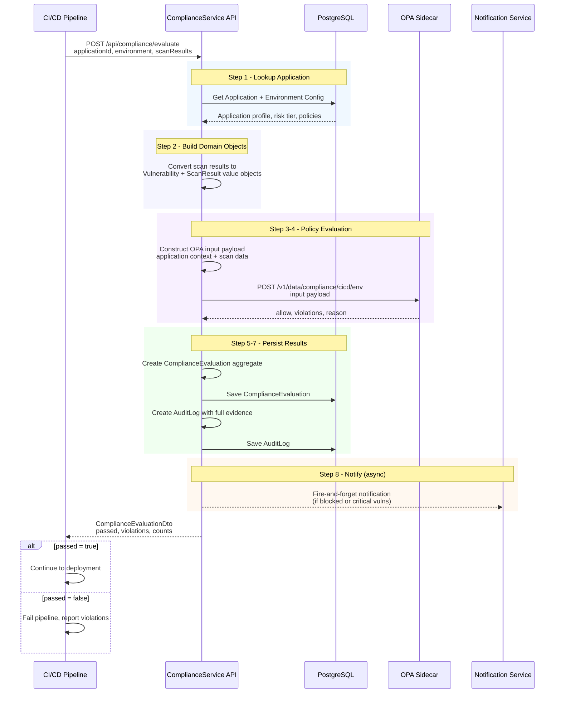
```mermaid
sequenceDiagram
    participant P as CI/CD Pipeline
    participant API as ComplianceService API
    participant DB as PostgreSQL
    participant OPA as OPA Sidecar
    participant N as Notification Service

    P->>API: POST /api/compliance/evaluate<br/>applicationId, environment, scanResults

    rect rgb(240, 248, 255)
        Note over API,DB: Step 1 - Lookup Application
        API->>DB: Get Application + Environment Config
        DB-->>API: Application profile, risk tier, policies
    end

    rect rgb(245, 245, 255)
        Note over API: Step 2 - Build Domain Objects
        API->>API: Convert scan results to<br/>Vulnerability + ScanResult value objects
    end

    rect rgb(248, 240, 255)
        Note over API,OPA: Step 3-4 - Policy Evaluation
        API->>API: Construct OPA input payload<br/>application context + scan data
        API->>OPA: POST /v1/data/compliance/cicd/env<br/>input payload
        OPA-->>API: allow, violations, reason
    end

    rect rgb(240, 255, 240)
        Note over API,DB: Step 5-7 - Persist Results
        API->>API: Create ComplianceEvaluation aggregate
        API->>DB: Save ComplianceEvaluation
        API->>API: Create AuditLog with full evidence
        API->>DB: Save AuditLog
    end

    rect rgb(255, 248, 240)
        Note over API,N: Step 8 - Notify (async)
        API-->>N: Fire-and-forget notification<br/>(if blocked or critical vulns)
    end

    API-->>P: ComplianceEvaluationDto<br/>passed, violations, counts

    alt passed = true
        P->>P: Continue to deployment
    else passed = false
        P->>P: Fail pipeline, report violations
    end
```

### 5.2 The 9-Step Evaluation Process (Detail)

| Step | Action | Description |
|------|--------|-------------|
| **1** | **Lookup Application** | Fetch application profile from PostgreSQL. Validate the application is active. Retrieve the environment configuration (risk tier, assigned policies, required tools). |
| **2** | **Build Domain Objects** | Parse each scan result into `ScanResult` and `Vulnerability` domain value objects. Validate CVE IDs, severity levels (critical/high/medium/low), CVSS scores (0-10), and package metadata. |
| **3** | **Construct OPA Input** | Assemble a structured JSON payload containing the application context (name, environment, risk tier, owner) and normalized scan data. |
| **4** | **Call OPA Sidecar** | HTTP POST to OPA's Data API at `/v1/data/{policy-package}`. OPA evaluates the Rego policy and returns `allow`, `violations[]`, and `reason`. |
| **5** | **Create PolicyDecision** | Map the OPA response into a domain value object. Enforce the invariant: a deny decision must carry at least one violation. |
| **6** | **Persist Evaluation** | Create and save the `ComplianceEvaluation` aggregate with the full scan results and policy decision. |
| **7** | **Create Audit Log** | Build an immutable `AuditLog` entry containing: raw scan results JSON, exact OPA input JSON, exact OPA output JSON, vulnerability counts, and the final decision. |
| **8** | **Send Notifications** | If the deployment was blocked or critical vulnerabilities were detected, notify the application owner asynchronously (non-blocking). |
| **9** | **Return Response** | Return the `ComplianceEvaluationDto` containing the pass/fail decision, violation details, and aggregated vulnerability counts. |

### 5.3 Application Registration Flow

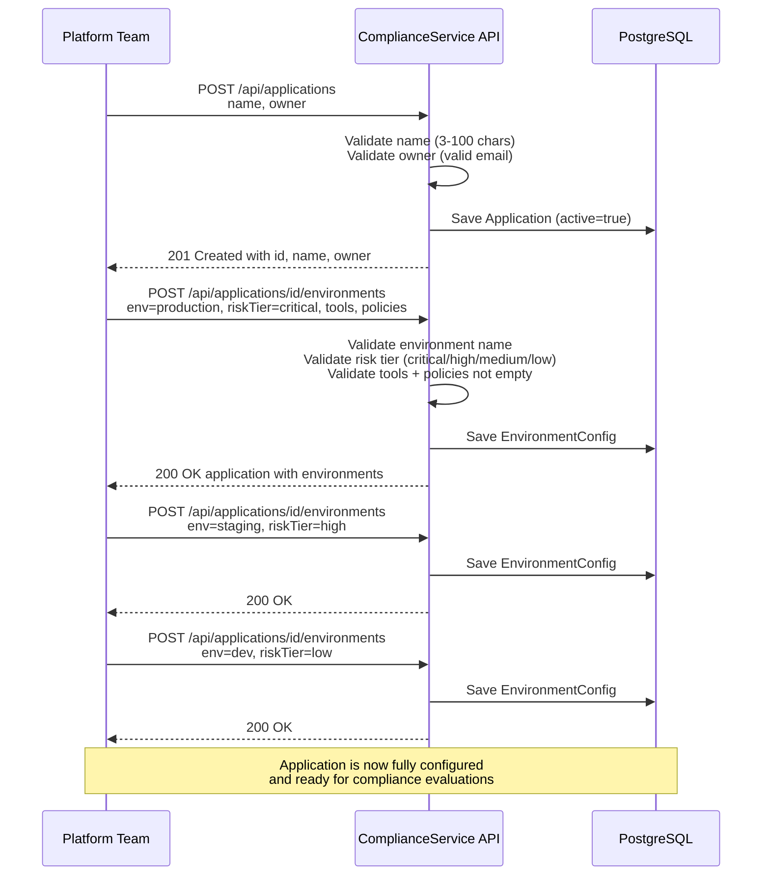
```mermaid
sequenceDiagram
    participant U as Platform Team
    participant API as ComplianceService API
    participant DB as PostgreSQL

    U->>API: POST /api/applications<br/>name, owner
    API->>API: Validate name (3-100 chars)<br/>Validate owner (valid email)
    API->>DB: Save Application (active=true)
    API-->>U: 201 Created with id, name, owner

    U->>API: POST /api/applications/id/environments<br/>env=production, riskTier=critical, tools, policies
    API->>API: Validate environment name<br/>Validate risk tier (critical/high/medium/low)<br/>Validate tools + policies not empty
    API->>DB: Save EnvironmentConfig
    API-->>U: 200 OK application with environments

    U->>API: POST /api/applications/id/environments<br/>env=staging, riskTier=high
    API->>DB: Save EnvironmentConfig
    API-->>U: 200 OK

    U->>API: POST /api/applications/id/environments<br/>env=dev, riskTier=low
    API->>DB: Save EnvironmentConfig
    API-->>U: 200 OK

    Note over U,DB: Application is now fully configured<br/>and ready for compliance evaluations
```

### 5.4 Audit Query & Reporting Flow

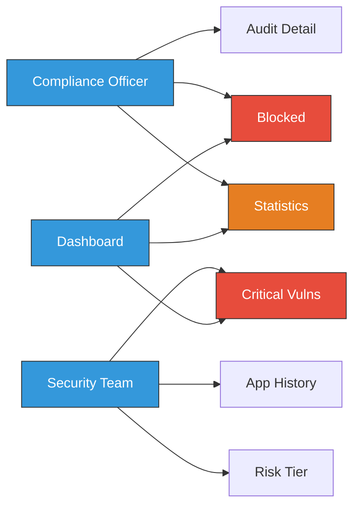
```mermaid
graph LR
    CO[Compliance Officer] --> S[Statistics]
    CO --> B[Blocked]
    CO --> DET[Audit Detail]
    SEC[Security Team] --> CV[Critical Vulns]
    SEC --> RT[Risk Tier]
    SEC --> APP[App History]
    DASH[Dashboard] --> S
    DASH --> B
    DASH --> CV

    style S fill:#E67E22,stroke:#333,color:#fff
    style B fill:#E74C3C,stroke:#333,color:#fff
    style CV fill:#E74C3C,stroke:#333,color:#fff
    style CO fill:#3498DB,stroke:#333,color:#fff
    style SEC fill:#3498DB,stroke:#333,color:#fff
    style DASH fill:#3498DB,stroke:#333,color:#fff
```

**Endpoint-to-consumer mapping:**

| Consumer | Endpoints Used | Purpose |
|----------|---------------|---------|
| **Compliance Officer** | `GET /statistics`, `GET /blocked`, `GET /audit/{id}` | Aggregate posture, denied deployments, decision evidence |
| **Security Team** | `GET /critical-vulnerabilities`, `GET /risk-tier/{tier}`, `GET /application/{id}` | CVE tracking, risk-based view, app history |
| **Dashboard / BI Tool** | `GET /statistics`, `GET /blocked`, `GET /critical-vulnerabilities` | Portfolio-wide metrics and visualization |

---

## 6. CI/CD Pipeline Integration Model

### 6.1 Pipeline Gate Architecture

ComplianceService acts as a **quality gate** in the CI/CD pipeline, positioned after security scans and before deployment:

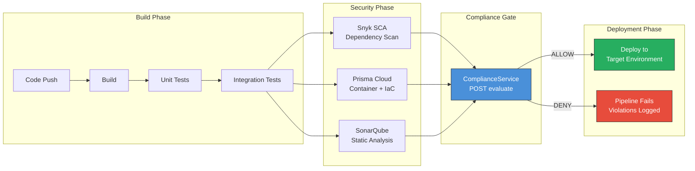
```mermaid
graph LR
    subgraph "Build Phase"
        A[Code Push] --> B[Build]
        B --> C[Unit Tests]
        C --> D[Integration Tests]
    end

    subgraph "Security Phase"
        D --> E[Snyk SCA<br/>Dependency Scan]
        D --> F[Prisma Cloud<br/>Container + IaC]
        D --> G[SonarQube<br/>Static Analysis]
    end

    subgraph "Compliance Gate"
        E --> H[ComplianceService<br/>POST evaluate]
        F --> H
        G --> H
    end

    subgraph "Deployment Phase"
        H -->|ALLOW| I[Deploy to<br/>Target Environment]
        H -->|DENY| J[Pipeline Fails<br/>Violations Logged]
    end

    style H fill:#4A90D9,stroke:#333,color:#fff
    style I fill:#27AE60,stroke:#333,color:#fff
    style J fill:#E74C3C,stroke:#333,color:#fff
```

### 6.2 Integration Contract

**Request (from CI/CD pipeline):**

```json
{
  "applicationId": "a1b2c3d4-e5f6-7890-abcd-ef1234567890",
  "environment": "production",
  "initiatedBy": "github-actions@org.com",
  "scanResults": [
    {
      "toolName": "snyk",
      "scannedAt": "2026-02-11T10:30:00Z",
      "vulnerabilities": [
        {
          "cveId": "CVE-2026-1234",
          "severity": "critical",
          "cvssScore": 9.8,
          "packageName": "lodash",
          "currentVersion": "4.17.20",
          "fixedVersion": "4.17.21"
        }
      ],
      "rawOutput": "{...}"
    }
  ],
  "metadata": {
    "pipelineId": "run-12345",
    "commitSha": "abc123"
  }
}
```

**Response (to CI/CD pipeline):**

```json
{
  "id": "eval-uuid",
  "applicationId": "a1b2c3d4-...",
  "applicationName": "payment-service",
  "environment": "production",
  "passed": false,
  "policyDecision": {
    "allow": false,
    "violations": [
      {
        "rule": "no_critical_vulnerabilities",
        "message": "Production deployments must have zero critical vulnerabilities. Found: 1",
        "severity": "critical"
      }
    ],
    "policyPackage": "compliance.cicd.production",
    "reason": "Production compliance violations detected"
  },
  "aggregatedCounts": {
    "critical": 1,
    "high": 0,
    "medium": 3,
    "low": 7,
    "total": 11
  }
}
```

### 6.3 Pipeline Decision Matrix

| Condition | Production | Staging | Development |
|-----------|-----------|---------|-------------|
| Critical vulnerabilities > 0 | **DENY** | **DENY** | Allow (up to 5) |
| High vulnerabilities > 0 | **DENY** | Allow (up to 3) | Allow |
| Missing required scan tools | **DENY** | **DENY** | Warn only |
| License violations (high) | **DENY** | Allow | Allow |
| No scans at all | **DENY** | **DENY** | Warn only |
| All checks pass | **ALLOW** | **ALLOW** | **ALLOW** |

---

## 7. Open Policy Agent (OPA) - The Decision Engine

### 7.1 What OPA Does

OPA is a general-purpose policy engine that decouples policy decisions from application code. ComplianceService sends structured data to OPA, and OPA evaluates it against Rego policy files to produce an allow/deny decision.

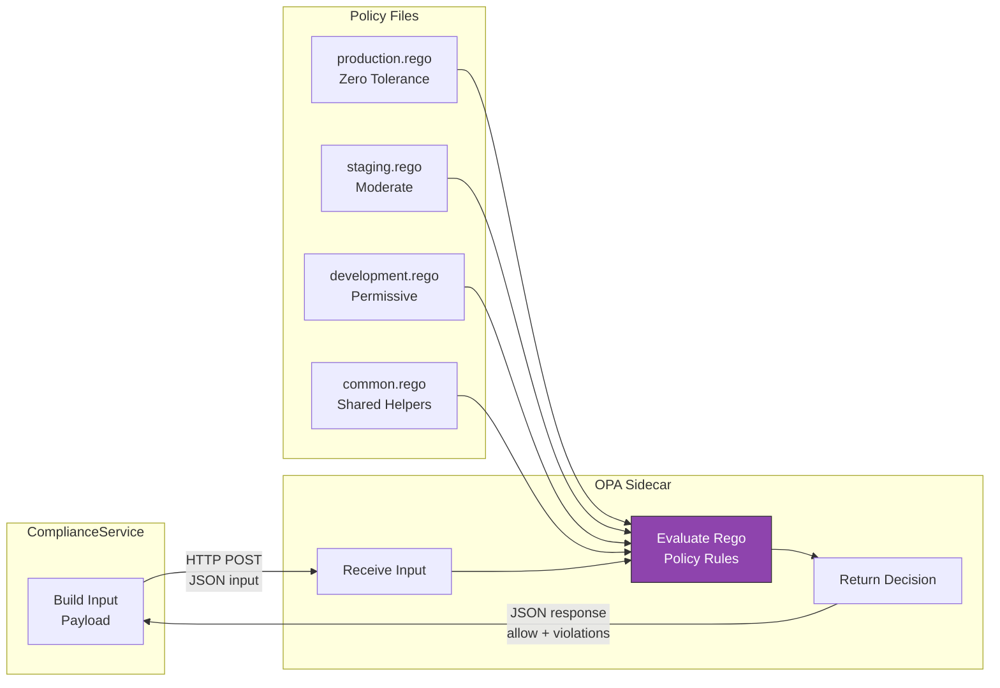
```mermaid
graph LR
    subgraph "ComplianceService"
        A[Build Input<br/>Payload]
    end

    subgraph "OPA Sidecar"
        B[Receive Input]
        C[Evaluate Rego<br/>Policy Rules]
        D[Return Decision]
    end

    subgraph "Policy Files"
        P1[production.rego<br/>Zero Tolerance]
        P2[staging.rego<br/>Moderate]
        P3[development.rego<br/>Permissive]
        P4[common.rego<br/>Shared Helpers]
    end

    A -->|HTTP POST<br/>JSON input| B
    B --> C
    P1 --> C
    P2 --> C
    P3 --> C
    P4 --> C
    C --> D
    D -->|JSON response<br/>allow + violations| A

    style C fill:#8E44AD,stroke:#333,color:#fff
```

### 7.2 OPA Communication Pattern

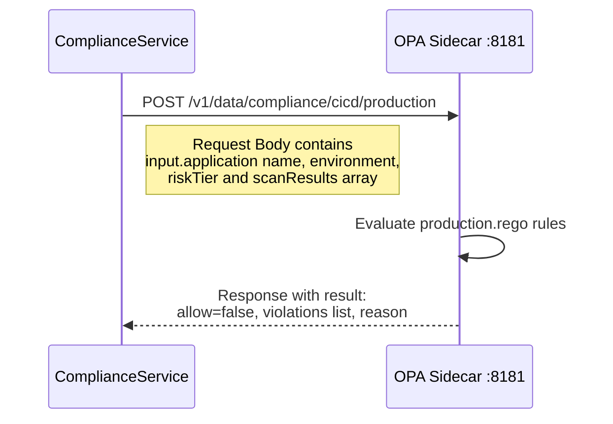
```mermaid
sequenceDiagram
    participant API as ComplianceService
    participant OPA as OPA Sidecar :8181

    API->>OPA: POST /v1/data/compliance/cicd/production
    Note right of API: Request Body contains<br/>input.application name, environment,<br/>riskTier and scanResults array

    OPA->>OPA: Evaluate production.rego rules

    OPA-->>API: Response with result:<br/>allow=false, violations list, reason
```

### 7.3 Policy Strictness Hierarchy

Each environment has a policy file with escalating strictness:

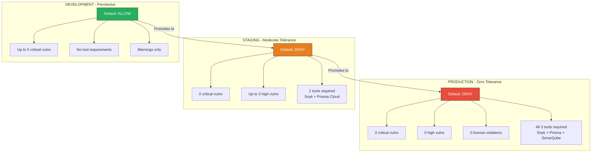
```mermaid
graph TB
    subgraph "PRODUCTION - Zero Tolerance"
        P1[Default: DENY]
        P1A[0 critical vulns]
        P1B[0 high vulns]
        P1C[0 license violations]
        P1D[All 3 tools required<br/>Snyk + Prisma + SonarQube]
        P1 --> P1A
        P1 --> P1B
        P1 --> P1C
        P1 --> P1D
    end

    subgraph "STAGING - Moderate Tolerance"
        P2[Default: DENY]
        P2A[0 critical vulns]
        P2B[Up to 3 high vulns]
        P2C[2 tools required<br/>Snyk + Prisma Cloud]
        P2 --> P2A
        P2 --> P2B
        P2 --> P2C
    end

    subgraph "DEVELOPMENT - Permissive"
        P3[Default: ALLOW]
        P3A[Up to 5 critical vulns]
        P3B[No tool requirements]
        P3C[Warnings only]
        P3 --> P3A
        P3 --> P3B
        P3 --> P3C
    end

    P3 -->|Promotes to| P2
    P2 -->|Promotes to| P1

    style P1 fill:#E74C3C,stroke:#333,color:#fff
    style P2 fill:#E67E22,stroke:#333,color:#fff
    style P3 fill:#27AE60,stroke:#333,color:#fff
```

### 7.4 Policy-as-Code Benefits

| Benefit | Description |
|---------|-------------|
| **Version controlled** | Rego files live in git alongside the service; every change has a commit history |
| **Reviewable** | Policy changes go through pull requests with peer review |
| **Testable** | OPA has a built-in test framework for Rego policies |
| **Decoupled** | Policies can be updated without redeploying the API service |
| **Auditable** | Git history shows who changed what policy, when, and why |
| **Declarative** | Rules express *what* should be enforced, not *how* |

---

## 8. Policy Management at Scale

### 8.1 The Scaling Challenge

The current design uses a flat policy directory with three environment-specific Rego files (`production.rego`, `staging.rego`, `development.rego`). Each application's `EnvironmentConfig` stores an explicit list of `PolicyReference` values, and the evaluation handler selects the first policy from that list.

This approach works for a small number of applications but introduces significant operational overhead as the organization scales:

| Challenge | Current Impact | Impact at 100+ Apps |
|-----------|---------------|---------------------|
| Manual policy assignment per app/env | Low effort (few apps) | Unsustainable -- every new app requires manual setup |
| No automatic policy selection by risk tier | Minor inconvenience | Misconfiguration risk across hundreds of environments |
| Flat policy namespace | Easy to navigate | No organizational structure by domain or team |
| Volume-mount policy loading | Acceptable for dev | Requires OPA container restart for any policy change |
| Single policy per evaluation | Sufficient | Cannot layer org-wide rules with app-specific overrides |
| No policy versioning | Manageable with git | Cannot roll back a bad policy without redeploying |

### 8.2 Proposed Architecture: Hierarchical Policy Resolution

The recommended approach introduces a **three-tier policy hierarchy** where the system resolves the correct policy by walking from most-specific to least-specific:

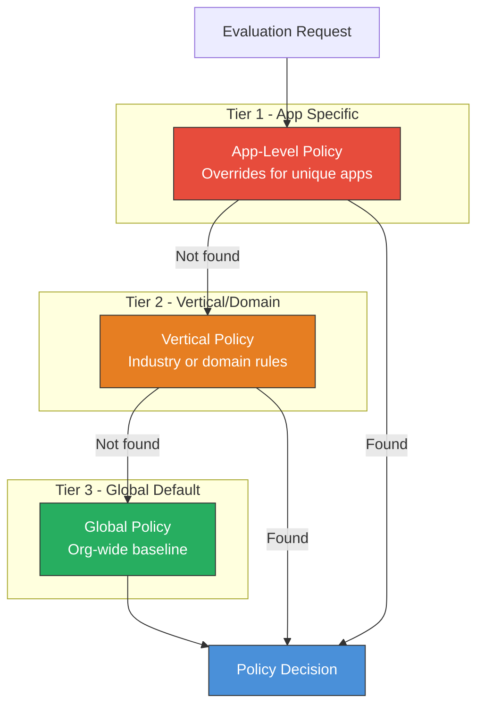
```mermaid
graph TB
    subgraph "Tier 1 - App Specific"
        T1[App-Level Policy<br/>Overrides for unique apps]
    end

    subgraph "Tier 2 - Vertical/Domain"
        T2[Vertical Policy<br/>Industry or domain rules]
    end

    subgraph "Tier 3 - Global Default"
        T3[Global Policy<br/>Org-wide baseline]
    end

    REQ[Evaluation Request] --> T1
    T1 -->|Not found| T2
    T2 -->|Not found| T3
    T3 --> DEC[Policy Decision]
    T1 -->|Found| DEC
    T2 -->|Found| DEC

    style T1 fill:#E74C3C,stroke:#333,color:#fff
    style T2 fill:#E67E22,stroke:#333,color:#fff
    style T3 fill:#27AE60,stroke:#333,color:#fff
    style DEC fill:#4A90D9,stroke:#333,color:#fff
```

**Resolution chain for each evaluation:**

```
1. App-specific   -->  app/{app-name}/{environment}.rego
2. Vertical       -->  vertical/{vertical}/{environment}.rego
3. Global default -->  global/{environment}.rego
```

The first match wins. Most applications (80-90%) will fall through to the global default, requiring zero per-app configuration.

### 8.3 Policy Directory Structure

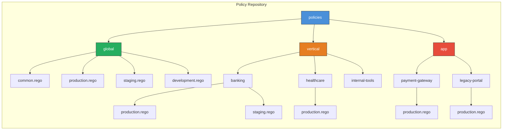
```mermaid
graph LR
    subgraph "Policy Repository"
        ROOT[policies]
        ROOT --> G[global]
        ROOT --> V[vertical]
        ROOT --> A[app]

        G --> GC[common.rego]
        G --> GP[production.rego]
        G --> GS[staging.rego]
        G --> GD[development.rego]

        V --> VB[banking]
        V --> VH[healthcare]
        V --> VI[internal-tools]
        VB --> VBP[production.rego]
        VB --> VBS[staging.rego]
        VH --> VHP[production.rego]

        A --> AP[payment-gateway]
        A --> AL[legacy-portal]
        AP --> APP[production.rego]
        AL --> ALP[production.rego]
    end

    style ROOT fill:#4A90D9,stroke:#333,color:#fff
    style G fill:#27AE60,stroke:#333,color:#fff
    style V fill:#E67E22,stroke:#333,color:#fff
    style A fill:#E74C3C,stroke:#333,color:#fff
```

**Directory layout:**

```
policies/
  global/                              # Org-wide baseline (every app inherits)
    common.rego                        # Shared helper functions
    production.rego                    # Default production rules
    staging.rego                       # Default staging rules
    development.rego                   # Default development rules

  vertical/                            # Industry/domain overrides
    banking/
      production.rego                  # Stricter: PCI-DSS, SOX compliance
      staging.rego                     # Banking staging rules
    healthcare/
      production.rego                  # HIPAA requirements
      staging.rego                     # Healthcare staging rules
    internal-tools/
      production.rego                  # Relaxed for internal-only apps

  app/                                 # App-specific overrides (rare)
    payment-gateway/
      production.rego                  # Zero tolerance + custom CVE blocklist
    legacy-portal/
      production.rego                  # Temporary exception waivers
```

### 8.4 Policy Resolution Flow

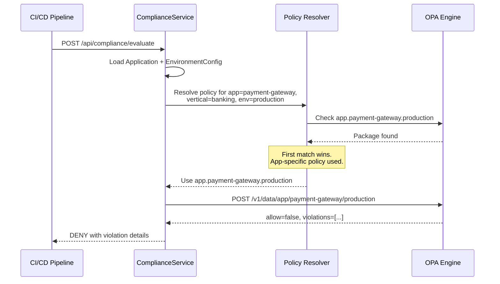
```mermaid
sequenceDiagram
    participant Pipeline as CI/CD Pipeline
    participant API as ComplianceService
    participant Resolver as Policy Resolver
    participant OPA as OPA Engine

    Pipeline->>API: POST /api/compliance/evaluate
    API->>API: Load Application + EnvironmentConfig

    API->>Resolver: Resolve policy for app=payment-gateway,<br/>vertical=banking, env=production

    Resolver->>OPA: Check app.payment-gateway.production
    OPA-->>Resolver: Package found

    Note over Resolver: First match wins.<br/>App-specific policy used.

    Resolver-->>API: Use app.payment-gateway.production

    API->>OPA: POST /v1/data/app/payment-gateway/production
    OPA-->>API: allow=false, violations=[...]
    API-->>Pipeline: DENY with violation details
```

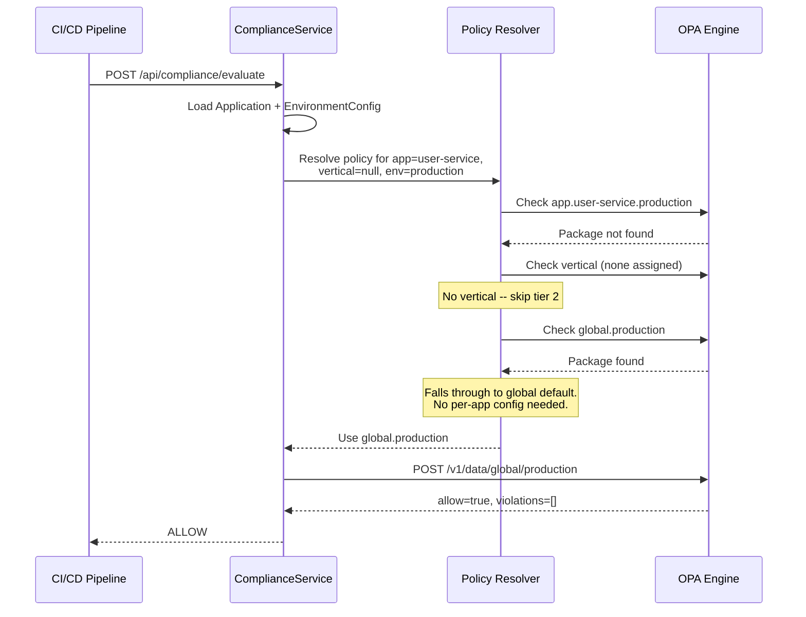
```mermaid
sequenceDiagram
    participant Pipeline as CI/CD Pipeline
    participant API as ComplianceService
    participant Resolver as Policy Resolver
    participant OPA as OPA Engine

    Pipeline->>API: POST /api/compliance/evaluate
    API->>API: Load Application + EnvironmentConfig

    API->>Resolver: Resolve policy for app=user-service,<br/>vertical=null, env=production

    Resolver->>OPA: Check app.user-service.production
    OPA-->>Resolver: Package not found

    Resolver->>OPA: Check vertical (none assigned)
    Note over Resolver: No vertical -- skip tier 2

    Resolver->>OPA: Check global.production
    OPA-->>Resolver: Package found

    Note over Resolver: Falls through to global default.<br/>No per-app config needed.

    Resolver-->>API: Use global.production

    API->>OPA: POST /v1/data/global/production
    OPA-->>API: allow=true, violations=[]
    API-->>Pipeline: ALLOW
```

### 8.5 Policy Inheritance via Rego Import

App-specific and vertical policies do not duplicate global rules. They **import and extend** the global baseline:

**Global baseline** (`global/production.rego`):

```rego
package global.production

import data.global.common

default allow := false

allow if {
    common.total_critical(input.scanResults) == 0
    common.total_high(input.scanResults) == 0
    common.tools_executed(input.scanResults, {"snyk", "prisma-cloud", "sonarqube"})
    no_high_severity_license_violations
}

violations[msg] if {
    common.total_critical(input.scanResults) > 0
    msg := sprintf("Found %d critical vulnerabilities", [common.total_critical(input.scanResults)])
}
```

**Vertical override** (`vertical/banking/production.rego`):

```rego
package vertical.banking.production

import data.global.production as base
import data.global.common

default allow := false

# Banking requires ALL base production rules PLUS PCI-DSS checks
allow if {
    base.allow
    pci_dss_compliant
    no_unencrypted_storage_dependencies
}

# Banking-specific: block any CVE tagged in PCI scope
pci_dss_compliant if {
    pci_cves := [v |
        some scan in input.scanResults
        some v in scan.vulnerabilities
        startswith(v.cveId, "CVE-PCI")
    ]
    count(pci_cves) == 0
}

# Extend base violations with banking-specific messages
violations[msg] if {
    some msg in base.violations
}

violations[msg] if {
    not pci_dss_compliant
    msg := "PCI-DSS compliance failure: blocked CVEs found in PCI scope"
}
```

**App-specific override** (`app/payment-gateway/production.rego`):

```rego
package app.payment_gateway.production

import data.vertical.banking.production as banking
import data.global.common

default allow := false

# Payment gateway inherits banking rules + adds custom blocklist
allow if {
    banking.allow
    no_blocked_cves
}

# App-specific: explicit CVE blocklist maintained by security team
blocked_cve_list := {"CVE-2024-1234", "CVE-2024-5678", "CVE-2025-0001"}

no_blocked_cves if {
    found := [v |
        some scan in input.scanResults
        some v in scan.vulnerabilities
        v.cveId in blocked_cve_list
    ]
    count(found) == 0
}

violations[msg] if {
    some msg in banking.violations
}

violations[msg] if {
    not no_blocked_cves
    msg := "Blocked CVE detected on payment-gateway explicit blocklist"
}
```

### 8.6 Distribution Model at Scale

The current volume-mount approach should be replaced with **OPA Bundle distribution** for production environments:

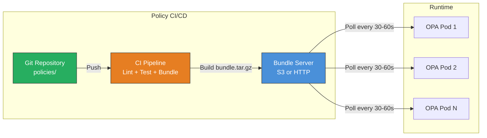
```mermaid
graph LR
    subgraph "Policy CI/CD"
        GIT[Git Repository<br/>policies/]
        CI[CI Pipeline<br/>Lint + Test + Bundle]
        STORE[Bundle Server<br/>S3 or HTTP]
    end

    subgraph "Runtime"
        OPA1[OPA Pod 1]
        OPA2[OPA Pod 2]
        OPAN[OPA Pod N]
    end

    GIT -->|Push| CI
    CI -->|Build bundle.tar.gz| STORE
    STORE -->|Poll every 30-60s| OPA1
    STORE -->|Poll every 30-60s| OPA2
    STORE -->|Poll every 30-60s| OPAN

    style CI fill:#E67E22,stroke:#333,color:#fff
    style STORE fill:#4A90D9,stroke:#333,color:#fff
    style GIT fill:#27AE60,stroke:#333,color:#fff
```

| Method | Use Case | Hot Reload | Versioned | Signed |
|--------|----------|------------|-----------|--------|
| **Volume mount** | Local development, Docker Compose | No (restart required) | No | No |
| **OPA Bundles** | Staging, Production, Kubernetes | Yes (polling interval) | Yes | Yes |
| **OPA Management API** | Emergency policy push | Yes (immediate) | No | No |

**OPA bundle configuration (production):**

```yaml
services:
  policy-store:
    url: https://policy-bundles.internal.org
    credentials:
      bearer:
        token: "${OPA_BUNDLE_TOKEN}"

bundles:
  compliance:
    service: policy-store
    resource: bundles/compliance/bundle.tar.gz
    polling:
      min_delay_seconds: 30
      max_delay_seconds: 60
    signing:
      keyid: global_key
      algorithm: RS256
```

### 8.7 Policy Lifecycle and CI/CD for Policies

Every policy change follows a governed pipeline before reaching OPA:


```mermaid
graph LR
    A[Author writes<br/>or edits .rego] --> B[Pull Request<br/>created]
    B --> C[Automated Checks]
    C --> D[Peer Review<br/>+ Security Approval]
    D --> E[Merge to main]
    E --> F[Bundle Build<br/>+ Sign]
    F --> G[Deploy to<br/>Staging OPA]
    G --> H[Smoke Test<br/>with known inputs]
    H --> I[Promote to<br/>Production OPA]

    style C fill:#E67E22,stroke:#333,color:#fff
    style D fill:#4A90D9,stroke:#333,color:#fff
    style I fill:#27AE60,stroke:#333,color:#fff
```

**Automated checks in the policy CI pipeline:**

| Check | Tool | Purpose |
|-------|------|---------|
| Syntax validation | `opa check` | Ensure all .rego files parse correctly |
| Unit tests | `opa test` | Run test cases for each policy package |
| Coverage report | `opa test --coverage` | Ensure minimum 90% rule coverage |
| Dependency analysis | Custom script | Verify all imports resolve to valid packages |
| Breaking change detection | Diff analysis | Flag changes to `allow` or `violations` signatures |
| Bundle build | `opa build` | Produce signed, versioned bundle artifact |

**Example policy test** (`global/production_test.rego`):

```rego
package global.production_test

import data.global.production

# Test: clean scan results should be allowed
test_allow_clean_scan if {
    production.allow with input as {
        "scanResults": [
            {
                "toolName": "snyk",
                "vulnerabilities": [],
                "criticalCount": 0,
                "highCount": 0
            },
            {
                "toolName": "prisma-cloud",
                "vulnerabilities": [],
                "criticalCount": 0,
                "highCount": 0
            },
            {
                "toolName": "sonarqube",
                "vulnerabilities": [],
                "criticalCount": 0,
                "highCount": 0
            }
        ]
    }
}

# Test: critical vulnerability should be denied
test_deny_critical_vuln if {
    not production.allow with input as {
        "scanResults": [
            {
                "toolName": "snyk",
                "vulnerabilities": [
                    {"cveId": "CVE-2025-0001", "severity": "critical"}
                ],
                "criticalCount": 1,
                "highCount": 0
            }
        ]
    }
}
```

### 8.8 Application Onboarding Model

With hierarchical resolution, onboarding a new application falls into one of three paths:

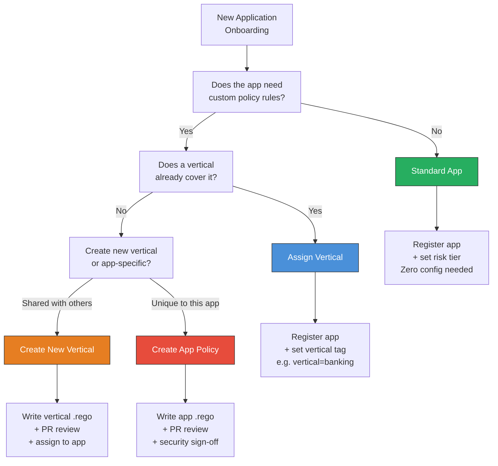
```mermaid
graph TD
    NEW[New Application<br/>Onboarding] --> Q1[Does the app need<br/>custom policy rules?]

    Q1 -->|No| PATH1[Standard App]
    Q1 -->|Yes| Q2[Does a vertical<br/>already cover it?]

    Q2 -->|Yes| PATH2[Assign Vertical]
    Q2 -->|No| Q3[Create new vertical<br/>or app-specific?]

    Q3 -->|Shared with others| PATH3[Create New Vertical]
    Q3 -->|Unique to this app| PATH4[Create App Policy]

    PATH1 --> R1[Register app<br/>+ set risk tier<br/>Zero config needed]
    PATH2 --> R2[Register app<br/>+ set vertical tag<br/>e.g. vertical=banking]
    PATH3 --> R3[Write vertical .rego<br/>+ PR review<br/>+ assign to app]
    PATH4 --> R4[Write app .rego<br/>+ PR review<br/>+ security sign-off]

    style PATH1 fill:#27AE60,stroke:#333,color:#fff
    style PATH2 fill:#4A90D9,stroke:#333,color:#fff
    style PATH3 fill:#E67E22,stroke:#333,color:#fff
    style PATH4 fill:#E74C3C,stroke:#333,color:#fff
```

| Onboarding Path | Effort | Frequency | Policy Files Changed |
|----------------|--------|-----------|---------------------|
| **Standard app** (global policy) | 5 minutes | ~85% of apps | None |
| **Assign existing vertical** | 10 minutes | ~10% of apps | None |
| **Create new vertical** | 1-2 days | ~4% of apps | 1-2 new .rego files |
| **App-specific override** | 1-2 days | ~1% of apps | 1 new .rego file |

### 8.9 Domain Model Changes

To support hierarchical resolution, the `EnvironmentConfig` entity gains an optional `Vertical` field:

```mermaid
graph LR
    subgraph "Current Model"
        EC1[EnvironmentConfig]
        EC1 --- F1[Name]
        EC1 --- F2[RiskTier]
        EC1 --- F3[SecurityTools]
        EC1 --- F4[Policies - list]
    end

    subgraph "Proposed Model"
        EC2[EnvironmentConfig]
        EC2 --- F5[Name]
        EC2 --- F6[RiskTier]
        EC2 --- F7[SecurityTools]
        EC2 --- F8[Vertical - optional]
        EC2 --- F9[PolicyOverride - optional]
    end

    EC1 -->|Evolves to| EC2

    style EC1 fill:#95A5A6,stroke:#333,color:#fff
    style EC2 fill:#4A90D9,stroke:#333,color:#fff
```

| Field | Type | Required | Purpose |
|-------|------|----------|---------|
| `Name` | string | Yes | Environment name (production, staging, dev) |
| `RiskTier` | RiskTier | Yes | Risk classification (critical, high, medium, low) |
| `SecurityTools` | List | Yes | Required scan tools for this environment |
| `Vertical` | string | No | Domain grouping (banking, healthcare, etc.). When null, skips tier 2 resolution. |
| `PolicyOverride` | PolicyReference | No | Explicit policy package. When set, **bypasses** the resolution chain entirely. Serves as an escape hatch for exceptions. |

**Resolution logic in the handler:**

```
IF PolicyOverride is set
    USE PolicyOverride directly (escape hatch)
ELSE
    TRY  app.{app-name}.{environment}
    TRY  vertical.{vertical}.{environment}   (skip if Vertical is null)
    USE  global.{environment}                 (always exists)
```

### 8.10 Scale Projections

| Metric | 10 Apps | 100 Apps | 500 Apps |
|--------|---------|----------|----------|
| Total .rego files | 4 (current) | 8-12 | 15-25 |
| Global policies | 4 | 4 | 4 |
| Vertical policies | 0 | 2-4 verticals (4-8 files) | 5-10 verticals (10-20 files) |
| App-specific policies | 0 | 1-3 | 3-8 |
| Apps needing zero policy config | 10 | ~85 | ~425 |
| Policy bundle size | < 50 KB | < 100 KB | < 200 KB |
| OPA evaluation latency impact | None | Negligible | < 5ms increase |

The hierarchy keeps the policy repository manageable regardless of how many applications are onboarded. Adding a new standard application requires **zero policy changes** -- only the application registration API call.

---

## 9. Domain Model & Data Design

### 9.1 Bounded Contexts

The domain is organized into three bounded contexts following Domain-Driven Design:

```mermaid
graph TB
    subgraph "Application Profile Context"
        APP[Application<br/>Aggregate Root]
        ENV[EnvironmentConfig<br/>Entity]
        RT[RiskTier<br/>Value Object]
        PR[PolicyReference<br/>Value Object]
        ST[SecurityToolType<br/>Value Object]
        APP --> ENV
        ENV --> RT
        ENV --> PR
        ENV --> ST
    end

    subgraph "Evaluation Context"
        EVAL[ComplianceEvaluation<br/>Aggregate Root]
        SR[ScanResult<br/>Value Object]
        VU[Vulnerability<br/>Value Object]
        PD[PolicyDecision<br/>Value Object]
        EVAL --> SR
        EVAL --> PD
        SR --> VU
    end

    subgraph "Audit Context"
        AL[AuditLog<br/>Aggregate Root]
        DE[DecisionEvidence<br/>Value Object]
        AL --> DE
    end

    APP -.->|referenced by| EVAL
    EVAL -.->|recorded in| AL

    style APP fill:#3498DB,stroke:#333,color:#fff
    style EVAL fill:#27AE60,stroke:#333,color:#fff
    style AL fill:#E67E22,stroke:#333,color:#fff
```

### 9.2 Entity Relationship Model

```mermaid
erDiagram
    APPLICATION {
        guid Id PK
        string Name UK
        string Owner
        bool IsActive
        datetime CreatedAt
        datetime UpdatedAt
    }

    ENVIRONMENT_CONFIG {
        guid Id PK
        guid ApplicationId FK
        string EnvironmentName
        string RiskTier
        json SecurityTools
        json Policies
        json Metadata
    }

    COMPLIANCE_EVALUATION {
        guid Id PK
        guid ApplicationId FK
        string Environment
        string RiskTier
        json ScanResults
        json PolicyDecision
        datetime EvaluatedAt
    }

    AUDIT_LOG {
        guid Id PK
        string EvaluationId FK
        guid ApplicationId FK
        string ApplicationName
        string Environment
        string RiskTier
        bool Allowed
        string Reason
        json Violations
        json Evidence
        int CriticalCount
        int HighCount
        int MediumCount
        int LowCount
        int TotalVulnerabilityCount
        int EvaluationDurationMs
        datetime EvaluatedAt
    }

    APPLICATION ||--o{ ENVIRONMENT_CONFIG : "has environments"
    APPLICATION ||--o{ COMPLIANCE_EVALUATION : "evaluated for"
    COMPLIANCE_EVALUATION ||--|| AUDIT_LOG : "recorded as"
```

### 9.3 Risk Tier Classification System

Risk tiers control which policies and enforcement levels apply to each application-environment pair:

```mermaid
graph TB
    subgraph "Risk Tier: CRITICAL"
        C[Customer-facing<br/>PCI / HIPAA regulated]
        C1[Zero tolerance policy]
        C2[All scanners required]
        C3[Example: Payment Processing]
    end

    subgraph "Risk Tier: HIGH"
        H[Business-critical<br/>Internal services]
        H1[Near-zero tolerance]
        H2[Most scanners required]
        H3[Example: HR System]
    end

    subgraph "Risk Tier: MEDIUM"
        M[Internal tools<br/>Non-critical services]
        M1[Moderate tolerance]
        M2[Basic scanning required]
        M3[Example: Internal Dashboard]
    end

    subgraph "Risk Tier: LOW"
        L[Dev utilities<br/>Experiments]
        L1[Tracking mode only]
        L2[No scan requirements]
        L3[Example: Dev Tooling]
    end

    C --> H --> M --> L

    style C fill:#E74C3C,stroke:#333,color:#fff
    style H fill:#E67E22,stroke:#333,color:#fff
    style M fill:#F39C12,stroke:#333,color:#fff
    style L fill:#27AE60,stroke:#333,color:#fff
```

### 9.4 Audit Evidence Structure

Every compliance decision stores three layers of evidence:

```mermaid
graph TB
    subgraph "Audit Log Record"
        D[Decision<br/>Allow or Deny]
        R[Reason<br/>Human-readable]
        V[Violations<br/>List of policy rules broken]
        VC[Vulnerability Counts<br/>critical / high / medium / low]
    end

    subgraph "Decision Evidence (Immutable JSON)"
        E1[Scan Results JSON<br/>Exact input from scanners]
        E2[Policy Input JSON<br/>Exact payload sent to OPA]
        E3[Policy Output JSON<br/>Exact response from OPA]
        E4[Captured Timestamp]
    end

    D --> AUDIT[AuditLog Record]
    R --> AUDIT
    V --> AUDIT
    VC --> AUDIT
    E1 --> AUDIT
    E2 --> AUDIT
    E3 --> AUDIT
    E4 --> AUDIT

    style AUDIT fill:#E67E22,stroke:#333,color:#fff
```

**Why three layers?**  An auditor can replay any decision by comparing:
- What the scanners reported (scan results)
- What the policy engine received (OPA input)
- What the policy engine decided (OPA output)

This provides end-to-end traceability from vulnerability to decision.

---

## 10. API Contract & Interface Design

### 10.1 API Endpoint Map

```mermaid
graph TB
    subgraph Compliance
    CE[POST evaluate]
    CG[GET evaluation by id]
    CA[GET evaluations by app]
    CR[GET recent]
    CB[GET blocked]
    end

    subgraph Applications
    AR[POST register]
    AGT[GET app by id]
    AN[GET app by name]
    AL[GET list all apps]
    AO[PATCH update owner]
    AD[POST deactivate app]
    AE[POST add environment]
    AU[PUT update environment]
    ADE[POST deactivate env]
    end

    subgraph Audit
    AI[GET audit log by id]
    AEV[GET log by evaluation]
    AAP[GET logs by application]
    ABL[GET blocked decisions]
    ACV[GET critical vulns]
    ART[GET logs by risk tier]
    AST[GET statistics]
    end

    subgraph Health
    HE[GET health check]
    end

    style CE fill:#4A90D9,stroke:#333,color:#fff
    style AST fill:#E67E22,stroke:#333,color:#fff
    style HE fill:#27AE60,stroke:#333,color:#fff
```

**Full endpoint paths:**

| Group | Method | Path | Description |
|-------|--------|------|-------------|
| **Compliance** | `POST` | `/api/compliance/evaluate` | Core evaluation endpoint |
| | `GET` | `/api/compliance/{id}` | Get evaluation by ID |
| | `GET` | `/api/compliance/application/{appId}` | Evaluations by app |
| | `GET` | `/api/compliance/recent` | Recent evaluations |
| | `GET` | `/api/compliance/blocked` | Denied deployments |
| **Applications** | `POST` | `/api/applications` | Register application |
| | `GET` | `/api/applications/{id}` | Get by ID |
| | `GET` | `/api/applications/by-name/{name}` | Get by name |
| | `GET` | `/api/applications` | List all (paginated) |
| | `PATCH` | `/api/applications/{id}/owner` | Update owner |
| | `POST` | `/api/applications/{id}/deactivate` | Deactivate |
| | `POST` | `/api/applications/{id}/environments` | Add environment config |
| | `PUT` | `/api/applications/{id}/environments/{env}` | Update environment |
| | `POST` | `/api/applications/{id}/environments/{env}/deactivate` | Deactivate environment |
| **Audit** | `GET` | `/api/audit/{id}` | Audit log by ID |
| | `GET` | `/api/audit/evaluation/{evalId}` | By evaluation ID |
| | `GET` | `/api/audit/application/{appId}` | By application |
| | `GET` | `/api/audit/blocked` | Blocked decisions |
| | `GET` | `/api/audit/critical-vulnerabilities` | Critical CVEs |
| | `GET` | `/api/audit/risk-tier/{tier}` | By risk tier |
| | `GET` | `/api/audit/statistics` | Aggregate stats |
| **Health** | `GET` | `/health` | PostgreSQL + OPA status |

### 10.2 Endpoint Reference

#### Compliance Evaluation

| Method | Endpoint | Description | Auth Required |
|--------|----------|-------------|---------------|
| `POST` | `/api/compliance/evaluate` | Evaluate scan results against policies | Yes (proposed) |
| `GET` | `/api/compliance/{id}` | Get evaluation by ID | Yes (proposed) |
| `GET` | `/api/compliance/application/{appId}?environment=&days=` | Evaluations by app | Yes (proposed) |
| `GET` | `/api/compliance/recent?days=7` | Recent evaluations | Yes (proposed) |
| `GET` | `/api/compliance/blocked?days=` | Denied deployments | Yes (proposed) |

#### Application Management

| Method | Endpoint | Description | Auth Required |
|--------|----------|-------------|---------------|
| `POST` | `/api/applications` | Register new application | Yes (proposed) |
| `GET` | `/api/applications/{id}` | Get application by ID | Yes (proposed) |
| `GET` | `/api/applications/by-name/{name}` | Get by name | Yes (proposed) |
| `GET` | `/api/applications?owner=&pageNumber=&pageSize=` | List all (paginated) | Yes (proposed) |
| `PATCH` | `/api/applications/{id}/owner` | Update owner | Yes (proposed) |
| `POST` | `/api/applications/{id}/deactivate` | Deactivate app | Yes (proposed) |
| `POST` | `/api/applications/{id}/environments` | Add environment config | Yes (proposed) |
| `PUT` | `/api/applications/{id}/environments/{env}` | Update environment | Yes (proposed) |
| `POST` | `/api/applications/{id}/environments/{env}/deactivate` | Deactivate env | Yes (proposed) |

#### Audit & Reporting

| Method | Endpoint | Description | Auth Required |
|--------|----------|-------------|---------------|
| `GET` | `/api/audit/{id}` | Single audit log with full evidence | Yes (proposed) |
| `GET` | `/api/audit/evaluation/{evalId}` | Audit log by evaluation ID | Yes (proposed) |
| `GET` | `/api/audit/application/{appId}?environment=&fromDate=&toDate=&pageSize=&pageNumber=` | Paginated audit logs per app | Yes (proposed) |
| `GET` | `/api/audit/blocked?days=&limit=` | Blocked decisions | Yes (proposed) |
| `GET` | `/api/audit/critical-vulnerabilities?days=` | Critical CVE tracking | Yes (proposed) |
| `GET` | `/api/audit/risk-tier/{tier}?fromDate=&toDate=` | Audit by risk tier | Yes (proposed) |
| `GET` | `/api/audit/statistics?fromDate=&toDate=` | Aggregate statistics | Yes (proposed) |

#### Statistics Response Structure

```json
{
  "totalEvaluations": 1247,
  "allowedCount": 1089,
  "blockedCount": 158,
  "blockedPercentage": 12.67,
  "totalCriticalVulnerabilities": 42,
  "totalHighVulnerabilities": 187,
  "evaluationsByEnvironment": {
    "production": 412,
    "staging": 523,
    "dev": 312
  },
  "evaluationsByRiskTier": {
    "critical": 298,
    "high": 445,
    "medium": 367,
    "low": 137
  }
}
```

---

## 11. Infrastructure & Deployment Architecture

### 11.1 Container Topology (Current - Docker Compose)

```mermaid
graph TB
    API[ComplianceService API<br>ASP.NET Core 8.0<br>Port 5000]
    OPA[OPA Policy Engine<br>Port 8181]
    REGO[Rego Policy Files<br>Read-Only Volume]
    PG[PostgreSQL 16<br>Port 5432]
    PGVOL[Persistent Volume<br>postgres-data]

    API -->|HTTP| OPA
    API -->|TCP| PG
    OPA --> REGO
    PG --> PGVOL

    style API fill:#4A90D9,stroke:#333,color:#fff
    style OPA fill:#8E44AD,stroke:#333,color:#fff
    style PG fill:#E67E22,stroke:#333,color:#fff
    style REGO fill:#D5A6E6,stroke:#333,color:#000
    style PGVOL fill:#F0C27A,stroke:#333,color:#000
```

All three containers run on a shared Docker network (`compliance-network`):

| Container | Image | Ports | Volumes | Health Check |
|-----------|-------|-------|---------|-------------|
| `compliance-api` | Custom .NET 8.0 build | `5000:80` | none | `curl /health` |
| `compliance-opa` | `openpolicyagent/opa:latest` | `8181:8181` | `./policies` (read-only) | `wget --spider /health` |
| `compliance-postgres` | `postgres:16-alpine` | `5432:5432` | `postgres-data` (named volume) | `pg_isready -U postgres` |

### 11.2 Production Deployment Target (Kubernetes)

```mermaid
graph TB
    subgraph "Kubernetes Cluster"
        ING[Ingress Controller<br/>TLS Termination]

        subgraph "ComplianceService Deployment (HPA)"
            subgraph "Pod 1"
                API1[API Container]
                OPA1[OPA Sidecar]
            end
            subgraph "Pod 2"
                API2[API Container]
                OPA2[OPA Sidecar]
            end
            subgraph "Pod N"
                APIN[API Container]
                OPAN[OPA Sidecar]
            end
        end

        SVC[ClusterIP Service]

        subgraph "Data Tier"
            PG_P[PostgreSQL Primary]
            PG_R1[Read Replica 1]
            PG_R2[Read Replica 2]
        end

        CM[ConfigMap<br/>Rego Policies]
        SEC[Secret<br/>DB Credentials]
    end

    ING --> SVC
    SVC --> API1
    SVC --> API2
    SVC --> APIN
    API1 --> OPA1
    API2 --> OPA2
    APIN --> OPAN
    API1 -->|writes| PG_P
    API2 -->|writes| PG_P
    APIN -->|writes| PG_P
    API1 -->|reads| PG_R1
    API2 -->|reads| PG_R1
    APIN -->|reads| PG_R2
    PG_P -->|replication| PG_R1
    PG_P -->|replication| PG_R2
    CM --> OPA1
    CM --> OPA2
    CM --> OPAN
    SEC --> API1
    SEC --> API2
    SEC --> APIN

    style ING fill:#95A5A6,stroke:#333,color:#fff
    style SVC fill:#95A5A6,stroke:#333,color:#fff
    style PG_P fill:#E67E22,stroke:#333,color:#fff
```

### 11.3 Database Schema Management

| Aspect | Strategy |
|--------|----------|
| **Migration tool** | Entity Framework Core migrations |
| **Development** | Auto-migrate on startup via `Database.Migrate()` |
| **Staging** | Apply migration scripts during deployment pipeline |
| **Production** | Explicit versioned SQL scripts; never auto-migrate |
| **Rollback** | Down migrations maintained; tested in staging first |
| **Connection resilience** | Npgsql retry-on-failure (3 retries, 5s delay) |

---

## 12. Security & Governance Model

### 12.1 Security Architecture

```mermaid
graph TB
    subgraph "Perimeter Security"
        TLS[TLS / HTTPS<br/>Encryption in Transit]
        AUTH[Authentication<br/>OAuth 2.0 / API Keys]
        RATE[Rate Limiting<br/>Abuse Prevention]
    end

    subgraph "Application Security"
        VAL[Input Validation<br/>FluentValidation]
        ERR[Error Sanitization<br/>No stack traces in prod]
        CORS[CORS Policy<br/>Restrict origins]
        MW[Request Logging<br/>Structured + Sanitized]
    end

    subgraph "Data Security"
        ENC[Encryption at Rest<br/>PostgreSQL TDE]
        RBAC[Role-Based Access<br/>Audit endpoints restricted]
        EVID[Evidence Immutability<br/>Write-once audit logs]
    end

    subgraph "Policy Security"
        GIT[Policy-as-Code<br/>Git version control]
        RO[Read-Only Mount<br/>Policies cannot be modified at runtime]
        PR[Pull Request Review<br/>Policy changes require approval]
    end

    TLS --> VAL --> ENC --> GIT
    AUTH --> ERR --> RBAC --> RO
    RATE --> CORS --> EVID --> PR

    style AUTH fill:#E74C3C,stroke:#333,color:#fff
    style EVID fill:#E67E22,stroke:#333,color:#fff
    style GIT fill:#8E44AD,stroke:#333,color:#fff
```

### 12.2 Security Controls Matrix

| Control | Category | Status | Priority |
|---------|----------|--------|----------|
| HTTPS enforcement | Perimeter | Implemented | - |
| Input validation (FluentValidation) | Application | Implemented | - |
| Error sanitization (no stack traces in prod) | Application | Implemented | - |
| Structured logging (Serilog) | Observability | Implemented | - |
| Health checks (PostgreSQL + OPA) | Observability | Implemented | - |
| Policy files mounted read-only | Policy | Implemented | - |
| Full evidence audit trail | Governance | Implemented | - |
| Domain invariant enforcement | Application | Implemented | - |
| **Authentication (OAuth 2.0 / API keys)** | Perimeter | **Not implemented** | **P0** |
| **Authorization (RBAC)** | Perimeter | **Not implemented** | **P0** |
| **CORS restriction (specific origins)** | Perimeter | **Not implemented** | **P0** |
| **Secrets management (vault)** | Infrastructure | **Not implemented** | **P0** |
| **Rate limiting** | Perimeter | **Not implemented** | **P1** |
| **Encryption at rest** | Data | **Not implemented** | **P1** |
| **Scan result signing (HMAC/JWT)** | Data Integrity | **Not implemented** | **P2** |
| **OPA bundle signing** | Policy | **Not implemented** | **P2** |

### 12.3 Governance Framework

```mermaid
graph TB
    subgraph "Policy Governance"
        PG1[Rego policies in Git]
        PG2[PR-based policy changes]
        PG3[Policy version tracking]
        PG4[Environment-specific enforcement]
    end

    subgraph "Risk Governance"
        RG1[Risk tier classification]
        RG2[Tier-appropriate strictness]
        RG3[Required tool enforcement]
        RG4[Escalating tolerance by env]
    end

    subgraph "Audit Governance"
        AG1[Every decision recorded]
        AG2[Full evidence preserved]
        AG3[Immutable audit logs]
        AG4[Queryable by any dimension]
    end

    subgraph "Operational Governance"
        OG1[Automated enforcement]
        OG2[No manual bypass]
        OG3[Owner notifications]
        OG4[Portfolio-wide visibility]
    end

    PG1 --> CENTER((Compliance<br/>Governance))
    PG2 --> CENTER
    PG3 --> CENTER
    PG4 --> CENTER
    RG1 --> CENTER
    RG2 --> CENTER
    RG3 --> CENTER
    RG4 --> CENTER
    AG1 --> CENTER
    AG2 --> CENTER
    AG3 --> CENTER
    AG4 --> CENTER
    OG1 --> CENTER
    OG2 --> CENTER
    OG3 --> CENTER
    OG4 --> CENTER

    style CENTER fill:#4A90D9,stroke:#333,color:#fff
```

### 12.4 Compliance Readiness

The audit trail is designed to support the following regulatory frameworks:

| Framework | Supported Capability |
|-----------|---------------------|
| **SOC 2 Type II** | Continuous control evidence with timestamped decisions |
| **PCI-DSS** | Vulnerability management evidence (Req 6.1, 6.2) |
| **HIPAA** | Access control and audit log requirements |
| **ISO 27001** | Information security management controls |
| **FedRAMP** | Continuous monitoring and vulnerability tracking |

---

## 13. Observability & Monitoring Strategy

### 13.1 Current Observability Stack

```mermaid
graph LR
    L1[Serilog] --> L2[Console Sink]
    L1 --> L3[File Sink]
    L1 --> L4[Request Logger]
    H1[Health Endpoint] --> H2[PostgreSQL Probe]
    H1 --> H3[OPA Probe]
    M1[Prometheus Metrics] --> D1[Grafana Dashboards]
    T1[OpenTelemetry] --> D1
    D1 --> A1[Alertmanager]

    style L1 fill:#27AE60,stroke:#333,color:#fff
    style L2 fill:#27AE60,stroke:#333,color:#fff
    style L3 fill:#27AE60,stroke:#333,color:#fff
    style L4 fill:#27AE60,stroke:#333,color:#fff
    style H1 fill:#27AE60,stroke:#333,color:#fff
    style H2 fill:#27AE60,stroke:#333,color:#fff
    style H3 fill:#27AE60,stroke:#333,color:#fff
    style M1 fill:#F39C12,stroke:#333,color:#fff
    style T1 fill:#F39C12,stroke:#333,color:#fff
    style D1 fill:#F39C12,stroke:#333,color:#fff
    style A1 fill:#F39C12,stroke:#333,color:#fff
```

Color key: Green = **Implemented** | Yellow = **Proposed**

| Component | Status | Description |
|-----------|--------|-------------|
| **Serilog** | Implemented | Structured logging with context enrichment |
| **Console Sink** | Implemented | Container stdout for log aggregation |
| **File Sink** | Implemented | Rolling daily log files, 30-day retention |
| **Request Logger** | Implemented | HTTP method, path, status code, duration in ms |
| **Health Endpoint** | Implemented | Combined PostgreSQL and OPA sidecar health |
| **PostgreSQL Probe** | Implemented | TCP connection check via Npgsql |
| **OPA Probe** | Implemented | HTTP GET to OPA health endpoint |
| **Prometheus Metrics** | Proposed | Request rates, latencies, evaluation counts |
| **OpenTelemetry** | Proposed | End-to-end distributed request tracing |
| **Grafana Dashboards** | Proposed | Compliance posture and trend visualization |
| **Alertmanager** | Proposed | SLA breach and availability alerts |

### 13.2 Proposed Key Metrics

| Metric | Type | Description |
|--------|------|-------------|
| `compliance_evaluations_total` | Counter | Total evaluations by result (allow/deny) |
| `compliance_evaluation_duration_seconds` | Histogram | End-to-end evaluation latency |
| `opa_evaluation_duration_seconds` | Histogram | OPA policy evaluation time |
| `compliance_violations_total` | Counter | Violations by rule and severity |
| `compliance_vulnerabilities_total` | Gauge | Active vulnerabilities by severity |
| `compliance_blocked_deployments_total` | Counter | Denied deployments by environment |
| `compliance_api_requests_total` | Counter | API requests by endpoint and status |

---

## 14. Scalability & Growth Strategy

### 14.1 Scalability Assessment

```mermaid
graph TB
    subgraph "Stateless Components - Horizontally Scalable"
        API[ComplianceService API<br/>Scale: Add more pods]
        OPA[OPA Sidecar<br/>Scale: One per API pod]
    end

    subgraph "Stateful Components - Vertically + Read Replicas"
        PG[PostgreSQL<br/>Scale: Vertical + read replicas]
    end

    subgraph "Growth Path"
        direction LR
        S1[Phase 1<br/>Single Instance<br/>~10 apps<br/>~50 evals/day]
        S2[Phase 2<br/>Multi-Instance + K8s<br/>~100-500 apps<br/>~5,000 evals/day]
        S3[Phase 3<br/>Event-Driven<br/>~1,000+ apps<br/>~100,000+ evals/day]
        S1 --> S2 --> S3
    end

    style S1 fill:#27AE60,stroke:#333,color:#fff
    style S2 fill:#F39C12,stroke:#333,color:#fff
    style S3 fill:#4A90D9,stroke:#333,color:#fff
```

### 14.2 Scaling Strategies by Phase

#### Phase 1: Single Instance (Current)

```mermaid
graph LR
    CI[CI/CD Pipelines] --> API[Single API<br/>+ OPA Sidecar]
    API --> PG[Single PostgreSQL]

    style API fill:#27AE60,stroke:#333,color:#fff
```

- Docker Compose deployment
- Suitable for initial rollout with a small number of teams
- No high availability

#### Phase 2: Kubernetes Multi-Instance

```mermaid
graph TB
    CI[CI/CD Pipelines] --> LB[Load Balancer]
    LB --> API1[Pod 1: API + OPA]
    LB --> API2[Pod 2: API + OPA]
    LB --> API3[Pod 3: API + OPA]
    API1 -->|writes| PGP[PG Primary]
    API2 -->|writes| PGP
    API3 -->|writes| PGP
    API1 -->|reads| PGR[PG Replica]
    API2 -->|reads| PGR
    API3 -->|reads| PGR
    PGP --> PGR

    style LB fill:#95A5A6,stroke:#333,color:#fff
    style PGP fill:#E67E22,stroke:#333,color:#fff
```

- Kubernetes Deployment with HPA (auto-scaling on CPU/request rate)
- OPA sidecar per pod (policy evaluation stays local)
- PostgreSQL primary + read replicas for audit query offloading
- OPA policies distributed via ConfigMap or OPA Bundle Server

#### Phase 3: Event-Driven Architecture

```mermaid
graph TB
    CI[CI/CD Pipelines] --> LB[Load Balancer]
    LB --> API[API Pods<br/>+ OPA Sidecars]
    API -->|evaluation results| MQ[Message Queue<br/>RabbitMQ / Kafka]
    MQ --> AW[Audit Writer<br/>Service]
    MQ --> NW[Notification<br/>Service]
    MQ --> MW[Metrics<br/>Aggregator]
    AW --> PGW[Write DB]
    API -->|reads| PGR[Read DB]
    PGW -->|replication| PGR
    API --> CACHE[Redis Cache<br/>App Profiles]

    style MQ fill:#8E44AD,stroke:#333,color:#fff
    style CACHE fill:#E74C3C,stroke:#333,color:#fff
```

- Decouple audit writes and notifications via message queue
- Redis cache for application profile lookups
- Separate read/write data stores (full CQRS)
- Independent scaling of evaluation, audit, and notification services

### 14.3 Performance Optimization Path

| Optimization | Impact | Effort | Phase |
|-------------|--------|--------|-------|
| Redis cache for app profiles | Reduce DB reads by ~80% | Low | 2 |
| Database read replicas | Offload audit queries | Medium | 2 |
| Async audit log writes | Reduce evaluation latency | Medium | 2 |
| OPA bundle server | Centralized policy distribution | Medium | 2 |
| Message queue for notifications | Decouple notification delivery | Medium | 3 |
| Request idempotency | Prevent duplicate evaluations | Low | 2 |
| Database index tuning | Faster audit queries | Low | 2 |
| Audit log archival to cold storage | Manage data growth | Medium | 3 |

---

## 15. Risk Assessment & Mitigations

### 15.1 Technical Risks

```mermaid
graph TB
    subgraph "High Risk"
        R1[No Authentication<br/>API is open to any caller]
        R2[CORS AllowAll<br/>No origin restrictions]
        R3[Secrets in Config Files<br/>DB credentials exposed]
    end

    subgraph "Medium Risk"
        R4[No Test Suite<br/>No automated quality assurance]
        R5[No CI/CD Pipeline<br/>for the service itself]
        R6[Notification Stub<br/>No real alerting]
        R7[Unbounded Audit Growth<br/>No retention policy]
    end

    subgraph "Low Risk"
        R8[Single DB Instance<br/>No HA in current setup]
        R9[No API Versioning<br/>Breaking changes possible]
        R10[No Request Caching<br/>Every request hits DB]
    end

    R1 --> M1[Add OAuth 2.0 /<br/>API Key auth]
    R2 --> M2[Restrict to known<br/>CI/CD origins]
    R3 --> M3[Use HashiCorp Vault /<br/>Azure Key Vault]
    R4 --> M4[Create xUnit test<br/>projects]
    R5 --> M5[Build GitHub Actions<br/>workflow]
    R6 --> M6[Implement Slack /<br/>email integration]
    R7 --> M7[Add retention policy /<br/>archival]

    style R1 fill:#E74C3C,stroke:#333,color:#fff
    style R2 fill:#E74C3C,stroke:#333,color:#fff
    style R3 fill:#E74C3C,stroke:#333,color:#fff
    style R4 fill:#E67E22,stroke:#333,color:#fff
    style R5 fill:#E67E22,stroke:#333,color:#fff
```

### 15.2 Operational Risks

| Risk | Likelihood | Impact | Mitigation |
|------|-----------|--------|------------|
| OPA sidecar becomes unavailable | Medium | High -- all evaluations fail | Health checks + circuit breaker + graceful degradation strategy |
| PostgreSQL downtime | Low | High -- no evaluations possible | Primary + standby with automatic failover |
| Pipeline bypass (teams skip the gate) | High | High -- compliance gap | Make the gate mandatory at platform level |
| Policy misconfiguration blocks all deployments | Medium | High -- deployment freeze | Policy testing in CI + canary policy evaluation |
| Audit log data loss | Low | Critical -- regulatory violation | Database backups + WAL archiving + replication |
| Scan result tampering | Medium | High -- false compliance | Implement HMAC signing of scan payloads |

---

## 16. Maturity Roadmap & Phased Delivery

### 16.1 Delivery Phases

```mermaid
gantt
    title ComplianceService Maturity Roadmap
    dateFormat YYYY-MM
    axisFormat %b %Y

    section Phase 1 - Foundation
    Security hardening (Auth, CORS, Secrets)      :crit, p1a, 2026-02, 2026-03
    Unit + integration test suite                  :p1b, 2026-02, 2026-04
    Dockerfile + CI/CD pipeline                    :p1c, 2026-03, 2026-04
    Initial production deployment                  :milestone, m1, 2026-04, 0d

    section Phase 2 - Operational Maturity
    Real notification channels (Slack, email)      :p2a, 2026-04, 2026-05
    Prometheus metrics + Grafana dashboards        :p2b, 2026-04, 2026-06
    OpenTelemetry distributed tracing              :p2c, 2026-05, 2026-06
    Redis caching + DB read replicas               :p2d, 2026-05, 2026-07
    OPA policy testing framework                   :p2e, 2026-04, 2026-05
    Production operational readiness               :milestone, m2, 2026-07, 0d

    section Phase 3 - Scale and Extend
    Kubernetes HPA deployment                      :p3a, 2026-07, 2026-08
    Event-driven audit + notification pipeline     :p3b, 2026-08, 2026-10
    Webhook callbacks for external consumers       :p3c, 2026-08, 2026-09
    Multi-tenant support                           :p3d, 2026-09, 2026-11
    Policy authoring UI for compliance teams       :p3e, 2026-10, 2026-12
    Full platform maturity                         :milestone, m3, 2026-12, 0d
```

### 16.2 Phase Detail

#### Phase 1 -- Foundation (Months 1-3)

**Goal:** Make the service production-ready with security and quality baselines.

| Deliverable | Description |
|-------------|-------------|
| Authentication & Authorization | OAuth 2.0 / API key authentication on all endpoints |
| CORS Restriction | Limit to known CI/CD runner IPs and internal origins |
| Secrets Management | Move credentials to vault; remove from appsettings |
| Test Suite | xUnit projects for domain logic, handlers, API integration, and OPA policies |
| Dockerfile | Multi-stage build for production container image |
| CI/CD Pipeline | GitHub Actions workflow: build, test, scan, publish container |
| Database Migration Strategy | Explicit scripts for production; no auto-migrate |

#### Phase 2 -- Operational Maturity (Months 3-6)

**Goal:** Make the service observable, resilient, and operationally excellent.

| Deliverable | Description |
|-------------|-------------|
| Notification Channels | Slack, email, PagerDuty integration for blocked deployments and critical CVEs |
| Prometheus Metrics | Request rates, evaluation latencies, violation counts, vulnerability gauges |
| Grafana Dashboards | Compliance posture, blocked deployment trends, portfolio vulnerability view |
| OpenTelemetry | End-to-end request tracing across API, OPA, and database |
| Caching | Redis cache for application profiles to reduce database load |
| Read Replicas | PostgreSQL replicas for audit query offloading |
| OPA Policy Tests | Automated Rego policy testing in CI pipeline |
| Audit Retention | Data retention policies and cold storage archival |

#### Phase 3 -- Scale & Extend (Months 6-12)

**Goal:** Scale the service for enterprise-wide adoption and extend capabilities.

| Deliverable | Description |
|-------------|-------------|
| Kubernetes HPA | Horizontal pod autoscaling based on request rate and CPU |
| Event-Driven Audit | Message queue for audit writes and notification delivery |
| Webhook Callbacks | Push evaluation results to external systems in real time |
| Multi-Tenant | Support multiple organizations from a single deployment |
| Policy Authoring UI | Web interface for compliance teams to write and test policies |
| SDK / Client Libraries | Pre-built integrations for GitHub Actions, Azure DevOps, Jenkins |
| Batch Evaluation | Evaluate multiple applications in a single request |

### 16.3 Success Criteria

| Metric | Target (Phase 1) | Target (Phase 2) | Target (Phase 3) |
|--------|-------------------|-------------------|-------------------|
| Applications onboarded | 5-10 | 50-100 | 500+ |
| Evaluations per day | ~50 | ~2,000 | ~50,000+ |
| Evaluation latency (p95) | < 2s | < 500ms | < 200ms |
| Audit query response time | < 5s | < 1s | < 500ms |
| Availability | 99% | 99.9% | 99.95% |
| Policy test coverage | 50% | 90% | 95% |
| Service test coverage | 40% | 80% | 85% |

---

## 17. Technology Stack Summary

```mermaid
graph TB
    subgraph "Application Runtime"
        NET[.NET 8.0 LTS]
        CS[C# 12]
        ASP[ASP.NET Core 8.0]
    end

    subgraph "Architecture Patterns"
        DDD[Domain-Driven Design]
        CQRS[CQRS via MediatR 12.2]
        CA[Clean Architecture]
    end

    subgraph "Policy Engine"
        OPA[Open Policy Agent 0.60+]
        REGO[Rego Policy Language]
    end

    subgraph Data and Persistence
        PG[PostgreSQL 16]
        EF[Entity Framework Core 8.0]
        NP[Npgsql Provider]
    end

    subgraph "Cross-Cutting"
        SER[Serilog 8.0 - Logging]
        FV[FluentValidation 11.9]
        SW[Swashbuckle 6.5 - OpenAPI]
    end

    subgraph "Infrastructure"
        DC[Docker Compose 3.8]
        K8S[Kubernetes - Target]
        GHA[GitHub Actions - Target]
    end

    NET --> ASP
    ASP --> DDD
    ASP --> CQRS
    ASP --> CA
    OPA --> REGO
    PG --> EF --> NP
    DC --> K8S

    style NET fill:#512BD4,stroke:#333,color:#fff
    style OPA fill:#8E44AD,stroke:#333,color:#fff
    style PG fill:#336791,stroke:#333,color:#fff
    style K8S fill:#326CE5,stroke:#333,color:#fff
```

| Category | Technology | Purpose |
|----------|-----------|---------|
| **Runtime** | .NET 8.0 LTS | Long-term support until November 2026 |
| **Language** | C# 12 | Nullable reference types, records, pattern matching |
| **Web Framework** | ASP.NET Core 8.0 | REST API hosting |
| **Policy Engine** | Open Policy Agent 0.60+ | Rego-based policy evaluation |
| **Database** | PostgreSQL 16 Alpine | Persistent data store |
| **ORM** | Entity Framework Core 8.0 | Database access and migrations |
| **DB Driver** | Npgsql 8.0 | .NET PostgreSQL driver |
| **Mediator** | MediatR 12.2 | CQRS command/query dispatch |
| **Validation** | FluentValidation 11.9 | Request input validation |
| **Logging** | Serilog 8.0 | Structured logging with sinks |
| **API Docs** | Swashbuckle 6.5 | Swagger / OpenAPI generation |
| **Containers** | Docker Compose 3.8 | Development orchestration |

---

> **Next Steps:** Review this proposal with stakeholders and proceed to Phase 1 security hardening and test suite creation. The core service architecture is implemented and functional -- the priority is making it production-ready with authentication, testing, and CI/CD pipeline automation.

---

*Technical Proposal prepared February 2026*
*ComplianceService -- Policy Gateway for CI/CD Pipeline Compliance*
